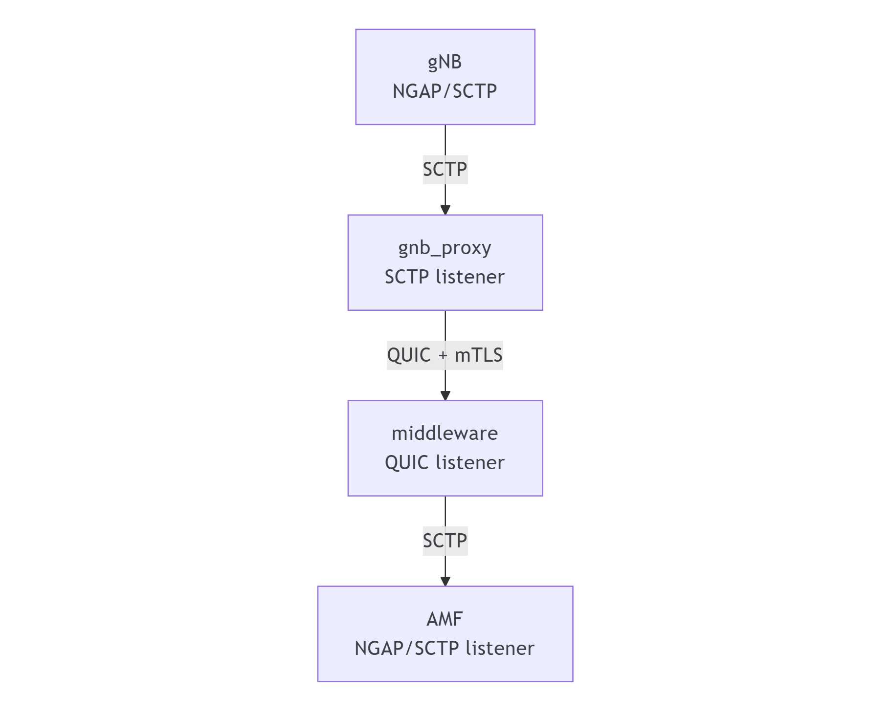
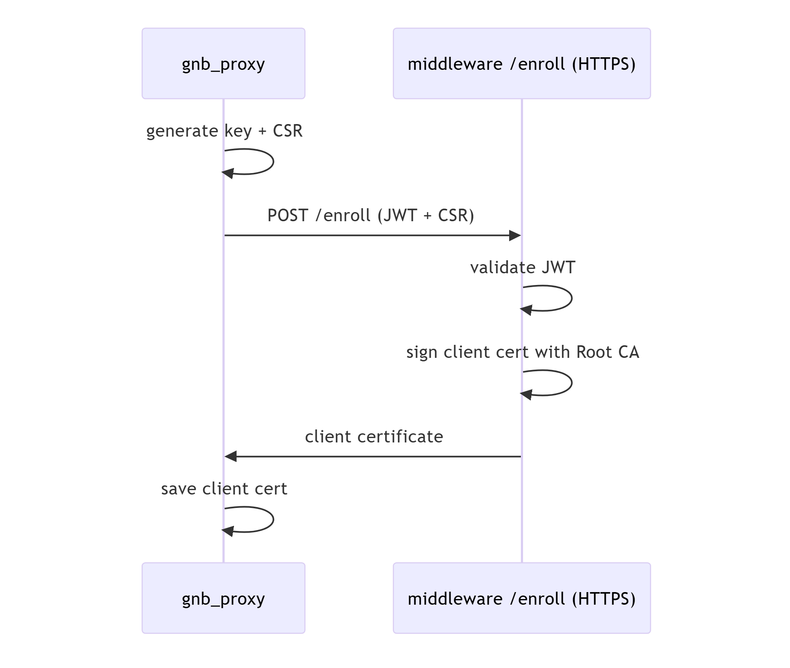

# Exploring the [N2 SCTP Middleware](https://github.com/DBGR18/N2-SCTP-middleware): A Zero Trust Hop for 5G Control Plane

>[!NOTE]
> Author: Kuan Lin Chen, Chieh Cheng Kuo
> Date: 2026/04/16
---

## Introduction
In modern 5G core networks, reliable signaling between components is absolutely critical. One of the key interfaces enabling this communication is the **N2 interface**, which connects the Radio Access Network (gNB) to the core network’s Access and Mobility Management Function (AMF).

The **N2-SCTP-middleware** project introduces a practical way to enhance this interface with Zero Trust principles, without modifying existing 5G components.

## Background: N2 Interface and SCTP in 5G
### What is the N2 Interface?

The N2 interface is part of the 5G control plane and is responsible for signaling between the gNB and AMF. It uses the NGAP (Next Generation Application Protocol) over SCTP as its transport layer. 

Key responsibilities of N2 include:

- Establishing and managing UE (User Equipment) context
- Supporting mobility procedures (handover, registration)
- Carrying NAS (Non-Access Stratum) signaling
- Managing session-related signaling

### Why SCTP?

SCTP (Stream Control Transmission Protocol) is used instead of TCP or UDP because it offers:

- Multi-streaming (avoids head-of-line blocking)
- Multi-homing (fault tolerance)
- Reliable and ordered delivery
- Better support for signaling workloads

These properties make SCTP ideal for 5G control plane communication—but not necessarily sufficient for modern security requirements.

## A Zero-Trust “Hop” for N2

NGAP on N2 is typically transported over **SCTP**. While SCTP provides reliability and multi-streaming, it does not offer a simple, widely adopted mechanism for **mutual authentication and encryption** comparable to TLS (Transport Layer Security).

Although SCTP can be secured using mechanisms like IPsec, such approaches are often **complex to deploy and operate**. 

This project instead adopts a more application-layer-friendly approach:

- **QUIC** for transport (UDP-friendly, modern)
- **TLS 1.3 with mTLS** for authentication and encryption
- A lightweight **certificate enrollment service**

Rather than redesigning the entire N2 interface, this project implements a **secure hop in the middle of the path:**

- **UERANSIM gNB** speaks **NGAP over SCTP** (unchanged)
- A local `gnb_proxy` accepts that SCTP association
- `gnb_proxy` tunnels NGAP over **QUIC (UDP) with mTLS**
- `middleware` receives the tunnel and forwards traffic to the **AMF (SCTP)**

This design treats the segment between `gnb_proxy` and `middleware` as **untrusted**, and secures it explicitly.

## Core Design and Architecture

### a. Components
#### `gnb_proxy` (edge / gNB side)

The `gnb_proxy` sits close to the gNB and acts as an adapter between **SCTP** and the secure tunnel.

**Responsibilities:**

- Listens for SCTP from UERANSIM gNB
- Ensures it has a valid client certificate (enrolling if needed)
- Establishes a QUIC mTLS session to middleware

**Conceptually, it provides:**

- **Local compatibility**
Accepts standard NGAP-over-SCTP without requiring any gNB changes
- **Secure hop**
Converts SCTP signaling into an encrypted, authenticated tunnel
- **Client identity**
Uses a client certificate to prove “who it is” to the middleware

#### **`middleware` (core / AMF side)**

The `middleware` sits close to the AMF and terminates the secure tunnel.
- Boots or loads a local **Root CA**
- Boots or regenerates its **server certificate**
- Runs two services:
  - **Enrollment HTTPS**: issues a client certificate to `gnb_proxy` (after JWT auth)
  - **QUIC mTLS tunnel**: accepts mutually-authenticated tunnel connections
- Bridges traffic to the AMF’s NGAP SCTP listener

Conceptually, it provides:

- **Trust anchor**
Acts as (or hosts) the Certificate Authority (CA)
- **Server identity**
Proves its identity to `gnb_proxy` via a server certificate
- **Client admission control**
Only allows connections from clients with valid, enrolled certificates
- **Protocol bridging**
Converts secure tunnel traffic back into SCTP for the AMF

### b. Security Model
The goal is simple:

> **Protect NGAP signaling across an untrusted segment and ensure both sides are authenticated.**

#### Certificate Authority (CA)

A **CA (Certificate Authority)** is the root of trust.

- Holds a private key used to sign certificates
- Distributes a public certificate used to verify them

In this project:

- The `middleware` acts as the CA
- It signs both:
    - **Server certificate** (for itself)
    - **Client certificates** (for proxies)

#### Client Certificates (Why `gnb_proxy` needs one)

Client certificates enable **mutual authentication**.

With them:

- `middleware` can require every client to present a certificate
- It verifies the certificate is signed by the trusted CA
- Only **authorized proxies** can establish tunnels

Without this, any host could attempt to connect to the tunnel endpoint.

#### QUIC + mTLS Tunnel

The tunnel between `gnb_proxy` and `middleware` uses:

- **QUIC (over UDP)** for transport
- **TLS 1.3 with mutual authentication (mTLS)** for security

This provides:

- **Confidentiality** — NGAP signaling is encrypted
- **Server authentication** — proxy verifies middleware
- **Client authentication** — middleware verifies proxy

In short, it behaves like:

> **“TLS-secured tunnel, but running over QUIC/UDP”**

## Demo
 [Demo video](https://youtu.be/GswpCyoVQaA)
## Final Thoughts
This design highlights a practical approach to introducing zero-trust principles into existing 5G systems: instead of redesigning protocols or modifying endpoints, it **wraps an insecure segment with a secure transport layer.** By combining SCTP compatibility with QUIC and mTLS, the project cleanly separates concerns—leaving NGAP untouched while strengthening the weakest part of the path.

More importantly, it demonstrates a general pattern that extends beyond 5G: when legacy protocols lack built-in security, you can often **bridge them through a modern, authenticated tunnel.** This makes the system not only easier to secure, but also easier to reason about—trust is explicit, scoped, and enforceable at a well-defined boundary.

## About Us
Hi! I'm Chieh-Cheng Kuo, currently working on open source projects free5GC and L25GC-plus. I hope you find this blog useful, and feel free to contact me if you'd like to discuss anything!

### Connect with Us
Github: [DBGR18](https://github.com/DBGR18), [Jasonkuo23](https://github.com/Jasonkuo23)