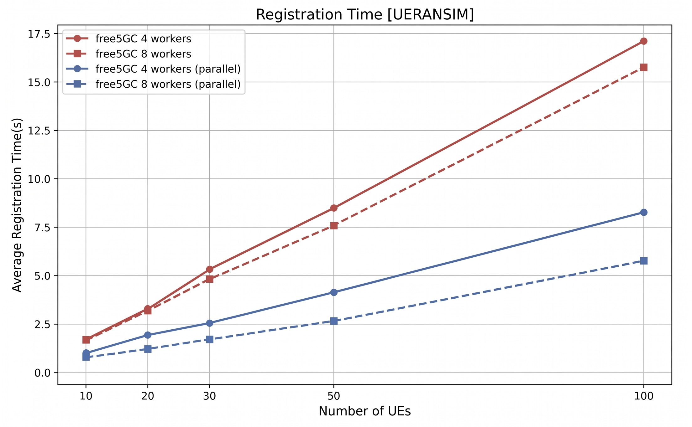
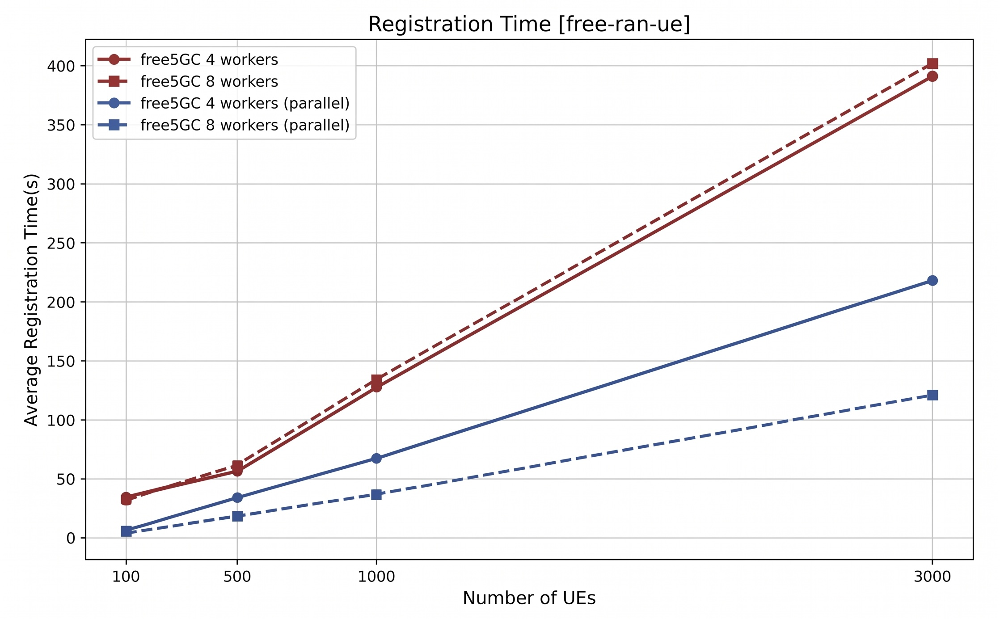

# Parallelizing NGAP Processing in free5GC AMF: From Per-Connection to Per-UE Concurrency
>[!NOTE]
> Author: Fang-Kai Ting, Guo-Cheng Wu, Yung-Hsuan Tsao, Pei-Chi Cheng
> Written by: Che-Wei Lin
> Date: 2026/04/29

## Introduction

As 5G networks scale to support thousands of concurrent devices per cell, the **Access and Mobility Management Function (AMF)** becomes a critical bottleneck. In the free5GC project, a fundamental architectural limitation existed: all NGAP messages from a single gNB connection were processed **serially by one goroutine**, causing head-of-line blocking and single-core saturation.

In this blog post, we will walk through [AMF PR #194](https://github.com/free5gc/amf/pull/194), which introduces a **worker pool architecture with hash-based task distribution** to enable per-UE parallel NGAP processing — significantly improving AMF throughput while preserving per-UE message ordering guarantees.

## Background: The NGAP/SCTP Connection Model

Before diving into the solution, let's quickly review how NGAP messages flow in a 5G network.

The **NG Application Protocol (NGAP)** is the control plane protocol between the gNB (base station) and the AMF. It runs over **SCTP (Stream Control Transmission Protocol)**, which provides reliable, message-oriented transport. Typically, each gNB maintains a single SCTP association with the AMF, and all UE-related signaling for that gNB — registrations, handovers, PDU session setups — flows over this one connection.

### Key NGAP Message Types

| Category | Examples | UE-Associated? |
|---|---|---|
| Non-UE messages | `NGSetupRequest`, `RANConfigurationUpdate` | No |
| UE-specific (Initiating) | `InitialUEMessage`, `UplinkNASTransport`, `HandoverRequired` | Yes |
| UE-specific (Response) | `InitialContextSetupResponse`, `PDUSessionResourceSetupResponse` | Yes |
| UE-specific (Failure) | `InitialContextSetupFailure`, `HandoverFailure` | Yes |

Each UE-associated message carries either a **RAN-UE-NGAP-ID** (assigned by gNB) or an **AMF-UE-NGAP-ID** (assigned by AMF), which uniquely identifies the UE context within the connection.

## The Problem: Head-of-Line Blocking

In the original free5GC AMF, the `handleConnection` function in `service.go` followed a straightforward pattern:

```go
// Original: sequential processing per connection
for {
    n, _, _, err := conn.SCTPRead(buf)
    // ...
    handler.HandleMessage(conn, buf[:n])  // ← blocks until complete
}
```

This meant every NGAP message on a gNB connection was processed **one at a time**. Consider a realistic scenario where a single gNB serves hundreds of UEs:


**The consequences were severe:**

1. **Head-of-Line (HoL) Blocking**: A slow operation for UE1 (e.g., waiting for UDM/AUSF responses) stalls all other UEs on the same gNB — even though their operations are completely independent.

2. **Single-Core Saturation**: On a multi-core server, only one CPU core per gNB connection was utilized for NGAP processing, regardless of available hardware capacity.

3. **Scalability Ceiling**: As UE density per gNB increases, the serial bottleneck becomes the dominant limiting factor for AMF throughput.

There was even a `TODO` comment in the original codebase acknowledging this:

```go
// TODO: concurrent on per-UE message
handler.HandleMessage(conn, buf[:n])
```

## The Solution: Per-UE Parallel Processing

The re-design introduces a **UEScheduler** that distributes NGAP messages across a pool of worker goroutines using consistent hashing on the UE identifier:


This design achieves two critical properties simultaneously:

- **Per-UE Sequentiality**: All messages for the same UE are routed to the same worker, preserving strict ordering.
- **Cross-UE Parallelism**: Messages for different UEs are processed concurrently across multiple workers and CPU cores.

### Component 1: The UE ID Extractor (`ue_id_extractor.go`)

The first challenge is determining *which UE* a message belongs to **before** full message processing. The project introduces `ExtractUEID()`, a lightweight NGAP decoder that extracts the UE identifier from the raw packet:

```go
func ExtractUEID(msg []byte) (uint64, bool) {
    pdu, err := ngap.Decoder(msg)
    if err != nil {
        return 0, false
    }

    switch pdu.Present {
    case ngapType.NGAPPDUPresentInitiatingMessage:
        return extractFromInitiatingMessage(pdu.InitiatingMessage)
    case ngapType.NGAPPDUPresentSuccessfulOutcome:
        return extractFromSuccessfulOutcome(pdu.SuccessfulOutcome)
    case ngapType.NGAPPDUPresentUnsuccessfulOutcome:
        return extractFromUnsuccessfulOutcome(pdu.UnsuccessfulOutcome)
    }
    return 0, false
}
```

The extractor covers **20+ NGAP procedure codes** across all three PDU categories (InitiatingMessage, SuccessfulOutcome, UnsuccessfulOutcome). A key design decision is the **ID preference strategy**:

- For `InitialUEMessage`: Uses **RAN-UE-NGAP-ID** (the AMF ID hasn't been assigned yet).
- For subsequent messages (e.g., `UplinkNASTransport`): Prefers **AMF-UE-NGAP-ID** when available.
- For `PathSwitchRequest`: Uses **SourceAMFUENGAPID** to maintain worker affinity during handover.
- For non-UE messages (e.g., `NGSetupRequest`): Returns `0, false`, routing them to a default worker.

### Component 2: The Worker Pool Scheduler (`scheduler.go`)

The scheduler is the core orchestration layer. Each worker is a dedicated goroutine with its own buffered task channel:

```go
type Task struct {
    UEID    uint64
    Conn    net.Conn
    Message []byte
}

type Worker struct {
    ID       int
    taskChan chan Task
    stopChan chan struct{}
    handler  func(conn net.Conn, msg []byte)
    wg       *sync.WaitGroup
}

type UEScheduler struct {
    workers    []*Worker
    numWorkers int
    wg         sync.WaitGroup
}
```

**Hash-based routing** ensures consistent UE-to-worker mapping with zero memory allocation:

```go
func (s *UEScheduler) hashUEID(ueID uint64) int {
    return int(ueID % uint64(s.numWorkers))
}
```

> The initial implementation used FNV hashing, but this was simplified to modulo arithmetic afterward. FNV required `make([]byte)` on every packet — an unnecessary allocation on the hot path. Simple modulo is sufficient for load distribution since UE IDs are already well-distributed integers.

**Backpressure** is implemented through the worker's `Submit` method using a `select` statement:

```go
func (w *Worker) Submit(task Task) bool {
    select {
    case w.taskChan <- task:
        return true
    case <-w.stopChan:
        logger.NgapLog.Warnf("Worker %d stopped, rejecting task for UE ID %d",
            w.ID, task.UEID)
        return false
    }
}
```

When the worker's buffer is full, the sender **blocks intentionally** — this is a deliberate design choice for 5G control plane signaling, where dropping messages would cause retransmissions and potential signaling storms. If a shutdown signal arrives while blocked, the operation exits immediately.

### Component 3: The Dispatch Layer (`service.go`)

The connection handler is refactored to decouple SCTP reading from message processing:

```go
// New: dispatch through worker pool
func dispatchToWorkerPool(conn net.Conn, msg []byte, handler NGAPHandler) {
    scheduler, err := ngap_internal.GetScheduler()
    if err != nil {
        // Fallback to sequential processing if scheduler unavailable
        handler.HandleMessage(conn, msg)
        return
    }

    ueID, found := ngap_internal.ExtractUEID(msg)
    if !found {
        ueID = 0  // Route non-UE messages to default worker
    }

    task := ngap_internal.Task{UEID: ueID, Conn: conn, Message: msg}
    if !scheduler.DispatchTask(task) {
        logger.NgapLog.Warnf("Drop packet for UE ID %d (Scheduler is shutting down)", ueID)
    }
}
```

A graceful **fallback to sequential processing** is provided when the scheduler isn't initialized, ensuring backward compatibility.

### Component 4: Configuration and Lifecycle (`config.go`, `init.go`)

Two new configuration parameters are added to `amfcfg.yaml`:

```yaml
configuration:
  ngapWorkerPoolSize: 0    # 0 = auto-detect (runtime.NumCPU())
  ngapTaskBufferSize: 4096 # per-worker task buffer size
```

The scheduler is initialized during AMF startup and gracefully shut down during teardown:

```go
// Startup
ngap.InitScheduler(workerPoolSize, taskBufferSize, ngap.Dispatch)

// Shutdown
ngap.ShutdownScheduler()
```

## Safety Considerations: The Worker-Switch Problem

One subtlety deserves special attention. Because this re-design uses the **global `AMFContext` with `sync.Map`** for UE state storage, a UE's lifecycle may span multiple workers:

1. `InitialUEMessage` → keyed by **RAN-UE-NGAP-ID** → routed to **Worker A**
2. `UplinkNASTransport` → keyed by **AMF-UE-NGAP-ID** → routed to **Worker B**

**Why is this safe?**

- The global context uses thread-safe `sync.Map` for all UE context access.
- The 5G request-response model inherently prevents a UE from sending messages with both RAN ID and AMF ID simultaneously — by the time the AMF-UE-NGAP-ID is assigned and used, the RAN-ID-only phase is complete.
- The worker switch happens only **once** per UE lifecycle (at the ID transition point).

**Future improvement**: A strictly lock-free, per-UE worker affinity model would require removing the global `UePool` and modifying the AMF-UE-ID allocation mechanism to bind specific IDs to specific workers.

## Shutdown Safety

The re-design went through several iterations:

### Iteration 1: Close the task channel directly

```go
// Problem: "send on closed channel" panic
func (s *UEScheduler) Shutdown() {
    close(w.taskChan) // Other goroutines may still be submitting!
}
```

### Iteration 2: Use `stopChan` + `select` pattern

```go
// Safe: stopChan signals shutdown without closing taskChan
func (w *Worker) run() {
    for {
        select {
        case task := <-w.taskChan:
            w.handler(task.Conn, task.Message)
        case <-w.stopChan:
            w.drainAndExit()
            return
        }
    }
}

func (w *Worker) drainAndExit() {
    for {
        select {
        case task := <-w.taskChan:
            w.handler(task.Conn, task.Message)
        default:
            return // Channel empty, exit safely
        }
    }
}
```

The final design ensures:

- No panic from sending on a closed channel.
- All queued tasks are drained before exit.
- `sync.WaitGroup` guarantees the AMF process doesn't exit until all workers have finished.

## Testing Strategy

The re-design includes a comprehensive test suite covering both correctness and performance:

### Unit Tests for UE ID Extraction (`ue_id_extractor_test.go`)

9 test scenarios that construct real NGAP PDUs, encode them, and verify extraction:

| Test Case | Message Type | Expected ID |
|---|---|---|
| InitialUEMessage | Initiating | RAN-UE-NGAP-ID |
| UplinkNASTransport | Initiating | AMF-UE-NGAP-ID (preferred over RAN ID) |
| HandoverRequired | Initiating | AMF-UE-NGAP-ID |
| InitialContextSetupResponse | Successful | AMF-UE-NGAP-ID |
| PDUSessionResourceSetupResponse | Successful | AMF-UE-NGAP-ID |
| UEContextReleaseRequest | Initiating | AMF-UE-NGAP-ID |
| NGSetupRequest | Initiating | Not found (non-UE message) |
| Invalid message | — | Not found |

### Scheduler Tests (`scheduler_test.go`)

| Test | What It Validates |
|---|---|
| Hash Consistency | Same UE ID always maps to same worker (100 iterations) |
| Hash Distribution | 10,000 UEs distributed evenly (±25% tolerance) |
| Hash Range | Worker index always in `[0, numWorkers)` including edge cases |
| Concurrent Submission | 50 goroutines × 100 tasks, all processed without loss |
| Per-UE Sequentiality | 100 ordered messages for same UE processed in order |
| Multiple UEs Concurrent | 20 UEs × 50 messages, per-UE order preserved |
| Graceful Shutdown | All 50 queued tasks processed during shutdown |

### Performance Testing

The re-design was validated with multiple UE simulation tools:
- **UERANSIM**: Up to ~100 concurrent UEs (`./nr-ue -c free5gc-ue.yaml -n 100`)
- **free-ran-ue** : Up to 3,000 concurrent UEs (`./build/free-ran-ue ue -c config/ue.yaml -n 3000`)
- **Custom webconsole scripts**: For multi-UE provisioning: [register_multiple_ues.sh](https://github.com/qawl987/amf/pull/1/files)

1. With **UERANSIM**, the test scaled to **100 concurrent simulated UEs**. The figure shows that the original sequential design (red) saw registration time increase steadily as UE count grew, reaching roughly **17 seconds** at 100 UEs. After parallel NGAP processing was introduced (blue), registration time dropped to about **8 seconds with 4 workers** and around **6 seconds with 8 workers**, showing a clear improvement in scalability even at modest UE counts.


2. With **free-ran-ue**, we're able to scale the test to **3,000 concurrent simulated UEs**. Under this heavier load, the original sequential path rose to roughly **400 seconds** for 3,000 UEs, while the parallel design reduced that to about **220 seconds with 4 workers** and around **120 seconds with 8 workers**. This larger-scale result better highlights the benefit of this per-UE parallelism re-design.


## Conclusion

This re-design demonstrates how a targeted architectural change — introducing a worker pool with hash-based routing — can dramatically improve the scalability of a 5G core network function without altering existing business logic. The key principles are:

1. **Decouple I/O from processing**: The SCTP reader no longer blocks on message handling.
2. **Hash-based affinity**: A simple `ueID % N` provides per-UE ordering guarantees with zero allocation.
3. **Backpressure over dropping**: In control plane signaling, blocking is preferable to packet loss.
4. **Incremental architecture**: By keeping the global `AMFContext`/`sync.Map`, the change minimizes blast radius while achieving significant parallelism gains.

The code review process also highlighted the importance of shutdown safety in concurrent Go systems — evolving from a naive `close(channel)` approach to a robust `stopChan + select + drain` pattern.

If you're interested in the implementation details, check out the full PR at [AMF PR #194](https://github.com/free5gc/amf/pull/194).

## Reference

- [3GPP TS 38.413](https://www.etsi.org/deliver/etsi_ts/138400_138499/138413/): NG Application Protocol (NGAP)
- [free5gc/amf PR #194](https://github.com/free5gc/amf/pull/194): feat: parallelize NGAP processing in AMF
- References to implementation:
    - Scheduler and worker pool: [internal/ngap/scheduler.go](https://github.com/free5gc/amf/blob/main/internal/ngap/scheduler.go)
    - UE ID extraction: [internal/ngap/ue_id_extractor.go](https://github.com/free5gc/amf/blob/main/internal/ngap/ue_id_extractor.go)
    - Connection dispatch: [internal/ngap/service/service.go](https://github.com/free5gc/amf/blob/main/internal/ngap/service/service.go)
    - Configuration: [pkg/factory/config.go](https://github.com/free5gc/amf/blob/main/pkg/factory/config.go)
    - Lifecycle management: [pkg/service/init.go](https://github.com/free5gc/amf/blob/main/pkg/service/init.go)
- [free-ran-ue](https://free-ran-ue.github.io): A next-generation open-source 5G RAN/UE project

## Acknowledgement

Special thanks to [**Fang-Kai Ting**](https://github.com/qawl987), [**Guo-Cheng Wu**](https://github.com/leowu0407), [**Yung-Hsuan Tsao**](https://github.com/reki9185), and [**Pei-Chi Cheng**](https://github.com/HiImPeggy) — the authors of this work. Their effort in designing and iterating on the parallel NGAP processing architecture made this contribution possible.

## About

Hello! I'm Che-Wei Lin, and this blog post is a write-up of the work done by the authors mentioned above. I hope you found this blog post helpful, and please feel free to reach out for further discussion.

## Connect with Me

- GitHub: [Zach1113](https://github.com/Zach1113)
