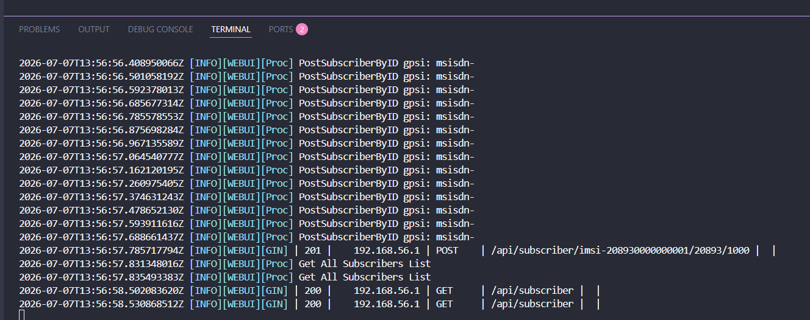
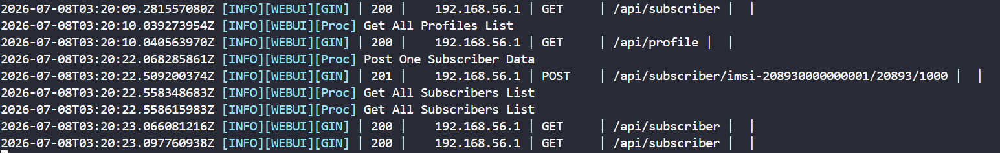
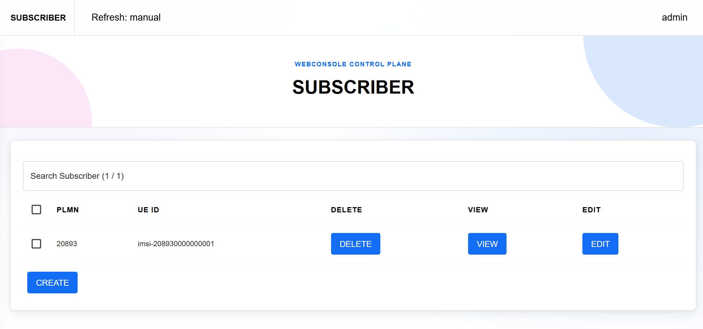
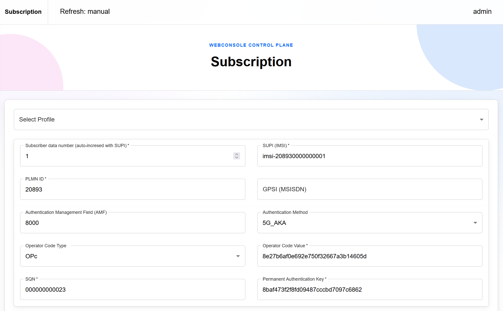
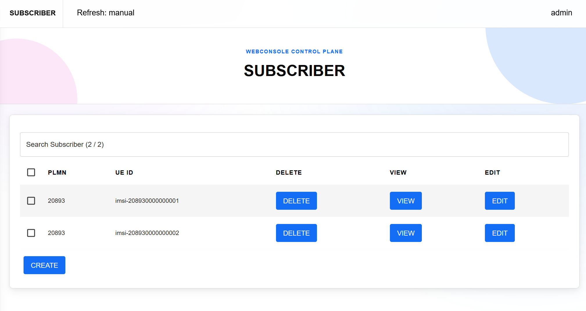

# Accelerating Bulk Subscriber Provisioning in free5GC WebConsole with MongoDB-Based IMSI Allocation
> [!NOTE]
> Author: Kai-Hung, Hu
> Date: 2026/05/06

## 1. Introduction

Large-scale free5GC experiments often focus on UE registration signaling performance, but the preparation step can also become a bottleneck. Before thousands of simulated UEs can register, their subscriber data must already exist in MongoDB. The free5GC WebConsole makes this easy for a few UEs, but the original bulk creation path becomes slow when provisioning large subscriber ranges.

This article describes an optimization to the WebConsole bulk subscriber creation path. The main change replaces the per-UE database workflow with MongoDB-backed IMSI range allocation and collection-level bulk insertion. In the tested 3,000-UE case, provisioning time dropped from minutes to less than a second while keeping the existing WebConsole API shape.

## 2. Background: Subscriber Data in free5GC

A UE in a 5G system is identified by a SUPI, often represented as an IMSI in test environments. In free5GC WebConsole, creating a subscriber means storing the required subscription data in MongoDB, including authentication, access and mobility, session management, policy, and optional GPSI-to-SUPI mapping data.

The bulk API path keeps the same idea but repeats it for a continuous IMSI range:

```http
POST /api/subscriber/{ueId}/{servingPlmnId}/{userNumber}
```

For example, if the request starts at `imsi-208930000100000` with `userNumber=3000`, the intended result is a continuous range from `imsi-208930000100000` to `imsi-208930000102999`, unless existing data requires the allocator to move the start forward. Because each UE maps to several MongoDB collections, repeating the one-UE workflow thousands of times creates many database round trips.

## 3. The Original Bottleneck

The original WebConsole implementation handled multi-subscriber creation by looping through each UE. The request accepted `userNumber`, parsed the numeric part of the seed IMSI, and then incremented the value inside a loop. For every generated UE ID, the code performed GPSI validation, identity mapping, duplicate checks, and the normal subscriber database operation.

A simplified version of the original flow looks like this:

```go
ueIdTemp, err := strconv.Atoi(ueId)
if err != nil {
    c.JSON(http.StatusBadRequest, gin.H{"cause": "ueId format incorrect"})
    return
}

for i := 0; i < userNumberTemp; i++ {
    ueId = fmt.Sprintf("imsi-%015d", ueIdTemp)

    if gpsiInt != 0 {
        if !validate(ueId, gpsi) {
            c.JSON(http.StatusBadRequest, gin.H{"cause": "duplicate gpsi"})
            return
        }
        gpsiInt += 1
    }

    ueIdTemp += 1
    identityDataOperation(ueId, gpsi, "post")
    dbOperation(ueId, servingPlmnId, "post", &subsData, nil, claims, false)
}
```

This approach is easy to understand and has the advantage of reusing the single-subscriber creation logic. However, the cost grows quickly because `dbOperation()` itself writes several collections. The loop also performs duplicate checks and identity operations per UE. At 100 or 200 subscribers, this may still feel acceptable. At 1,000 or 3,000 subscribers, the overhead becomes obvious.

The API trace makes the bottleneck easy to see. When the old implementation creates 1,000 subscribers, it repeats the subscriber creation request 1,000 times. Each POST creates one UE, then the client or loop moves on to the next UE ID.



The fundamental issue is not that MongoDB cannot store the data quickly. The issue is that the WebConsole repeatedly performs many small database operations, one UE at a time. Each iteration has its own application-side object conversion, filter creation, database calls, and error-handling path. The total cost is therefore dominated by the repeated per-UE round trips rather than by the raw size of the data.

There is also a correctness concern when multiple bulk requests happen at the same time. A simple "find current maximum IMSI, then start inserting" strategy is not sufficient by itself. If two requests observe the same maximum value concurrently, both may attempt to create overlapping UE ranges. A bulk provisioning implementation should therefore allocate IMSI ranges atomically, not merely calculate them in memory.

These two observations guided the redesign: reduce the number of database operations, and make range allocation explicit and atomic.

## 4. New Design: Range Allocation and Bulk Insert

The optimized implementation introduces a dedicated bulk subscriber path in `api_subscriber_bulk.go`. The single-subscriber path remains available, but when the route contains `userNumber`, the request is delegated to the bulk implementation:

```go
if c.Param("userNumber") != "" {
    postBulkSubscriberByID(c, &subsData, claims)
    return
}
```

The bulk flow is organized around five main steps: ensuring indexes, finding an allocation floor, atomically reserving an IMSI range, building documents in memory, and inserting documents collection by collection with `InsertMany`.

From the caller's point of view, the optimized path turns the same 1,000-UE provisioning task into a single POST request. The requested subscriber count is carried by the route, and the server handles range allocation and bulk insertion internally.



### 4.1. Indexes for the Hot Queries

The WebConsole startup path calls `EnsureSubscriberIndexes()` after connecting to MongoDB. The bulk path frequently needs to find the maximum UE ID for a PLMN and check for conflicts in UE ID or GPSI ranges. The following indexes support those operations:

```go
indexes := []struct {
    collName string
    models   []mongo.IndexModel
}{
    {
        collName: amDataColl,
        models: []mongo.IndexModel{
            {
                Keys: bson.D{
                    {Key: "servingPlmnId", Value: 1},
                    {Key: "ueId", Value: -1},
                },
                Options: options.Index().SetName("servingPlmnId_1_ueId_-1"),
            },
        },
    },
    {
        collName: authWebSubsDataColl,
        models: []mongo.IndexModel{
            {
                Keys:    bson.D{{Key: "ueId", Value: 1}},
                Options: options.Index().SetName("ueId_1"),
            },
        },
    },
    {
        collName: identityDataColl,
        models: []mongo.IndexModel{
            {
                Keys:    bson.D{{Key: "gpsi", Value: 1}},
                Options: options.Index().SetName("gpsi_1"),
            },
        },
    },
}
```

These indexes are intentionally small and targeted. They do not change the logical data model, but they make the allocator and conflict checks scale better as the database grows.

### 4.2. IMSI Range Validation

The implementation treats IMSI values as numeric ranges tied to the serving PLMN. For a PLMN such as `20893`, the valid IMSI range is computed by using the PLMN as the prefix and filling the remaining digits:

```go
func imsiBoundsForPLMN(plmnID string) (int64, int64, error) {
    prefix, err := strconv.ParseInt(plmnID, 10, 64)
    if err != nil {
        return 0, 0, fmt.Errorf("parse servingPlmnId: %w", err)
    }

    multiplier := int64(1)
    for i := 0; i < imsiDigitSize-len(plmnID); i++ {
        multiplier *= 10
    }

    minValue := prefix * multiplier
    return minValue, minValue + multiplier - 1, nil
}
```

Before reserving or inserting anything, the bulk path validates that the seed IMSI and the final allocated range fit inside the PLMN-derived bounds. This prevents a request from accidentally creating `imsi-*` values that no longer match the requested serving PLMN.

### 4.3. Atomic Range Reservation

The most important part of the design is the allocator stored in `webui.idAllocator`. Instead of trusting an application-side maximum calculation alone, the implementation uses MongoDB `FindOneAndUpdate` with an update pipeline. Each PLMN has a document whose `_id` is derived from the PLMN, for example `subscriber:20893`. The document stores the next available IMSI.

A simplified version of the allocator logic is:

```go
filter := bson.M{
    "_id": subscriberAllocatorID(servingPlmnID),
    "$or": bson.A{
        bson.M{"nextImsi": bson.M{"$exists": false}},
        bson.M{"nextImsi": bson.M{"$lte": maxStart}},
    },
}

update := mongo.Pipeline{
    bson.D{{Key: "$set", Value: bson.D{
        {Key: "nextImsi", Value: bson.D{
            {Key: "$add", Value: bson.A{
                bson.D{{Key: "$max", Value: bson.A{
                    bson.D{{Key: "$ifNull", Value: bson.A{"$nextImsi", floor}}},
                    floor,
                }}},
                int64(count),
            }},
        }},
    }}},
}

opts := options.FindOneAndUpdate().
    SetProjection(bson.M{"nextImsi": 1}).
    SetReturnDocument(options.After).
    SetUpsert(true)
```

This makes allocation a database-level operation. If two requests try to allocate ranges concurrently, MongoDB serializes the document update. Each successful request receives a distinct range. The code then derives the start value from the returned `nextImsi`:

```go
start := result.NextIMSI - count64
return subscriberIMSIAllocation{Start: start, Next: result.NextIMSI}, nil
```

This allocator also respects a `floor` value. The floor is the greater of the requested seed IMSI and the next value after the existing maximum IMSI. This preserves the intuitive behavior that a bulk request should not allocate below the requested seed, while also avoiding ranges already occupied by existing subscription data.

### 4.4. Building Documents Once

After the range is reserved, the code builds all UE IDs in memory and converts the submitted subscriber profile into per-collection documents. The bulk builder clones the base subscriber data and changes only fields that must vary per UE, such as `ueId`, `servingPlmnId`, tenant metadata, and generated MSISDN values.

```go
for i, ueID := range ueIDs {
    webAuthDoc := cloneBsonM(webAuthBase)
    webAuthDoc["ueId"] = ueID
    docs.authWeb = append(docs.authWeb, webAuthDoc)

    amDoc := cloneBsonM(amBase)
    if len(gpsis) > 0 {
        amDoc["gpsis"] = replaceMSISDN(
            subsData.AccessAndMobilitySubscriptionData.Gpsis,
            gpsis[i],
        )
    }
    amDoc["ueId"] = ueID
    amDoc["servingPlmnId"] = servingPlmnID
    docs.am = append(docs.am, amDoc)

    // Other subscription and policy collections are prepared similarly.
}
```

The MSISDN handling deserves special mention. If the input contains a GPSI such as `msisdn-1000`, the bulk path generates a continuous GPSI range: `msisdn-1000`, `msisdn-1001`, `msisdn-1002`, and so on. If the input has no MSISDN, no identity mapping documents are created. This keeps the behavior useful for both realistic subscriber data and pure IMSI-scale load preparation.

### 4.5. Collection-Level Bulk Insert

Finally, instead of upserting each UE separately, the implementation groups documents by collection and calls `InsertMany`:

```go
insertOpts := options.InsertMany().SetOrdered(false)
for _, batch := range batches {
    if len(batch.docs) == 0 {
        continue
    }
    if _, err := db.Collection(batch.collName).InsertMany(ctx, batch.docs, insertOpts); err != nil {
        return fmt.Errorf("insert %s: %w", batch.collName, err)
    }
}
```

Using unordered bulk inserts allows MongoDB to process a batch more efficiently than a long sequence of independent writes. The WebConsole still inserts into the same logical collections, but it greatly reduces the overhead of repeatedly crossing the application/database boundary.

## 5. API Behavior and Failure Handling

The external route remains the same:

```http
POST /api/subscriber/{ueId}/{servingPlmnId}/{userNumber}
```

The difference is that the presence of `userNumber` now triggers the optimized bulk path. Single subscriber creation continues to use the existing logic, which reduces compatibility risk for users who are not provisioning subscribers in bulk.

On success, the new path returns a response that is more informative than an empty JSON object:

```json
{
  "created": 3000,
  "startUeId": "imsi-208930000100000",
  "endUeId": "imsi-208930000102999"
}
```

This is useful in automated test preparation because the caller can record exactly which UE range was created. It is also helpful when the allocator advances beyond the requested seed due to existing subscribers.

The allocator behavior is especially useful when the requested seed overlaps with data that already exists. For example, assume the WebConsole already has one subscriber whose UE ID ends in `1`:



With the old single-subscriber behavior, trying to create the same UE ID again sends a normal create request for that exact ID:



Because the UE already exists, the request fails with a duplicate error instead of creating another subscriber:


With the new bulk path, the requested seed is treated as an allocation floor. If the seed overlaps with an existing subscriber, the allocator searches for the current maximum UE ID under the serving PLMN and starts from the next available value. In this example, after finding UE ID `1`, the new path creates UE ID `2`:



The implementation handles several failure modes explicitly:

- Invalid `userNumber` values return `400 Bad Request`.
- Invalid IMSI or serving PLMN format is rejected before allocation.
- A range that would exceed the PLMN-derived IMSI bounds is rejected.
- Existing UE or GPSI conflicts are checked before insertion.
- If a bulk insert fails after some collections have already been written, the cleanup path removes documents in the allocated UE range.

The cleanup logic is not a replacement for multi-document transactions, but it is a practical safeguard for the current WebConsole data model. It keeps the bulk path from silently leaving partially provisioned subscribers when an insertion error occurs.

## 6. Performance Evaluation

To evaluate the improvement, I compared the original implementation with the new bulk implementation using the same API shape and the same subscriber payload. The test used local MongoDB, separate test databases for the original and new versions, and verified the number of documents in `subscriptionData.provisionedData.amData` after each run.

One detail is important: the benchmark payload used a non-MSISDN GPSI placeholder. The original multi-UE path can reject repeated MSISDN values as duplicates, so using a non-MSISDN placeholder isolates the provisioning performance comparison from GPSI duplicate semantics. The purpose of this benchmark is to compare large IMSI range provisioning, not to test MSISDN allocation policy.

The results show a large improvement:

| UE Count | Original | New Bulk API | Speedup |
|---:|---:|---:|---:|
| 1,000 | 25.910s | 0.196s | 132x |
| 2,000 | 66.382s | 0.390s | 170x |
| 3,000 | 120.465s | 0.575s | 209x |

The original implementation becomes slower as the UE count grows because each subscriber repeats the same set of database operations. At 3,000 UEs, the old path took about two minutes. The new path completed the same scale in slightly more than half a second.

I also measured larger counts for the new bulk API:

| UE Count | New Bulk API |
|---:|---:|
| 5,000 | 0.908s |
| 10,000 | 1.674s |

The important result is not only that the new implementation is faster, but also that it changes the shape of the preparation workflow. With the old path, creating thousands of subscribers is something a tester may hesitate to repeat frequently. With the new path, recreating a large subscriber dataset becomes cheap enough to include in normal test setup and cleanup cycles.

The performance gain comes from three design choices working together:

1. IMSI allocation is performed as one atomic range reservation instead of repeatedly discovering and checking IDs.
2. Subscriber documents are generated in memory from shared base data instead of invoking the full per-UE write path repeatedly.
3. MongoDB writes are batched per collection with `InsertMany`, reducing application-to-database round trips.

## 7. Conclusion

Bulk subscriber provisioning is not the same as UE registration signaling, but it has a direct impact on how quickly large-scale free5GC experiments can be prepared. When a test scenario needs thousands of UEs, waiting minutes for WebConsole subscriber creation adds friction to every experiment cycle.

The optimized WebConsole bulk path addresses this by replacing the original per-UE database workflow with MongoDB-backed IMSI range allocation and collection-level bulk insertion. The implementation keeps the existing route structure, validates IMSI and PLMN ranges, supports generated MSISDN ranges when applicable, and returns the created UE range to the caller.

In the measured 3,000-UE case, the provisioning time dropped from 120.465 seconds to 0.575 seconds. Larger new-path tests also remained fast, with 10,000 UEs provisioned in 1.674 seconds in the local benchmark environment.

Future work could explore concurrent bulk request stress testing, transaction-based rollback for deployments that require stronger all-or-nothing semantics, and more detailed observability around allocator state and per-collection insertion latency. Even without those extensions, the current improvement already makes bulk subscriber preparation much more practical for free5GC WebConsole users who work with large simulated UE populations.

## References

- [MongoDB Manual: `db.collection.findOneAndUpdate()`](https://www.mongodb.com/docs/manual/reference/method/db.collection.findOneAndUpdate/)
- [MongoDB Manual: `db.collection.insertMany()`](https://www.mongodb.com/docs/manual/reference/method/db.collection.insertMany/)
- [MongoDB Manual: Indexes](https://www.mongodb.com/docs/manual/indexes/)
- [free5GC WebConsole](https://github.com/free5gc/webconsole)

## About

Hello! I'm Kai-Hung Hu. I hope this blog post has been informative. If you have ideas for further discussion, please don't hesitate to get in touch.

## Connect with Me

- GitHub: [carlhus](https://github.com/carlhus)
