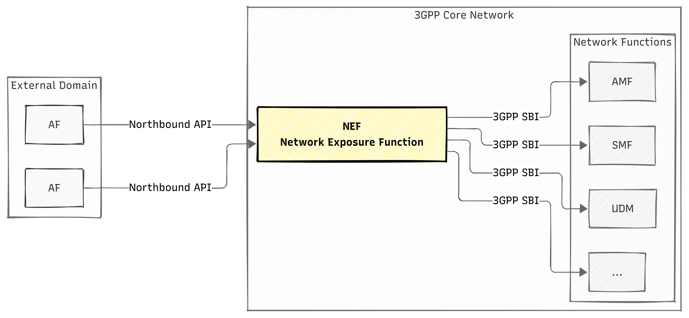
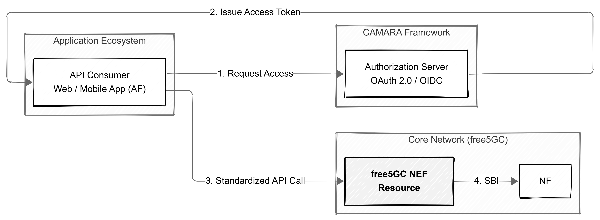
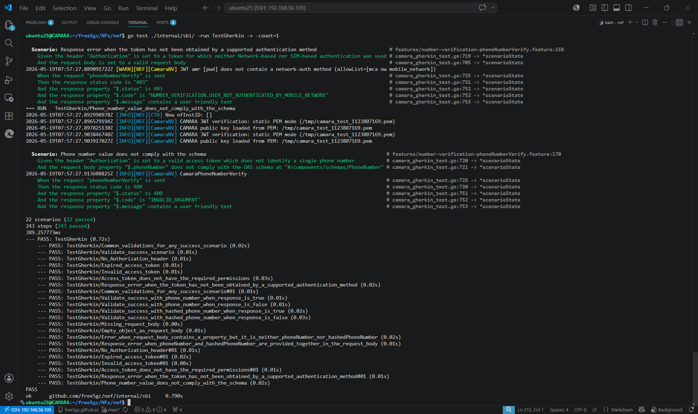

# Empowering free5GC NEF with Standardized CAMARA APIs
> [!NOTE]
> Author: [Yu-Chen Chan](https://github.com/solar224)
> Date: 2026/05/20

---

## 1. Introduction

As 5G networks mature, the focus of the telecommunications industry has shifted from merely "increasing bandwidth" to "Network Programmability." To allow external applications to flexibly invoke 5G network capabilities, 3GPP has defined the NEF (Network Exposure Function), which is responsible for exposing network capabilities to the outside world.

However, traditional 3GPP standard APIs are filled with complex telecommunication terminology and underlying signaling, presenting a very high learning curve for most Web and App developers. To solve this pain point, the open-source project CAMARA, promoted by the Linux Foundation, has emerged. CAMARA is dedicated to abstracting complex telecommunication APIs, transforming them into intuitive, cross-carrier consistent, and interoperable standard interfaces.

This article will delve into how to integrate the CAMARA API standard with the open-source 5G core network free5GC.

---

## 2. Background: Understanding the Core Ecosystem

Before diving deeper, it is necessary to first understand the two core components in the ecosystem:

### 2.1. free5GC NEF

In the free5GC architecture, NEF acts as a secure bridge between the 5G core network and external applications (AF, Application Function).



According to 3GPP specifications, its main responsibilities are not only to provide interfacing but also include the following key functions:

* **High Security and Topology Hiding**: Blocks external direct access to the core network and hides the topology structure and complex operations of the internal network.
* **Capability Exposure**: Safely externally provides underlying network capabilities (such as connection monitoring, QoS configuration, device status) in the form of standard APIs.
* **Access Control and Protection**: Executes rate limiting, authorization, and authentication checks to ensure the core network is not paralyzed by malicious or overloaded requests.
* **Identity and Format Conversion**: Responsible for mapping between identifiers used by external applications (such as universal GPSI/MSISDN) and identifiers used by internal network elements (such as SUPI), and safely and correctly forwards external requests to the corresponding internal network elements (such as AMF, SMF, UDM, etc.).

Through NEF, enterprises and developers can fully invoke the powerful resources of the 5G network in a controlled and secure environment.

### 2.2. CAMARA API

[CAMARA API](https://github.com/camaraproject) is a global open-source project jointly promoted by the Linux Foundation and GSMA, aiming to define a set of globally universal and cross-carrier network exposure API specifications. It highly abstracts the complex underlying 5G telecommunication capabilities (such as QoS bandwidth on demand, precise device location, network status monitoring, etc.), transforming them into RESTful APIs familiar to modern developers.

The core values of this project are:

* **Developer-Friendly**: Fully adopts mainstream Web technology standards such as HTTP/JSON and OAuth 2.0/OIDC. Developers can easily invoke 5G network functions without having to read obscure 3GPP specifications or understand underlying Telco signaling.
* **Cross-Telco Interoperability**: Achieves the vision of "Write once, run on any network". The application code written by developers does not require significant modifications simply because the underlying carrier or equipment brand has changed.
* **Service-Driven**: Converts rigid network parameters into service intents with commercial value, allowing applications to view network capabilities as programmable cloud resources for flexible invocation.

---

## 3. CAMARA Specification System and Architecture Integration

To perfectly integrate the CAMARA standard into an open-source project, we must first understand the operational nature of the CAMARA project. CAMARA itself is a collection of Specification Artifacts, rather than an executable application framework.

In CAMARA's multi-repo architecture, each API has a dedicated repository, and consistency is ensured through shared specifications across APIs:

* **API Definition (OpenAPI YAML)**: Defines standard data structures and RESTful endpoints (e.g., [Number Verification](https://github.com/camaraproject/NumberVerification)).

* **Test Definition (Gherkin)**: Uses Cucumber-style BDD (Behavior-Driven Development) test scenarios to ensure consistent implementation behavior across different carriers (e.g., [Number Verification](https://github.com/camaraproject/NumberVerification/tree/main/code/Test_definitions)).

* **Common Specifications** ([Commonalities](https://github.com/camaraproject/Commonalities) & [ICM](https://github.com/camaraproject/IdentityAndConsentManagement)): Includes API design guidelines, security interoperability profiles for Identity and Consent Management (ICM), and unified release processes.

### 3.1. Architecture Integration Analysis: How CAMARA Meets free5GC NEF

> [!NOTE]
> Integrating the CAMARA API into free5GC NEF is essentially an engineering effort to transform NEF into a "Resource Server".



Under CAMARA's security architecture specifications, data flow and business logic are strictly divided. The complete operational flow is as follows:

1. **Authorization**: The application (or end user) must first authenticate with the Authorization Server (AS, e.g., Keycloak). The AS is responsible for handling regulatory compliance, purpose review, and user consent authorization. Once approved, it will issue a JWT (JSON Web Token) with specific permissions.

2. **API Request (API Consumer)**: The external application acting as an AF will carry the acquired JWT (Bearer Token) in the HTTP Header to send standard CAMARA API requests to the free5GC NEF.

3. **Security Middleware Gatekeeping**: After the request arrives at the free5GC NEF, it will not directly enter the core network, but will first pass through strict inspection by the middleware. Here, it performs Rate Limiting (preventing abuse), Body Size Limiting (preventing attacks), and most crucially, **JWT verification** (including verifying RSA signatures, issuer `iss`, audience `aud`, preventing replay attacks via `jti`, and the Authentication Method Reference `amr`).

4. **Core Network Processing and Response (Processor & Consumer)**: After passing verification, the NEF will accurately extract the SUPI of the connected device from the JWT, then perform NRF Discovery to find the `nudm-sdm` service, and query the internal UDM for the corresponding subscription data and true status. The final verification result will be returned to the developer in a concise CAMARA JSON format.

This perfectly decoupled architecture not only ensures the absolute security of the 5G core network but also cleanly and neatly separates complex authorization logic from underlying network processing.

---

## 4. Implementation

To put the above architecture into practice, the Number Verification API was chosen as the primary implementation target for Proof of Concept (PoC).

Traditional App registration relies on SMS verification codes (SMS OTP), which are vulnerable to Phishing or SMS Interception / SS7 interception attacks. Through CAMARA Number Verification, applications can directly request the 5G core network to verify the true number of the currently connected device, achieving a seamless and highly secure Zero-Touch authentication.

### 4.1. Core Implementation in free5GC NEF

To equip the free5GC NEF with the capability to process CAMARA APIs, modular extensions were made to the architecture, which is primarily divided into three core layers: **Security Middleware**, **Business Logic Processor (Processor)**, and **Core Network Communication Layer (Consumer)**.

#### 4.1.1. Security Middleware

All CAMARA API requests must undergo strict JWT verification before entering the business logic. I implemented a dedicated Middleware series (including Rate Limit, Body Size Limit, and Token verification), responsible for obtaining the JWKS (JSON Web Key Set) from the Authorization Server and verifying the validity of the Token, including the RSA signature, `iss` (issuer), `aud` (audience), etc.

To prevent Replay Attacks, a `jti` (JWT ID) caching mechanism was introduced; meanwhile, in terms of fetching values, it supports the extension of custom formats such as `ppid`:

```go
// Security Middleware Implementation (Middleware)
func (s *Server) CamaraAuthMiddleware(requiredScope string) gin.HandlerFunc {
    // Obtain the JWKS key provider in advance to avoid I/O for every request
    keyProvider, _ := buildCamaraKeyProvider(s)

    return func(c *gin.Context) {
        // 1. JWT signature and basic claim verification
        token, err := jwt.ParseWithClaims(bearerToken, &CamaraJWTClaims{}, ...)
        claims := token.Claims.(*CamaraJWTClaims)

        // 2. Verify jti to prevent replay attacks
        if jtiReplayCache.Check(claims.ID) {
            abortWithCamaraError(c, http.StatusUnauthorized, ...)
            return
        }

        // 3. Verify scope and amr (must include network authentication methods allowed by the profile)
        // ... (Verification logic omitted)

        // 4. Extract SUPI from the token (supports sub or custom PPID claim)
        var supi string
        if s.Config().GetCamaraAuthSubClaimFormat() == "ppid" {
            supi, _ = extractCustomClaim(bearerToken, customClaim)
        } else {
            supi = claims.Subject
        }

        // Place the verified supi into Context for subsequent Processor use
        c.Set("supi", supi)
        c.Next()
    }
}
```

#### 4.1.2. Business Logic Processor (Processor)

After the request passes security verification, it enters the Processor layer. Taking the Number Verification API as an example, the application passes in the user-claimed phone number or its hash value at this stage. The Processor's responsibility is to normalize the incoming data and prepare to initiate a query into the 5G core network.

Here, the verified SUPI is extracted from the Context, and the Consumer layer service is called. Finally, the internal result is packaged back into a JSON reply according to the CAMARA standard specification.

```go
// Business Processing Logic (Processor)
func (p *Processor) CamaraPhoneNumberVerify(c *gin.Context, body *NumberVerificationRequestBody) {
    // Retrieve the SUPI verified by the Middleware
    supi := c.GetString("supi")
    
    // Determine if the request contains a plaintext phone number or a hash value
    hasPhone := body.PhoneNumber != nil && *body.PhoneNumber != ""
    hasHash := body.HashedPhoneNumber != nil && *body.HashedPhoneNumber != ""
    // ... (Omit fool-proof checks for containing both or neither)

    // Call the Consumer layer to query the core network for the true MSISDN via SUPI
    msisdn, probDetails, err := p.Consumer().GetMsisdnFromSupi(supi)
    if err != nil || probDetails != nil {
         // Handle errors, converting them to corresponding CAMARA error codes (e.g., INVALID_ARGUMENT, etc.)
    }

    var verified bool
    if hasPhone {
        // Directly compare E.164 phone numbers
        verified = *body.PhoneNumber == msisdn
    } else if hasHash {
        // Perform SHA-256 hashing on the MSISDN obtained from the core network before comparing
        hashBytes := sha256.Sum256([]byte(msisdn))
        hashHex := hex.EncodeToString(hashBytes[:])
        verified = strings.EqualFold(hashHex, *body.HashedPhoneNumber)
    }

    // Return the verification result in the format specified by CAMARA
    c.JSON(http.StatusOK, gin.H{"devicePhoneNumberVerified": verified})
}
```

#### 4.1.3. Core Network Communication Layer (Consumer)

This is the most critical part of the free5GC NEF. External applications cannot directly know the topology of the 5G internal network, so the Consumer layer is responsible for performing Service Discovery through the NRF (Network Repository Function) to locate the internal endpoint of the UDM (Unified Data Management) that manages subscription data.

Next, the Consumer will use the previously obtained SUPI to call the `nudm-sdm` service provided by the UDM to obtain access and mobility subscription data containing the device's true identity (MSISDN).

```go
// Core Network Communication Logic (Consumer)
func (s *nudmService) GetMsisdnFromSupi(supi string) (string, *models.ProblemDetails, error) {
    // 1. Find the UDM Nudm-SDM endpoint via NRF
    uri, err := s.getNudmSdmUri()
    if err != nil {
        return "", nil, err
    }

    // 2. Create or acquire an API Client connecting to the UDM (configuring HTTP and Metrics)
    client := s.getUdmSdmClient(uri)

    // 3. Query the UDM for the user's subscription data (Access and Mobility Subscription Data)
    ctx, _, _ := s.consumer.Context().GetTokenCtx(models.ServiceName_NUDM_SDM, models.NrfNfManagementNfType_UDM)
    req := &SubscriberDataManagement.GetAmDataRequest{
        Supi: &supi,
    }
    resp, err := client.AccessAndMobilitySubscriptionDataRetrievalApi.GetAmData(ctx, req)
    
    // 4. Parse the returned data, filter the GPSIs field, and extract the true number starting with "msisdn-"
    // ... (Parsing logic omitted)
    
    return msisdn, nil, nil
}
```

Through the three-tier architecture described above, we have successfully realized the seamless integration of the RESTful API defined by CAMARA with the 3GPP 5G core network architecture.

From the `Consumer` implementation above, it can be seen that when the underlying layer actually operates, it needs to handle traditional 3GPP signaling details such as NRF service discovery, UDM `nudm-sdm` subscription data queries, and cumbersome SUPI/GPSI identifier conversions. However, with the CAMARA-standardized NEF serving as a proxy and abstraction layer, **external App or Web developers completely do not need to know what NRF, UDM, or SUPI are**. They only need to use familiar HTTP POST, bringing in a phone number in JSON format, to call a simple `/number-verification` endpoint to obtain a `true` or `false` verification result. This completely smooths out the technical difficulty between telecommunication networks and Internet applications.

### 4.2. Testing Strategy & Demo

The most important indicator of compliance with CAMARA specifications is that it must fully pass the standard test scripts provided by the CAMARA project. This ensures that the APIs implemented by different carriers or open-source projects have compatibility and consistency for external developers.

In terms of testing, this project adopts **Behavior-Driven Development (BDD)** as its core strategy. The specific approach is to directly introduce the Gherkin `.feature` scripts officially written by CAMARA (such as scenarios like `number-verification-phoneNumberVerify.feature` covering various success and failure paths), and hook them up with the free5GC NEF in the Go testing framework.

By mocking the Authorization Server issuing a Token, and using `gock` to intercept queries sent to the 5G UDM, end-to-end automated integration testing is achieved:

```go
// Example of a lightweight architecture using BDD to test CAMARA scenarios
func InitializeScenario(ctx *godog.ScenarioContext) {
    // Initialize the mocked 5G core network and NEF Server (including Middleware, Processor, Consumer)
    server := setupMockCamaraServer()

    // Define the logic corresponding to each step in the BDD scenarios
    ctx.Step(`^a valid access token with scopes "([^"]*)"$`, setupValidToken)
    ctx.Step(`^the client sends a POST request with phoneNumber "([^"]*)"$`, sendPostRequest)
    ctx.Step(`^the server should reply with status (\d+)$`, checkStatusCode)
    ctx.Step(`^devicePhoneNumberVerified should be (true|false)$`, checkVerificationResult)
}
```

Since this testing system runs directly on the real Handler Stack, any missed detections of JWT in the Middleware layer, or non-compliance with specifications in the Processor layer, will be directly caught during the testing in this phase.



**Keycloak Setup & Demo**

To facilitate integration, we use a setup script to automatically configure the OIDC infrastructure on Keycloak. Key configurations include:
1. **Client & Scopes**: Creating the `camara` realm, registering the `nef-api-consumer` client, and assigning CAMARA-specific scopes (e.g., `number-verification:verify`).
2. **Protocol Mappers**: Injecting required claims (`camara-amr`, `camara-sub-supi`) into the JWT.

After adding the generated JWKS endpoints to `nefcfg.yaml`, developers can use the Client Secret to request a Bearer Token and invoke the API.

Below is the complete integration demo:

<iframe width="100%" height="500" src="https://www.youtube.com/embed/TUlDWwevwWY" title="CAMARA NumberVerification" frameborder="0" allow="accelerometer; autoplay; clipboard-write; encrypted-media; gyroscope; picture-in-picture; web-share" referrerpolicy="strict-origin-when-cross-origin" allowfullscreen></iframe>

---

## 5. Conclusion

Looking back at the Number Verification implementation case in this article, we witnessed how the free5GC NEF securely exposes controlled 5G network capabilities to external applications while hiding the complexity of the underlying signaling. This not only successfully achieves Zero-Touch authentication without SMS verification codes (SMS OTP), fundamentally preventing security threats such as SMS interception, SS7 attacks, and OTP phishing scams, but also concretely demonstrates the perfect balance between security and performance in NEF.

As the application scenarios of Network Exposure APIs become increasingly diverse, the future development of NEF will become even more crucial. The NEF of the future will not just be a simple "interface converter," but a "smart telecom cloud gateway" equipped with highly secure mechanisms. Facing low-latency demands such as real-time remote drone control, or QoS On-Demand for telemedicine, NEF will execute more meticulous dynamic authorization reviews and resource scheduling based on a Zero Trust Architecture.

## Reference

- [free5GC](https://github.com/free5gc/free5gc): Open source 5G core network
- [UERANSIM](https://github.com/aligungr/UERANSIM): A next-generation open-source 5G RAN/UE project
- [keycloak](https://github.com/keycloak/keycloak): Access Management For Modern Applications and Services
- CAMARA API Specification:
    - [Number Verification](https://github.com/camaraproject/NumberVerification)
    - [ICM](https://github.com/camaraproject/IdentityAndConsentManagement)
    - [Commonalities](https://github.com/camaraproject/Commonalities)
- [ETSI TS 129 522](https://www.etsi.org/deliver/etsi_ts/129500_129599/129522/18.10.00_60/ts_129522v181000p.pdf): Network Exposure Function Northbound APIs
- [Official paper](https://ieeexplore.ieee.org/document/11152879): Offering CAMARA APIs as a Service- Demo

---

## About

Hello, I'm [Yu-Chen Chan](https://github.com/solar224). I hope this project and blog post have been helpful. If you have any questions, suggestions, or would like to discuss further, please don't hesitate to reach out.

### Connect with Me

- GitHub: [solar224](https://github.com/solar224)