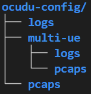
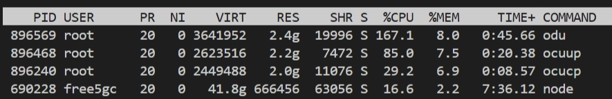

# Connecting free5GC and OCUDU With ZeroMQ Software Simulation
> [!NOTE]
> Author: [Fang-Kai Ting](https://github.com/qawl987)
> Date: 2026/06/19
---

This guide describes how to connect **OCUDU** to **free5GC** and run a software UE with **srsUE** through **ZeroMQ**. It first covers a basic single-UE setup, then provides an advanced two-UE network slicing example with `iperf3` traffic testing.

Since the official OCUDU documentation only provides examples for Open5GS, this article was written to make it easy to copy the configurations step-by-step and quickly verify the basic functionality between free5GC and OCUDU.

This article does not explain every configuration parameter in detail. Instead, it provides configuration files that can be used to quickly bring up the setup. For parameter details, refer to the [Configuration Reference — srsRAN Project documentation](https://docs.srsran.com/projects/project/en/latest/user_manuals/source/config_ref.html). Also note that the software simulation has a throughput limit of around 3 Mbits/sec. For better performance, refer to [srsRAN gNB with srsUE — srsRAN Project documentation](https://docs.srsran.com/projects/project/en/latest/tutorials/source/srsUE/source/index.html) and use a physical RU.

## Overview

The setup uses OCUDU as the 5G RAN, free5GC as the 5G Core, and srsUE as the UE. ZeroMQ is used as the software RF transport between the OCUDU DU and srsUE, so the test can run without SDR hardware.

This guide includes:

- Building OCUDU with ZeroMQ support.
- Building srsUE from `srsRAN_4G`.
- Starting free5GC, OCUDU CU-CP, OCUDU CU-UP, OCUDU DU, and srsUE.
- Registering one UE and testing data-plane connectivity.
- Running two UEs with different slice settings.
- Testing traffic behavior with `iperf3`.

## Components

- **free5GC**: Provides the 5G Core.
- **OCUDU CU-CP**: Handles RAN control-plane functions.
- **OCUDU CU-UP**: Handles RAN user-plane functions.
- **OCUDU DU**: Connects to srsUE through ZeroMQ.
- **srsUE**: Provides the software UE and creates the `tun_srsue` interface.
- **ZeroMQ**: Provides the software RF transport between DU and UE.
- **Appendix config**: Provides the configuration files used in this guide.

## Prerequisites

This guide was tested in the environment described below; however, the minimum RAM requirement and supported Ubuntu versions have not been tested.

- Ubuntu-based 22.04 or newer VM or host.
- CPU: 4 or more
- RAM: 16GB or more

### Install free5GC by following:

[free5GC Quick Setup](https://free5gc.org/guide/quick-setup/#step-2-find-your-network-interface-name)

### Set config

1. Create below in home directory 
    
    
    
2. Move the configuration files in the appendix to the `~/ocudu-config` directory, and the multi-ue configuration files to the `~/ocudu-config/multi-ue` directory.

## Build OCUDU

1. Install the required packages:
    
    `sudo apt install cmake make gcc g++ pkg-config libfftw3-dev libmbedtls-dev libsctp-dev libyaml-cpp-dev libgtest-dev libzmq3-dev`
    
2. Clone OCUDU:
    
    `git clone --branch release_26_04 --depth 1 https://gitlab.com/ocudu/ocudu.git`
    
3. Build OCUDU with ZeroMQ support:
    
    ```bash
    cd ocudu
    mkdir build
    cd build
    cmake ../ -DENABLE_EXPORT=ON -DENABLE_ZEROMQ=ON
    make -j$(nproc)
    ```
    
4. During CMake configuration, confirm that ZeroMQ is detected:
    
    ```bash
    -- FINDING ZEROMQ.
    -- Checking for module 'ZeroMQ'
    -- Found libZEROMQ: /usr/local/include, /usr/local/lib/libzmq.so
    ```
    

If CMake uses stale build artifacts, clean the build directory and rerun the configuration step.

## Build srsUE

1. Install the required packages:
    
    `sudo apt install build-essential cmake libfftw3-dev libmbedtls-dev libboost-program-options-dev libconfig++-dev libsctp-dev libzmq3-dev`
    
2. Clone `srsRAN_4G`:
    
    `git clone --branch release_25_10 --depth 1 https://github.com/srsran/srsRAN_4G`
    
3. Build srsUE:
    
    ```bash
    cd srsRAN_4G
    mkdir build
    cd build
    cmake ../ -DENABLE_RF_PLUGINS=OFF
    make -j$(nproc)
    ```
    

## Basic Scenario: Single UE Registration and Connectivity

This section starts free5GC, OCUDU, and one srsUE instance. After the UE registers, the data-plane connection is verified with a ping test through `tun_srsue`.


### Start free5GC

Start the free5GC core:

`~/free5gc$ ./run.sh`

### Start OCUDU

Start CU-CP:

`sudo ~/ocudu/build/apps/cu_cp/ocucp -c ~/ocudu-config/cu_cp.yml`

Start CU-UP:

`sudo ~/ocudu/build/apps/cu_up/ocuup -c ~/ocudu-config/cu_up.yml`

Start DU with the ZeroMQ configuration:

`sudo ~/ocudu/build/apps/du/odu -c ~/ocudu-config/du_zmq.yml`

When the processes start correctly, the CU and DU components should wait for the UE connection.

- OCUDU startup result
    
    
    

### Reduce CPU Usage in a VM

In VM environments, OCUDU may consume a large amount of CPU due to excessive VM context switching. Adding the following block to the CU-CP, CU-UP, and DU YAML files can significantly reduce CPU utilization:

```yaml
expert_execution:
  threads:
    main_pool:
      backoff_period: 1000
```

- Before apply
    
    
    
- After apply
    
    
    

### Start srsUE

1. Before starting srsUE, create the corresponding subscriber in the free5GC web console (the `ue.conf` has already been modified to the default settings of the web console). Please refer to the official documentation [Create Subscriber via webconsole - free5GC](https://free5gc.org/guide/Webconsole/Create-Subscriber-via-webconsole/) for steps on registering the UE.
2. Create ue1 namespace:
    
    `sudo ip netns add ue1`
    
3. Start srsUE:
    
    `sudo ~/srsRAN_4G/build/srsue/src/srsue ~/ocudu-config/ue.conf`
    

After the UE registers, srsUE creates the `tun_srsue` interface.

- UE registration result
    
    
    

### Configure Routing and NAT

1. Update the default route inside the UE namespace:
    
    ```bash
    sudo ip netns exec ue1 ip route del default via 10.60.0.1 dev tun_srsue
    sudo ip netns exec ue1 ip route add default dev tun_srsue
    ```
    
2. Enable IP forwarding:
    
    `sudo sysctl -w net.ipv4.ip_forward=1`
    
3. Add NAT for the UE subnet:
    
    `sudo iptables -t nat -A POSTROUTING -s 10.60.0.0/16 -o enp0s3 -j MASQUERADE`
    
4. Allow forwarding between `upfgtp` and the external network interface:
    
    ```bash
    sudo iptables -A FORWARD -i upfgtp -o enp0s3 -j ACCEPT
    sudo iptables -A FORWARD -i enp0s3 -o upfgtp -m state --state RELATED,ESTABLISHED -j ACCEPT
    ```
    

Replace `enp0s3` with the external network interface used by your environment.

### Verify Connectivity

Run a ping test from the UE namespace:

`sudo -n ip netns exec ue1 ping -c 4 -I tun_srsue 8.8.8.8`

- Ping result
    
    
    

## Advanced Scenario: Two UEs with Network Slicing

This section runs two UE instances with different slice settings. Because we use `iperf3` for traffic testing, we create two dummy interfaces to serve as the iperf3 servers.


The example uses:

- UE1: `imsi=208930000000001`, eMBB slice `nssai-sd=010203`
- UE2: `imsi=208930000000002`, URLLC slice `nssai-sd=112233`
- UE1 server endpoint: `192.168.100.1`
- UE2 server endpoint: `192.168.100.2`

### Prerequisites

1. Install GNU Radio
    
    `sudo apt-get install gnuradio`
    
2. Install iperf3 with `--bind-dev` support
3. Make sure the subscriber profiles in the free5GC web console match the two UE configuration files. For steps on registering a dual-UE slice, please refer to the [A Practical Guide to Network Slicing and Traffic Steering with free5GC and OAI-MEC - free5GC](https://free5gc.org/blog/20250625/20250625/?h=prac) "Create a new network slice" section in the previous blog post.

### Create Dummy Interfaces

Create a dummy interface for UE1:

```bash
sudo ip link add dummy-ue1 type dummy
sudo ip addr add 192.168.100.1/24 dev dummy-ue1
sudo ip link set dummy-ue1 up
```

Create a dummy interface for UE2:

```bash
sudo ip link add dummy-ue2 type dummy
sudo ip addr add 192.168.100.2/24 dev dummy-ue2
sudo ip link set dummy-ue2 up
```

### Start free5GC

Start the core network:

`~/free5gc$ ./run.sh`

### Start OCUDU with Multi-UE Configuration

Start CU-CP:

`sudo ~/ocudu/build/apps/cu_cp/ocucp -c ~/ocudu-config/multi-ue/cu_cp.yml`

Start CU-UP:

`sudo ~/ocudu/build/apps/cu_up/ocuup -c ~/ocudu-config/multi-ue/cu_up.yml`

Start DU:

`sudo ~/ocudu/build/apps/du/odu -c ~/ocudu-config/multi-ue/du_zmq.yml`

### Start Two UEs

Start UE1:

`sudo ip netns add ue1`

`sudo ~/srsRAN_4G/build/srsue/src/srsue ~/ocudu-config/multi-ue/ue.conf`

Start UE2:

`sudo ip netns add ue2` 

`sudo ~/srsRAN_4G/build/srsue/src/srsue ~/ocudu-config/multi-ue/ue2.conf`

### Start GNU Breaker

1. Start the GNU breaker process from the same directory:
    
    `grcc -r ~/ocudu-config/multi-ue/multi_ue_scenario.grc`
    

If both UEs register successfully, each UE should have its tunnel interface.

- UE1 result
    
    
    
- UE2 result
    
    
    

### Start iperf3 Servers

Start the UE1 server:

`iperf3 -s -B 192.168.100.1`

Start the UE2 server:

`iperf3 -s -B 192.168.100.2`

### Configure UE Routes

Add the default route for UE1:

`sudo ip netns exec ue1 ip route add default dev tun_srsue`

Add the default route for UE2:

`sudo ip netns exec ue2 ip route add default dev tun_srsue`

### Run UE1 Traffic

Start a 60-second UDP flow from UE1:

```bash
sudo ip netns exec ue1 sudo -u free5gc iperf3 --bind-dev tun_srsue -c 192.168.100.1 -i 1 -t 60 -u -b 3M --get-server-output --logfile ~/ocudu-config/embb.log
```

### Run UE2 Traffic

Start UE2 about 15 seconds after UE1:

```bash
sudo ip netns exec ue2 sudo -u free5gc iperf3 --bind-dev tun_srsue -c 192.168.100.2 -i 1 -t 30 -u -b 3M --get-server-output --logfile ~/ocudu-config/urllc.log
```

Expected behavior:

- `0s-15s`: only the eMBB UE1 traffic is running, so UE1 can reach the software simulation limit of around 3 Mbps.
- `15s-45s`: the eMBB UE1 and URLLC UE2 traffic overlap. Because the URLLC flow has a higher priority, UE2 can keep the 3 Mbps throughput, while the eMBB UE1 traffic is compressed to only a small amount of remaining bandwidth. This behavior matches the `15s-45s` interval in the results below.
- `45s-60s`: the URLLC UE2 traffic stops, leaving only the eMBB UE1 traffic. As a result, UE1 recovers and returns to around 3 Mbps.


Example UE1 result:

```bash
[ ID] Interval           Transfer     Bitrate         Jitter    Lost/Total Datagrams
[  5]   0.00-1.00   sec   248 KBytes  2.03 Mbits/sec  2.004 ms  0/180 (0%)
[  5]   1.00-2.00   sec   277 KBytes  2.27 Mbits/sec  1.362 ms  0/201 (0%)
[  5]  14.00-15.00  sec   321 KBytes  2.63 Mbits/sec  1.833 ms  3/236 (1.3%)
[  5]  15.00-16.00  sec   175 KBytes  1.44 Mbits/sec  29.659 ms  8/135 (5.9%)
[  5]  16.00-17.00  sec  13.8 KBytes   113 Kbits/sec  55.679 ms  10/20 (50%)
[  5]  30.00-31.00  sec  9.65 KBytes  79.1 Kbits/sec  122.631 ms  1/8 (12%)
[  5]  44.00-45.00  sec  11.0 KBytes  90.3 Kbits/sec  106.456 ms  8/16 (50%)
[  5]  49.00-50.00  sec   176 KBytes  1.44 Mbits/sec  2.212 ms  176/304 (58%)
[  5]  56.00-57.00  sec   332 KBytes  2.72 Mbits/sec  1.562 ms  21/262 (8%)
```

Example UE2 result:

```bash
[ ID] Interval           Transfer     Bitrate         Jitter    Lost/Total Datagrams
[  5]   0.00-1.00   sec   239 KBytes  1.95 Mbits/sec  2.031 ms  0/173 (0%)
[  5]   1.00-2.00   sec   196 KBytes  1.60 Mbits/sec  9.493 ms  54/196 (28%)
[  5]  15.00-16.00  sec   163 KBytes  1.34 Mbits/sec  11.741 ms  159/277 (57%)
[  5]  29.00-30.00  sec   181 KBytes  1.48 Mbits/sec  11.185 ms  127/258 (49%)
[  5]   0.00-30.66  sec  5.75 MBytes  1.57 Mbits/sec  15.185 ms  3686/7959 (46%)
```

### Limitation

As noted earlier, this setup uses ZMQ software emulation instead of real radio hardware such as a USRP. The results should therefore be treated as a functional connectivity test between OCUDU and free5GC, rather than a performance benchmark.

## Troubleshooting

If the UE cannot register:

- Confirm that the subscriber exists in the free5GC web console.
- Confirm that the UE SUPI, key, OPc, DNN, and S-NSSAI match the subscriber profile.
- Confirm that OCUDU was built with `-DENABLE_ZEROMQ=ON`.
- Check if the UE has entered the RRC connected state.
- Check the AMF log to identify at which stage the UE failed.

If the UE registers but cannot pass traffic:

- Check the route inside the UE namespace.
- Confirm that the default route points to `tun_srsue`.
- Confirm that host IP forwarding is enabled.
- Confirm that the NAT rule uses the correct UE subnet.
- Confirm that the forwarding rules use the correct external network interface.

If CPU usage is too high:

- Add the `expert_execution` block shown in the Basic Usage section to the OCUDU YAML files.

## Appendix

### Single UE scenario

- cu_cp.yml
    
    ```yaml
    # Example config for a locally deployed CU-CP listening on the localhost interface for a CU-UP and DU connection
    
    cu_cp:
      request_pdu_session_timeout: 40
      inactivity_timer: 7000
      amf:
        addr: 127.0.0.18               # The address or hostname of the AMF.
        port: 38412
        bind_addr: 127.0.0.1            # A local IP that the gNB binds to for traffic from the AMF.
        supported_tracking_areas:
          - tac: 1
            plmn_list:
              - plmn: "20893"
                tai_slice_support_list:
                  - sst: 1
                    sd: "010203"
      e1ap:
        bind_addr: 127.0.20.1
      f1ap:
        bind_addr: 127.0.10.1
    
    log:
      filename: ~/ocudu-config/logs/cu_cp.log
      all_level: warning
    
    pcap:
      ngap_enable: true
      ngap_filename: ~/ocudu-config/pcaps/cu_cp_ngap.pcap
      f1ap_enable: true
      f1ap_filename: ~/ocudu-config/pcaps/cu_cp_f1ap.pcap
      e1ap_enable: true
      e1ap_filename: ~/ocudu-config/pcaps/cu_cp_e1ap.pcap
    
    # Below work for VM env
    expert_execution:
      threads:
        main_pool:
          backoff_period: 1000
    ```
    
- cu_up.yml
    
    ```yaml
    # Example config for a locally deployed CU-UP
    
    cu_up:
      e1ap:
        cu_cp_addr: 127.0.20.1
        bind_addr: 127.0.20.2
      ngu:
        socket:
          -
            bind_addr: 127.0.0.1
      f1u:
        socket:
          -
            bind_addr: 127.0.10.1
    
    log:
      filename: ~/ocudu-config/cu_up.log
      all_level: warning
    
    pcap:
      e1ap_enable: true
      e1ap_filename: ~/ocudu-config/pcaps/cu_up_e1ap.pcap
      f1u_enable: true
      f1u_filename: ~/ocudu-config/pcaps/cu_up_f1u.pcap
      n3_enable: true
      n3_filename: ~/ocudu-config/pcaps/cu_up_n3.pcap
    
    # Below work for VM env
    expert_execution:
      threads:
        main_pool:
          backoff_period: 1000
    ```
    
- du_zmq.yml
    
    ```yaml
    # Example config for a DU with ZMQ radio.
    f1ap:
      cu_cp_addr: 127.0.10.1
      bind_addr: 127.0.10.2
    
    f1u:
      socket:
        -
          bind_addr: 127.0.10.2
    
    ru_sdr:
      device_driver: zmq                # The RF driver name.
      device_args: tx_port=tcp://127.0.0.1:2000,rx_port=tcp://127.0.0.1:2001,base_srate=23.04e6,verbose # Optionally pass arguments to the selected RF driver.
      srate: 23.04                      # RF sample rate might need to be adjusted according to selected bandwidth.
      tx_gain: 75                       # Transmit gain of the RF might need to adjusted to the given situation.
      rx_gain: 75                       # Receive gain of the RF might need to adjusted to the given situation.
    
    cell_cfg:
      dl_arfcn: 368500                  # ARFCN of the downlink carrier (center frequency).
      band: 3                           # The NR band.
      channel_bandwidth_MHz: 20         # Bandwith in MHz. Number of PRBs will be automatically derived.
      common_scs: 15                    # Subcarrier spacing in kHz used for data.
      plmn: "20893"                     # PLMN broadcasted by the gNB.
      tac: 1                            # Tracking area code (needs to match the core configuration).
      pci: 1
      pdcch:
        common:
          ss0_index: 0                  # Set search space zero index to match srsUE capabilities
          coreset0_index: 12            # Set search CORESET Zero index to match srsUE capabilities
        dedicated:
          ss2_type: common              # Search Space type, has to be set to common
          dci_format_0_1_and_1_1: false # Set correct DCI format (fallback)
      prach:
        prach_config_index: 1           # Sets PRACH config to match what is expected by srsUE
      pdsch:
        mcs_table: qam64                # Sets PDSCH MCS to 64 QAM
      pusch:
        mcs_table: qam64                # Sets PUSCH MCS to 64 QAM
    
    log:
      filename: ~/ocudu-config/logs/du.log
      all_level: warning
    
    pcap:
      mac_enable: true
      mac_filename: ~/ocudu-config/pcaps/du_mac.pcap
      f1ap_enable: true
      f1ap_filename: ~/ocudu-config/pcaps/du_f1ap.pcap
      f1u_enable: true
      f1u_filename: ~/ocudu-config/pcaps/du_f1u.pcap
    
    # Below work for VM env
    expert_execution:
      threads:
        main_pool:
          backoff_period: 1000                        # Optional UINT (50). Main thread pool back-off period, in microseconds.
    ```
    
- ue.conf
    
    ```ini
    
    #####################################################################
    #                   srsUE configuration file
    #####################################################################
    
    [rf]
    # Using ZMQ device to connect to the gNB.
    # The ports and srate are configured to match your du_zmq.yml.
    freq_offset = 0
    tx_gain = 50
    rx_gain = 40
    srate = 23.04e6
    nof_antennas = 1
    
    device_name = zmq
    device_args = tx_port=tcp://127.0.0.1:2001,rx_port=tcp://127.0.0.1:2000,base_srate=23.04e6
    
    # According to your du_zmq.yml, the gNB is on band 3.
    # The dl_arfcn is 368500, which corresponds to band 3.
    [rat.eutra]
    dl_earfcn = 2850
    nof_carriers = 0
    
    [rat.nr]
    bands = 3
    nof_carriers = 1
    max_nof_prb = 106
    nof_prb = 106
    
    [rrc]
    release = 15
    ue_category = 4
    
    [usim]
    # USIM configuration from your free5gc-ue.yaml
    mode = soft
    algo = milenage
    imsi = 208930000000001
    k    = 8baf473f2f8fd09487cccbd7097c6862
    opc  = 8e27b6af0e692e750f32667a3b14605d
    imei = 356938035643803
    
    [nas]
    # APN from your free5gc-ue.yaml
    apn = internet
    apn_protocol = ipv4
    
    [slicing]
    # Slicing configuration from your free5gc-ue.yaml
    enable = true
    nssai-sst = 1
    nssai-sd = 66051
    
    [gw]
    netns = ue1
    ip_devname = tun_srsue
    ip_netmask = 255.255.255.0
    
    [gui]
    enable = false
    
    [log]
    all_level = warning
    filename = ~/ocudu-config/logs/ue.log
    phy_lib_level = none
    all_hex_limit = 32
    
    [pcap]
    enable = nas
    nas_filename = ~/ocudu-config/pcaps/ue_nas.pcap
    ```
    

### Dual UE scenario

- cu_cp.yml
    
    ```yaml
    # Example config for a locally deployed CU-CP listening on the localhost interface for a CU-UP and DU connection
    
    cu_cp:
      request_pdu_session_timeout: 20
      inactivity_timer: 7200
      amf:
        addr: 127.0.0.18               # The address or hostname of the AMF.
        port: 38412
        bind_addr: 127.0.0.1            # A local IP that the gNB binds to for traffic from the AMF.
        supported_tracking_areas:
          - tac: 1
            plmn_list:
              - plmn: "20893"
                tai_slice_support_list:
                  - sst: 1
                    sd: "010203"
                  - sst: 1
                    sd: "112233"
      e1ap:
        bind_addr: 127.0.20.1
      f1ap:
        bind_addr: 127.0.10.1
    
    log:
      filename: ~/ocudu-config/multi-ue/logs/cu_cp.log
      all_level: warning
    
    pcap:
      ngap_enable: true
      ngap_filename: ~/ocudu-config/multi-ue/pcaps/cu_cp_ngap.pcap
      f1ap_enable: true
      f1ap_filename: ~/ocudu-config/multi-ue/pcaps/cu_cp_f1ap.pcap
      e1ap_enable: true
      e1ap_filename: ~/ocudu-config/multi-ue/pcaps/cu_cp_e1ap.pcap
    ```
    
- cu_up.yml
    
    ```yaml
    # Example config for a locally deployed CU-UP
    
    cu_up:
      e1ap:
        cu_cp_addr: 127.0.20.1
        bind_addr: 127.0.20.2
      ngu:
        socket:
          -
            bind_addr: 127.0.0.1
      f1u:
        socket:
          -
            bind_addr: 127.0.10.1
    
    log:
      filename: ~/ocudu-config/multi-ue/logs/cu_up.log
      all_level: warning
    
    pcap:
      e1ap_enable: true
      e1ap_filename: ~/ocudu-config/multi-ue/pcaps/cu_up_e1ap.pcap
      f1u_enable: true
      f1u_filename: ~/ocudu-config/multi-ue/pcaps/cu_up_f1u.pcap
      n3_enable: true
      n3_filename: ~/ocudu-config/multi-ue/pcaps/cu_up_n3.pcap 
    ```
    
- du_zmq.yml
    
    ```yaml
    # Example config for a DU with ZMQ radio.
    
    f1ap:
      cu_cp_addr: 127.0.10.1
      bind_addr: 127.0.10.2
    
    f1u:
      socket:
        -
          bind_addr: 127.0.10.2
    
    ru_sdr:
      device_driver: zmq                # The RF driver name.
      device_args: tx_port=tcp://127.0.0.1:2000,rx_port=tcp://127.0.0.1:2001,base_srate=11.52e6,verbose # Optionally pass arguments to the selected RF driver.
      srate: 11.52                      # RF sample rate might need to be adjusted according to selected bandwidth.
      tx_gain: 75                       # Transmit gain of the RF might need to adjusted to the given situation.
      rx_gain: 75                       # Receive gain of the RF might need to adjusted to the given situation.
    
    cell_cfg:
      dl_arfcn: 368500                  # ARFCN of the downlink carrier (center frequency).
      band: 3                           # The NR band.
      channel_bandwidth_MHz: 10         # Bandwith in MHz. Number of PRBs will be automatically derived.
      common_scs: 15                    # Subcarrier spacing in kHz used for data.
      plmn: "20893"                     # PLMN broadcasted by the gNB.
      tac: 1                            # Tracking area code (needs to match the core configuration).
      pci: 1
      scheduler:
        policy:
          qos_sched:
            # Higher fairness = more consistent scheduling = lower jitter
            # Value 5.0 balances throughput vs fairness for mixed traffic
            pf_fairness_coeff: 2.0
            prio_enabled: true
            pdb_enabled: true
            gbr_enabled: true
      pdcch:
        common:
          ss0_index: 0                  # Set search space zero index to match srsUE capabilities
          coreset0_index: 6            # Set search CORESET Zero index to match srsUE capabilities
        dedicated:
          ss2_type: common              # Use common search space for lower latency
          dci_format_0_1_and_1_1: false # Use fallback DCI (0_0/1_0) for faster scheduling
      prach:
        prach_config_index: 1           # Sets PRACH config to match what is expected by srsUE
        total_nof_ra_preambles: 64      # Sets number of available PRACH preambles
        nof_cb_preambles_per_ssb: 64    # Sets the number of contention based preambles per SSB.
      pdsch:
        mcs_table: qam64                # Sets PDSCH MCS to 64 QAM
      pusch:
        mcs_table: qam64                # Sets PUSCH MCS to 64 QAM
      
      slicing:
        - # Slice 1: eMBB (needs guaranteed resources)
          sst: 1
          sd: 66051 # 0x010203 in decimal
          sched_cfg:
            # Set min=0 to allow full utilization when alone
            min_prb_policy_ratio: 0
            # Allow eMBB to use 50% max to leave headroom for URLLC
            max_prb_policy_ratio: 50
            # LOWER priority value (0-255 scale, higher number = higher priority)
            priority: 10
    
        - # Slice 2: URLLC (low latency priority)
          sst: 1
          sd: 1122867 # 0x112233 in decimal
          sched_cfg:
            # No minimum - takes what it needs when active
            min_prb_policy_ratio: 0
            # Can burst up to 100% for low latency
            max_prb_policy_ratio: 100
            # HIGHER priority value = scheduled first (0-255 scale)
            priority: 200
    
    log:
      filename: ~/ocudu-config/multi-ue/logs/du_zmq.log
      all_level: warning
    
    pcap:
      mac_enable: true
      mac_filename: ~/ocudu-config/multi-ue/pcaps/du_mac.pcap
      f1ap_enable: true
      f1ap_filename: ~/ocudu-config/multi-ue/pcaps/du_f1ap.pcap
      f1u_enable: true
      f1u_filename: ~/ocudu-config/multi-ue/pcaps/du_f1u.pcap  
    ```
    
- multi_ue_scenario.grc
    
    ```yaml
    options:
      parameters:
        author: ''
        catch_exceptions: 'True'
        category: '[GRC Hier Blocks]'
        cmake_opt: ''
        comment: ''
        copyright: ''
        description: ''
        gen_cmake: 'On'
        gen_linking: dynamic
        generate_options: no_gui
        hier_block_src_path: '.:'
        id: multi_ue_scenario
        max_nouts: '0'
        output_language: python
        placement: (0,0)
        qt_qss_theme: ''
        realtime_scheduling: ''
        run: 'True'
        run_command: '{python} -u {filename}'
        run_options: run
        sizing_mode: fixed
        thread_safe_setters: ''
        title: srsRAN_multi_UE_2Users
        window_size: (1000,1000)
      states:
        bus_sink: false
        bus_source: false
        bus_structure: null
        coordinate: [8, 8]
        rotation: 0
        state: enabled
    
    blocks:
    - name: samp_rate
      id: variable
      parameters:
        comment: ''
        value: '11520000'
      states:
        bus_sink: false
        bus_source: false
        bus_structure: null
        coordinate: [184, 12]
        rotation: 0
        state: enabled
    - name: slow_down_ratio
      id: variable
      parameters:
        comment: ''
        value: '1'
      states:
        bus_sink: false
        bus_source: false
        bus_structure: null
        coordinate: [1064, 468.0]
        rotation: 0
        state: true
    - name: ue1_path_loss_db
      id: variable
      parameters:
        comment: ''
        value: '0'
      states:
        bus_sink: false
        bus_source: false
        bus_structure: null
        coordinate: [1088, 20.0]
        rotation: 0
        state: true
    - name: ue2_path_loss_db
      id: variable
      parameters:
        comment: ''
        value: '0'
      states:
        bus_sink: false
        bus_source: false
        bus_structure: null
        coordinate: [1088, 172.0]
        rotation: 0
        state: true
    - name: zmq_hwm
      id: variable
      parameters:
        comment: ''
        value: '-1'
      states:
        bus_sink: false
        bus_source: false
        bus_structure: null
        coordinate: [432, 12.0]
        rotation: 0
        state: enabled
    - name: zmq_timeout
      id: variable
      parameters:
        comment: ''
        value: '100'
      states:
        bus_sink: false
        bus_source: false
        bus_structure: null
        coordinate: [304, 12.0]
        rotation: 0
        state: enabled
    - name: blocks_add_xx_0
      id: blocks_add_xx
      parameters:
        affinity: ''
        alias: ''
        comment: ''
        maxoutbuf: '0'
        minoutbuf: '0'
        num_inputs: '2'
        type: complex
        vlen: '1'
      states:
        bus_sink: false
        bus_source: false
        bus_structure: null
        coordinate: [648, 408.0]
        rotation: 0
        state: true
    - name: blocks_multiply_const_vxx_0
      id: blocks_multiply_const_vxx
      parameters:
        affinity: ''
        alias: ''
        comment: ''
        const: 10**(-1.0*ue1_path_loss_db/20.0)
        maxoutbuf: '0'
        minoutbuf: '0'
        type: complex
        vlen: '1'
      states:
        bus_sink: false
        bus_source: false
        bus_structure: null
        coordinate: [384, 348.0]
        rotation: 0
        state: true
    - name: blocks_multiply_const_vxx_0_0
      id: blocks_multiply_const_vxx
      parameters:
        affinity: ''
        alias: ''
        comment: ''
        const: 10**(-1.0*ue2_path_loss_db/20.0)
        maxoutbuf: '0'
        minoutbuf: '0'
        type: complex
        vlen: '1'
      states:
        bus_sink: false
        bus_source: false
        bus_structure: null
        coordinate: [384, 436.0]
        rotation: 0
        state: true
    - name: blocks_multiply_const_vxx_0_1
      id: blocks_multiply_const_vxx
      parameters:
        affinity: ''
        alias: ''
        comment: ''
        const: 10**(-1.0*ue1_path_loss_db/20.0)
        maxoutbuf: '0'
        minoutbuf: '0'
        type: complex
        vlen: '1'
      states:
        bus_sink: false
        bus_source: false
        bus_structure: null
        coordinate: [664, 76.0]
        rotation: 0
        state: true
    - name: blocks_multiply_const_vxx_0_1_1
      id: blocks_multiply_const_vxx
      parameters:
        affinity: ''
        alias: ''
        comment: ''
        const: 10**(-1.0*ue2_path_loss_db/20.0)
        maxoutbuf: '0'
        minoutbuf: '0'
        type: complex
        vlen: '1'
      states:
        bus_sink: false
        bus_source: false
        bus_structure: null
        coordinate: [664, 172.0]
        rotation: 0
        state: true
    - name: blocks_throttle_0
      id: blocks_throttle
      parameters:
        affinity: ''
        alias: ''
        comment: ''
        ignoretag: 'True'
        maxoutbuf: '0'
        minoutbuf: '0'
        samples_per_second: 1.0*samp_rate/(1.0*slow_down_ratio)
        type: complex
        vlen: '1'
      states:
        bus_sink: false
        bus_source: false
        bus_structure: null
        coordinate: [392, 172.0]
        rotation: 0
        state: true
    - name: zeromq_rep_sink_0
      id: zeromq_rep_sink
      parameters:
        address: tcp://127.0.0.1:2100
        affinity: ''
        alias: ''
        comment: ''
        hwm: zmq_hwm
        pass_tags: 'False'
        timeout: zmq_timeout
        type: complex
        vlen: '1'
      states:
        bus_sink: false
        bus_source: false
        bus_structure: null
        coordinate: [856, 60.0]
        rotation: 0
        state: true
    - name: zeromq_rep_sink_0_0
      id: zeromq_rep_sink
      parameters:
        address: tcp://127.0.0.1:2200
        affinity: ''
        alias: ''
        comment: ''
        hwm: zmq_hwm
        pass_tags: 'False'
        timeout: zmq_timeout
        type: complex
        vlen: '1'
      states:
        bus_sink: false
        bus_source: false
        bus_structure: null
        coordinate: [856, 156.0]
        rotation: 0
        state: true
    - name: zeromq_rep_sink_0_1
      id: zeromq_rep_sink
      parameters:
        address: tcp://127.0.0.1:2001
        affinity: ''
        alias: ''
        comment: ''
        hwm: zmq_hwm
        pass_tags: 'False'
        timeout: zmq_timeout
        type: complex
        vlen: '1'
      states:
        bus_sink: false
        bus_source: false
        bus_structure: null
        coordinate: [856, 420.0]
        rotation: 0
        state: true
    - name: zeromq_req_source_0
      id: zeromq_req_source
      parameters:
        address: tcp://127.0.0.1:2000
        affinity: ''
        alias: ''
        comment: ''
        hwm: zmq_hwm
        maxoutbuf: '0'
        minoutbuf: '0'
        pass_tags: 'False'
        timeout: zmq_timeout
        type: complex
        vlen: '1'
      states:
        bus_sink: false
        bus_source: false
        bus_structure: null
        coordinate: [128, 156.0]
        rotation: 0
        state: true
    - name: zeromq_req_source_1
      id: zeromq_req_source
      parameters:
        address: tcp://127.0.0.1:2101
        affinity: ''
        alias: ''
        comment: ''
        hwm: zmq_hwm
        maxoutbuf: '0'
        minoutbuf: '0'
        pass_tags: 'False'
        timeout: zmq_timeout
        type: complex
        vlen: '1'
      states:
        bus_sink: false
        bus_source: false
        bus_structure: null
        coordinate: [128, 332.0]
        rotation: 0
        state: true
    - name: zeromq_req_source_1_0
      id: zeromq_req_source
      parameters:
        address: tcp://127.0.0.1:2201
        affinity: ''
        alias: ''
        comment: ''
        hwm: zmq_hwm
        maxoutbuf: '0'
        minoutbuf: '0'
        pass_tags: 'False'
        timeout: zmq_timeout
        type: complex
        vlen: '1'
      states:
        bus_sink: false
        bus_source: false
        bus_structure: null
        coordinate: [128, 420.0]
        rotation: 0
        state: true
    
    connections:
    - [blocks_add_xx_0, '0', zeromq_rep_sink_0_1, '0']
    - [blocks_multiply_const_vxx_0, '0', blocks_add_xx_0, '0']
    - [blocks_multiply_const_vxx_0_0, '0', blocks_add_xx_0, '1']
    - [blocks_multiply_const_vxx_0_1, '0', zeromq_rep_sink_0, '0']
    - [blocks_multiply_const_vxx_0_1_1, '0', zeromq_rep_sink_0_0, '0']
    - [blocks_throttle_0, '0', blocks_multiply_const_vxx_0_1, '0']
    - [blocks_throttle_0, '0', blocks_multiply_const_vxx_0_1_1, '0']
    - [zeromq_req_source_0, '0', blocks_throttle_0, '0']
    - [zeromq_req_source_1, '0', blocks_multiply_const_vxx_0, '0']
    - [zeromq_req_source_1_0, '0', blocks_multiply_const_vxx_0_0, '0']
    
    metadata:
      file_format: 1
    ```
    
- ue.conf
    
    ```ini
    
    #####################################################################
    #                   srsUE configuration file
    #####################################################################
    
    [rf]
    # Using ZMQ device to connect to the gNB.
    # The ports and srate are configured to match your du_zmq.yml.
    freq_offset = 0
    tx_gain = 50
    rx_gain = 40
    srate = 11.52e6
    nof_antennas = 1
    
    device_name = zmq
    device_args = tx_port=tcp://127.0.0.1:2101,rx_port=tcp://127.0.0.1:2100,base_srate=11.52e6
    
    # According to your du_zmq.yml, the gNB is on band 3.
    # The dl_arfcn is 368500, which corresponds to band 3.
    [rat.eutra]
    dl_earfcn = 2850
    nof_carriers = 0
    
    [rat.nr]
    bands = 3
    nof_carriers = 1
    max_nof_prb = 52
    nof_prb = 52
    
    [rrc]
    release = 15
    ue_category = 4
    
    [usim]
    # USIM configuration from your free5gc-ue.yaml
    mode = soft
    algo = milenage
    imsi = 208930000000001
    k    = 8baf473f2f8fd09487cccbd7097c6862
    opc  = 8e27b6af0e692e750f32667a3b14605d
    imei = 356938035643803
    
    [nas]
    # APN from your free5gc-ue.yaml
    apn = internet
    apn_protocol = ipv4
    
    [slicing]
    # Slicing configuration from your free5gc-ue.yaml
    enable = true
    nssai-sst = 1
    nssai-sd = 66051
    
    [gw]
    netns = ue1
    ip_devname = tun_srsue
    ip_netmask = 255.255.255.0
    
    [gui]
    enable = false
    
    [log]
    all_level = warning
    filename = ~/ocudu-config/multi-ue/logs/ue.log
    phy_lib_level = none
    all_hex_limit = 32
    
    [pcap]
    enable = nas
    nas_filename = ~/ocudu-config/multi-ue/pcaps/ue_nas.pcap
    ```
    
- ue2.conf
    
    ```ini
    
    #####################################################################
    #                   srsUE configuration file
    #####################################################################
    
    [rf]
    # Using ZMQ device to connect to the gNB.
    # The ports and srate are configured to match your du_zmq.yml.
    freq_offset = 0
    tx_gain = 50
    rx_gain = 40
    srate = 11.52e6
    nof_antennas = 1
    
    device_name = zmq
    device_args = tx_port=tcp://127.0.0.1:2201,rx_port=tcp://127.0.0.1:2200,base_srate=11.52e6
    
    # According to your du_zmq.yml, the gNB is on band 3.
    # The dl_arfcn is 368500, which corresponds to band 3.
    [rat.eutra]
    dl_earfcn = 2850
    nof_carriers = 0
    
    [rat.nr]
    bands = 3
    nof_carriers = 1
    max_nof_prb = 52
    nof_prb = 52
    
    [rrc]
    release = 15
    ue_category = 4
    
    [usim]
    # USIM configuration from your free5gc-ue.yaml
    mode = soft
    algo = milenage
    imsi = 208930000000002
    k    = 8baf473f2f8fd09487cccbd7097c6862
    opc  = 8e27b6af0e692e750f32667a3b14605d
    imei = 356938035643803
    
    [nas]
    # APN from your free5gc-ue.yaml
    apn = internet
    apn_protocol = ipv4
    
    [slicing]
    # Slicing configuration from your free5gc-ue.yaml
    enable = true
    nssai-sst = 1
    nssai-sd = 1122867
    
    [gw]
    netns = ue2
    ip_devname = tun_srsue
    ip_netmask = 255.255.255.0
    
    [gui]
    enable = false
    
    [log]
    all_level = warning
    filename = ~/ocudu-config/multi-ue/logs/ue2.log
    phy_lib_level = none
    all_hex_limit = 32
    
    [pcap]
    enable = nas
    nas_filename = ~/ocudu-config/multi-ue/pcaps/ue2_nas.pcap
    ```
    

## References

- [OCUDU GitLab](https://gitlab.com/ocudu/ocudu)
- [srsRAN 4G](https://github.com/srsran/srsRAN_4G)
- [free5GC Quick Setup](https://free5gc.org/guide/quick-setup/#step-2-find-your-network-interface-name)
- [srsran-config](https://github.com/qawl987/srsran-config)

### **About me**

Hi, I’m Fang-Kai Ting, currently conducting research on Network Slicing. 

## Connect with Me

GitHub: [qawl987](https://github.com/qawl987)

LinkedIn: [www.linkedin.com/in/方凱-丁-a26a7925a](http://www.linkedin.com/in/%E6%96%B9%E5%87%B1-%E4%B8%81-a26a7925a)
