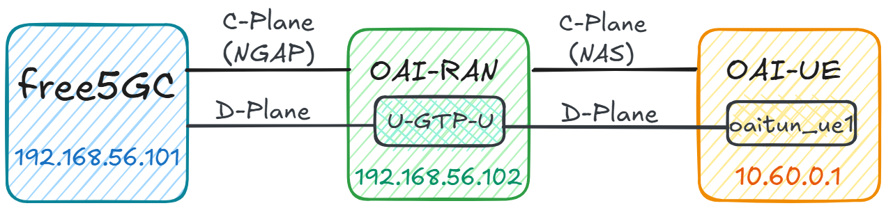

# Installing OAI-RAN - a UE/RAN Simulator

>[!NOTE]
> Author: [Chieh Cheng Kuo](https://github.com/Jasonkuo23), [Kuan Lin Chen](https://github.com/DBGR18)
> Date: 2026/06/22
---

In this demo we will practice:

- Installing OAI-RAN
- Configuring OAI-RAN
- Running OAI-RAN against free5GC

Topology:


> [!IMPORTANT]
> Based on our testing, OAI-RAN requires Ubuntu 22.04 or later, and the VM needs support AVX.

## 1. Install OAI-RAN VM

Repeat the steps of cloning `free5gc` VM from the base VM, create a new VM for the OAN-RAN simulator:

- Name the VM `oai-ran`, and create new MAC addresses for all network cards.
- Make sure the VM has internet access and can log in using SSH.
- Change the hostname to `oai-ran`.
- Make the Host-only network interface have static IP address `192.168.56.102`.
- Reboot the oaitan VM, as well as the free5gc VM.
- You can ping `192.168.56.101` from the oairan VM, and also `ping 192.168.56.102` from the free5gc VM.

## 2. Install OAI-RAN

Take a look at [oai-ran](https://openairinterface.org/ran/) website for more information about it. You can check out its official [deployment guide](https://gitlab.eurecom.fr/oai/openairinterface5g/-/blob/develop/doc/NR_SA_Tutorial_OAI_nrUE.md?ref_type=heads) or follow the steps below.

Update and upgrade OAI-RAN VM first:
```bash
sudo apt update
sudo apt upgrade
```

Install required tools:
```bash
sudo apt install -y \
  autoconf automake ninja-build build-essential cmake g++ git \
  libboost-all-dev libncurses-dev \
  python3-dev python3-mako python3-numpy \
  python3-requests python3-scipy \
  python3-setuptools python3-ruamel.yaml \
  libcap-dev libblas-dev liblapacke-dev
```

Download and build OAI-RAN:
```bash
cd ~
git clone https://github.com/openairinterface/openairinterface5g.git
cd openairinterface5g
git checkout develop

# Install OAI dependencies
cd cmake_targets
./build_oai -I

# Build OAI-RAN:
./build_oai --ninja --nrUE --gNB
```

## 3. Install free5GC WebConsole
free5GC provides a simple web tool WebConsole to help creating and managing UE registrations to be used by various 5G network functions (NF). 

If WebConsole isn't installed yet, please, SSH into free5gc's VM (`192.168.56.101`) and follow the [instructions contained on this section here](https://free5gc.org/guide/3-install-free5gc/#d-install-webconsole).


## 4. Use WebConsole to Add an UE

First start up the WebConsole server:
```bash
cd ~/free5gc/webconsole
./bin/webconsole
```

The screen shows the port number `:5000` at the end. Open your web browser from your host machine, and enter the URL `http://192.168.56.101:5000`

- On the login page, enter username `admin` and password `free5gc`.
- Once logged in, widen the page until you see “Subscribers” on the left-hand side column.
- Click on the `Subscribers` tab and then on the `New Subscriber` button
- Once the data shows up on the "Subscribers" table, you can press `Ctrl-C` on the terminal to kill the WebConsole process on the free5gc VM
- You can view more tutorials through this [link](https://free5gc.org/guide/Webconsole/Create-Subscriber-via-webconsole/). 
>[!NOTE]
>
>You have to make sure that the parameters on the webconsole are consistent with the UE.

## 5. Setting OAI-RAN
In the oai-ran VM, there are two files need to be changed：

- `~/openairinterface5g/targets/PROJECTS/GENERIC-NR-5GC/CONF/gnb.sa.band78.fr1.106PRB.usrpb210.conf`
- `~/openairinterface5g/targets/PROJECTS/GENERIC-NR-5GC/CONF/ue.conf`

First SSH into oairan, and edit the file `~/openairinterface5g/targets/PROJECTS/GENERIC-NR-5GC/CONF/gnb.sa.band78.fr1.106PRB.usrpb210.conf`.

The gNB must be configured with the correct PLMN and slice information so that it matches the core network settings, and it must also use the correct IP addresses for the N2 and N3 interfaces so it can communicate with the AMF and UPF properly, in this example we use default ue information:

##### (a) Update `plmn_list` in the `gNBs` entry
```bash
    plmn_list = ({ mcc = 208; mnc = 93; mnc_length = 2; snssaiList = ({ sst = 0x01; sd = 0x010203; }) });
```

##### (b) Set `amf_ip_address` to the AMF's N2 interface IP address
```bash
    ////////// AMF parameters:
    amf_ip_address = ({ ipv4 = "192.168.56.101"; });
```

##### (c) Set the gNB's N2 and N3 interface IP addresses in `NETWORK_INTERFACES`
```bash
    NETWORK_INTERFACES :
    {
        GNB_IPV4_ADDRESS_FOR_NG_AMF              = "192.168.56.102";
        GNB_IPV4_ADDRESS_FOR_NGU                 = "192.168.56.102";
        GNB_PORT_FOR_S1U                         = 2152; # Spec 2152
    };
```
Next, the UE configuration, edit `uicc0` in ~/openairinterface5g/targets/PROJECTS/GENERIC-NR-5GC/CONF/ue.conf`:
```bash
uicc0 = {
  imsi = "208930000000001";
  key = "8baf473f2f8fd09487cccbd7097c6862";
  opc= "8e27b6af0e692e750f32667a3b14605d";
  pdu_sessions = ({ dnn = "internet"; nssai_sst = 0x01; nssai_sd = 0x010203; });
}
```
The data appear to be the same as what we set in WebConsole.

## 6. Testing OAI-RAN against free5GC

### A. Start free5GC

SSH into free5gc. If you have rebooted free5gc, remember to run:
```bash
sudo sysctl -w net.ipv4.ip_forward=1
sudo iptables -t nat -A POSTROUTING -o <dn_interface> -j MASQUERADE
sudo systemctl stop ufw
```

**Note:** In Ubuntu Server 20.04 and 22.04 the dn_interface may be called `enp0s3` or `enp0s4` by default. Use the command `ip a` to help to figure it out

In addition, execute the following command:
```bash
sudo iptables -I FORWARD 1 -j ACCEPT
```

**Tip:** As per the information on the [appendix page](https://free5gc.org/guide/Appendix/#appendix-h-using-the-reload_host_configsh-script), it's possible to use a script to reload the config above automatically after reboot

Also, make sure you have make proper changes to the free5GC configuration files, then run `./run.sh`:
```bash
cd ~/free5gc
./run.sh
```

At this time free5GC has been started.

### B. Start OAI-RAN
Next, prepare three additional SSH terminals from your host machine (if you know how to use `tmux`, you can use just one).

In terminal 1: SSH into oai-ran, make sure OAI-RAN is built, and configuration files have been changed correctly, then run gNB in simulation mode:
```bash
cd ~/openairinterface5g/cmake_targets/ran_build/build
sudo ./nr-softmodem -O ../../../targets/PROJECTS/GENERIC-NR-5GC/CONF/gnb.sa.band78.fr1.106PRB.usrpb210.conf --gNBs.[0].min_rxtxtime 6 --rfsim
```

In terminal 2, SSH into oai-ran, and run the ue in simulation mode:
```bash
cd ~/openairinterface5g/cmake_targets/ran_build/build
sudo ./nr-uesoftmodem --rfsim --rfsimulator.serveraddr 127.0.0.1 -r 106   --numerology 1 --band 78 -C 3619200000 --ssb 516 -O ../../../targets/PROJECTS/GENERIC-NR-5GC/CONF/ue.conf
```

In terminal 3, SSH into oai-ran, and ping `192.168.56.101` to see free5gc is alive. Then, use ifconfig to see if the tunnel `oaitun_ue1` has been created (by nr-ue):
```bash
ifconfig

4: oaitun_ue1: <POINTOPOINT,NOARP,UP,LOWER_UP> mtu 1500 qdisc fq_codel state UNKNOWN group default qlen 500
    link/none
    inet 10.60.0.1/24 scope global oaitun_ue1
       valid_lft forever preferred_lft forever
    inet6 fe80::50f4:1d4b:3323:e3fe/64 scope link stable-privacy
       valid_lft forever preferred_lft forever
```

Now use `ping`:
```bash
ping -I oaitun_ue1 google.com
```
If `ping` gets replies, then free5GC is running properly. Congratulations!