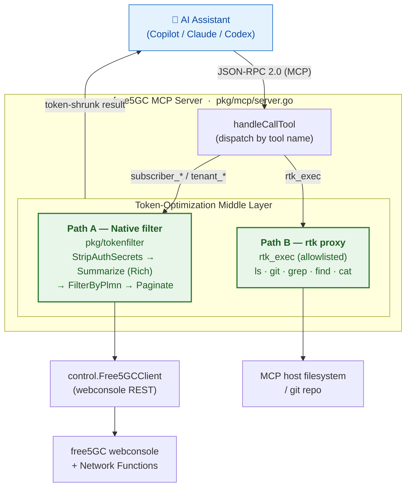
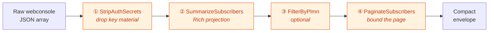
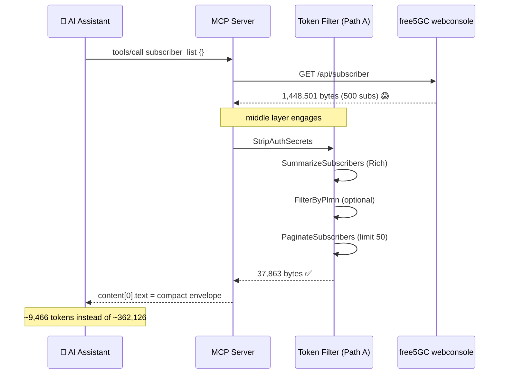
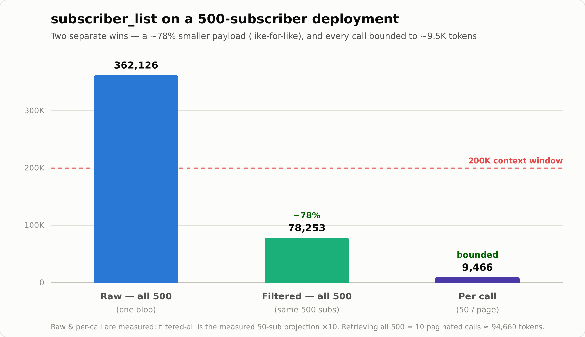

>[!NOTE]
> **Author:** [Ng Warren](https://github.com/warren0813)  
> **Date:** 2026/07/15

---
## Quick Recap: free5GC-MCP
This is a follow-up in the free5GC-MCP series. My last post, [*MCP Server Integration with free5GC: Architecture and Use Cases*](https://free5gc.org/blog/20260107/20260107/), introduced the server that lets an AI assistant drive free5GC through typed, controlled tools instead of raw shell access. This post is about what happens **on the backend** — the middle layer that keeps verbose 5G-core responses from drowning the model's context window, and the measured before/after numbers that justify it.

---

## 1. Why a Token-Optimization Middle Layer?

In that first post we gave an AI assistant a set of MCP tools — `subscriber_list`, `subscriber_get`, `local_free5gc_status`, the Kubernetes/Helm controls, and so on — and it worked: the model could translate *"show me all the subscribers on PLMN 20893 and tell me which ones are on the low-latency slice"* into a real webconsole query.

But there is a cost nobody sees until the deployment grows. free5GC's webconsole is built for a browser, not for a language model. A single subscriber object is ~2.9 KB of deeply nested JSON — cryptographic keys, sequence numbers, SM-policy plumbing, SMF-selection tables, flow rules — most of which an AI **never reasons about**. Multiply that by a few hundred subscribers and one `subscriber_list` call returns more tokens than the model's entire context window can hold. The tool call *succeeds*. The conversation *dies* — truncated, or billed at a price that makes routine operations absurd.

So the design goal of this iteration was blunt:
> **Every verbose tool response must be compressed *before* it reaches the AI, without losing the information the AI actually needs to make an operational decision.**

That compression stage — the *token-optimization middle layer* — is the whole subject of this post.

---

## 2. The Problem, in Numbers

Here is the raw shape of one free5GC subscriber, straight from the webconsole.
This is what the model used to receive, **per subscriber**, on every list call:

<details>
<summary>Show the full raw subscriber context</summary>

```json
{
  "AccessAndMobilitySubscriptionData": {
    "gpsis": ["msisdn-"],
    "nssai": {
      "defaultSingleNssais": [{ "sd": "010203", "sst": 1 }],
      "singleNssais": [{ "sd": "112233", "sst": 1 }]
    },
    "subscribedUeAmbr": { "downlink": "2 Gbps", "uplink": "1 Gbps" }
  },
  "AmPolicyData": { "subscCats": ["free5gc"] },
  "AuthenticationSubscription": {
    "authenticationManagementField": "8000",
    "authenticationMethod": "5G_AKA",
    "milenage": { "op": { "encryptionAlgorithm": 0, "encryptionKey": 0, "opValue": "" } },
    "opc": { "encryptionAlgorithm": 0, "encryptionKey": 0, "opcValue": "8e27b6af0e692e750f32667a3b14605d" },
    "permanentKey": { "encryptionAlgorithm": 0, "encryptionKey": 0, "permanentKeyValue": "8baf473f2f8fd09487cccbd7097c6862" },
    "sequenceNumber": "000000000000"
  },
  "ChargingDatas": [
    { "chargingMethod": "Offline", "dnn": "", "filter": "", "quota": "0", "snssai": "01010203", "unitCost": "1" },
    { "chargingMethod": "Offline", "dnn": "internet", "filter": "1.1.1.1/32", "qosRef": 1, "quota": "0", "snssai": "01010203", "unitCost": "1" },
    { "chargingMethod": "Online", "dnn": "", "filter": "", "quota": "100000", "snssai": "01112233", "unitCost": "1" },
    { "chargingMethod": "Online", "dnn": "internet", "filter": "1.1.1.1/32", "qosRef": 2, "quota": "5000", "snssai": "01112233", "unitCost": "1" }
  ],
  "FlowRules": [
    { "dnn": "internet", "filter": "1.1.1.1/32", "precedence": 128, "qosRef": 1, "snssai": "01010203" },
    { "dnn": "internet", "filter": "1.1.1.1/32", "precedence": 127, "qosRef": 2, "snssai": "01112233" }
  ],
  "QosFlows": [
    { "5qi": 8, "dnn": "internet", "gbrDL": "108 Mbps", "gbrUL": "108 Mbps", "mbrDL": "208 Mbps", "mbrUL": "208 Mbps", "qosRef": 1, "snssai": "01010203" },
    { "5qi": 7, "dnn": "internet", "gbrDL": "207 Mbps", "gbrUL": "207 Mbps", "mbrDL": "407 Mbps", "mbrUL": "407 Mbps", "qosRef": 2, "snssai": "01112233" }
  ],
  "SessionManagementSubscriptionData": [
    {
      "dnnConfigurations": {
        "internet": {
          "5gQosProfile": { "5qi": 9, "arp": { "preemptCap": "", "preemptVuln": "", "priorityLevel": 8 }, "priorityLevel": 8 },
          "pduSessionTypes": { "allowedSessionTypes": ["IPV4"], "defaultSessionType": "IPV4" },
          "sessionAmbr": { "downlink": "1000 Mbps", "uplink": "1000 Mbps" },
          "sscModes": { "allowedSscModes": ["SSC_MODE_2", "SSC_MODE_3"], "defaultSscMode": "SSC_MODE_1" }
        }
      },
      "singleNssai": { "sd": "010203", "sst": 1 }
    },
    {
      "dnnConfigurations": {
        "internet": {
          "5gQosProfile": { "5qi": 8, "arp": { "preemptCap": "", "preemptVuln": "", "priorityLevel": 8 }, "priorityLevel": 8 },
          "pduSessionTypes": { "allowedSessionTypes": ["IPV4"], "defaultSessionType": "IPV4" },
          "sessionAmbr": { "downlink": "1000 Mbps", "uplink": "1000 Mbps" },
          "sscModes": { "allowedSscModes": ["SSC_MODE_2", "SSC_MODE_3"], "defaultSscMode": "SSC_MODE_1" }
        }
      },
      "singleNssai": { "sd": "112233", "sst": 1 }
    }
  ],
  "SmPolicyData": {
    "smPolicySnssaiData": {
      "01010203": { "smPolicyDnnData": { "internet": { "dnn": "internet" } }, "snssai": { "sd": "010203", "sst": 1 } },
      "01112233": { "smPolicyDnnData": { "internet": { "dnn": "internet" } }, "snssai": { "sd": "112233", "sst": 1 } }
    }
  },
  "SmfSelectionSubscriptionData": {
    "subscribedSnssaiInfos": {
      "01010203": { "dnnInfos": [{ "dnn": "internet" }] },
      "01112233": { "dnnInfos": [{ "dnn": "internet" }] }
    }
  },
  "plmnID": "20893",
  "ueId": "imsi-208930000000001"
}
```

</details>

Scale that up and the numbers get hostile fast:

| Deployment size | Raw `subscriber_list` payload | Approx. tokens (`bytes/4`) |
|---|---:|---:|
| 50 subscribers  | **144,851 bytes** (≈ 141 KB) | ≈ **36,213** |
| 500 subscribers | **1,448,501 bytes** (≈ 1.4 MB) | ≈ **362,126** |

A 500-subscriber list is **~362K tokens**. It does not *fit* in a 200K-token context window — the single most common operational query is physically impossible to answer without help. That is the problem the middle layer exists to solve.

---

## 3. System Architecture

The MCP server sits between the AI and free5GC, and **every** tool response passes through the optimization layer on the way out. There are two complementary compression paths — one for structured 5G-domain data, one for generic host inspection.



| Path | Handles | How | Measured reduction |
|------|---------|-----|--------------------|
| **A — Native** (`pkg/tokenfilter`) | 5G-domain data: subscribers, tenants | Go, domain-aware (knows SUPI / PLMN / slices / QoS) | **~78%** per payload on `subscriber_list`, and each call bounded to ~9.5K tokens |
| **B — rtk** (`rtk_exec`) | Generic host dev-tool output | External `rtk` "Rust Token Killer" proxy | **49%–86%** on `ls` / `git` / `grep` |

Path A is domain-specific and **always on** for 5G data. Path B covers everything rtk already knows how to shrink — filesystem, git, search — so the AI can cheaply inspect the free5GC host without a bespoke tool per command.

---

## 4. Path A — The Native Domain Filter

The native filter is a small, dependency-free pipeline in `pkg/tokenfilter`. Every stage is **defensive**: if the input is not the shape it expects (say, an error object instead of an array), it passes the data through untouched rather than erroring. Four stages run in order:



The heavy lifter is stage 2 — the **"Rich" projection**. An earlier revision of this filter kept only six scalar fields and threw away all the DNN/QoS/slice context. That was *too lossy*: the AI kept having to re-fetch full objects, which defeated the point. The Rich projection instead keeps the **entire operational UE context** — slices, UE and per-DNN AMBR, PDU session types, SSC modes, QoS flows, charging mode — and drops only two categories: **cryptographic secrets** and **redundant policy plumbing that is derivable from the slices + DNNs**.

Here is the same subscriber, **before and after** the projection:

```json
// BEFORE — 2,896 bytes of nested webconsole JSON (abridged above in (2))

// AFTER — 625 bytes, everything the AI needs to know
{
  "ueId": "imsi-208930000000001",
  "plmnId": "20893",
  "authMethod": "5G_AKA",
  "slices": [ { "sst": 1, "sd": "010203" }, { "sst": 1, "sd": "112233" } ],
  "ueAmbr": { "up": "1 Gbps", "down": "2 Gbps" },
  "dnns": [
    { "dnn": "internet", "5qi": 9,
      "sessAmbr": { "up": "1000 Mbps", "down": "1000 Mbps" },
      "sessionTypes": ["IPV4"], "sscModes": ["SSC_MODE_2", "SSC_MODE_3"] }
  ],
  "qosFlows": [
    { "5qi": 8, "dnn": "internet", "gbrUL": "108 Mbps", "gbrDL": "108 Mbps", "mbrUL": "208 Mbps", "mbrDL": "208 Mbps" },
    { "5qi": 7, "dnn": "internet", "gbrUL": "207 Mbps", "gbrDL": "207 Mbps", "mbrUL": "407 Mbps", "mbrDL": "407 Mbps" }
  ],
  "charging": [ { "dnn": "internet", "method": "Offline" }, { "dnn": "internet", "method": "Online" } ]
}
```

**What is kept vs dropped:**

| Kept (operational context) | Dropped |
|---|---|
| `ueId`, `plmnId`, `authMethod` | crypto secrets (`opcValue`, `permanentKeyValue`, `milenage`), `sequenceNumber` |
| `slices` (default + single, de-duplicated) | `FlowRules` (derivable from QoS + DNN) |
| `ueAmbr` (subscribed UE AMBR) | `SmPolicyData`, `SmfSelectionSubscriptionData` (redundant with slices + DNNs) |
| per-DNN `5qi`, `sessAmbr`, `sessionTypes`, `sscModes` | `arp`, `priorityLevel`, `qosRef`, `snssai`, `filter`, `quota`, `gpsis`, `subscCats` |
| `qosFlows` (`5qi`, GBR/MBR per DNN) | JSON indentation / field-name repetition (compact marshal) |
| `charging` (per-DNN billing mode) | DNN-less charging catch-all rows |

Stage 4, pagination, is what **bounds the worst case**: even a 500-subscriber backend returns at most 50 compact objects wrapped in a metadata envelope, so the output stays ~38 KB no matter how large the deployment gets. The AI pages with `offset` / `limit` or narrows with `plmn_id`.

```json
// The envelope the AI actually receives:
{ "total": 500, "offset": 0, "limit": 50, "count": 50, "subscribers": [ /* 50 Rich objects */ ] }
```

---

## 5. Path B — rtk, the Rust Token Killer

Not every question an operator asks is about subscribers. *"What's in the config directory?"*, *"What did the last commit change?"*, *"Grep the SMF logs for `PFCP`"* — these are host-inspection tasks, and their tools (`ls`, `git`, `grep`, `find`, `cat`) emit their own brand of low-signal noise: owner/group/date columns, permission strings, repeated path prefixes, prose framing.

Rather than write a bespoke filter for each, the server exposes a single `rtk_exec` tool that shells out to [**rtk**](https://github.com/rtk-ai/rtk) — the "Rust Token Killer" CLI proxy — which already knows how to shrink those formats.

Because `rtk` runs *real* commands, the tool is deliberately gated:

- **Allowlist.** Only the first token of the command is checked, and it must be an allowlisted read-only subcommand. Default: `ls git grep find cat gain discover`. Anything else (`rm`, `mv`, `sh`, …) is rejected with `rtk subcommand not allowed`. The allowlist is overridable via the `RTK_ALLOW` env var — and it *replaces* the default entirely, so widening it is an explicit, auditable act.
- **No shell interpretation.** The command string is split on whitespace and passed as `argv` directly — no pipes, redirects, or `;` chaining.
- **30-second timeout** on every invocation.

That allowlist is security-critical, so in this iteration it also gained direct unit tests (`pkg/mcp/rtk_test.go`) covering the default list, the `RTK_ALLOW` override semantics, and the empty-env fallback.

Here is a concrete example of the shrinker on `rtk find . -name '*.go'`:

```sh
# BEFORE (389 bytes)
./cmd/mockwebui/main.go
./cmd/server/main.go
./cmd/server/main_test.go
./cmd/tokendemo/main.go
./pkg/control/free5gc_client_test.go
./pkg/control/k8s_service.go
./pkg/control/free5gc_client.go
./pkg/tokenfilter/tokenfilter.go
./pkg/tokenfilter/tokenfilter_test.go
./pkg/k8s/manager.go
./pkg/api/handlers.go
./pkg/api/router.go
./pkg/config/config.go
./pkg/mcp/server.go
./pkg/auth/auth.go

# AFTER — rtk find . -name '*.go' (320 bytes)
15F 10D:

cmd/mockwebui/ main.go
cmd/server/ main.go main_test.go
cmd/tokendemo/ main.go
pkg/api/ handlers.go router.go
pkg/auth/ auth.go
pkg/config/ config.go
pkg/control/ free5gc_client.go free5gc_client_test.go k8s_service.go
pkg/k8s/ manager.go
pkg/mcp/ server.go
pkg/tokenfilter/ tokenfilter.go tokenfilter_test.go
```

---

## 6. Request Flow, End to End

Putting both paths together, here is what a single `subscriber_list` call looks like from the model's prompt to the shrunk response:



The key property: the 1.4 MB backend blob **never leaves the server**. The AI only ever sees the ~38 KB envelope.

---

## 7. Benchmarks: Before vs After

All numbers below are **measured, not estimated** — they come from running the real `pkg/tokenfilter` code (and, for the end-to-end rows, the real `mcp.Server` + `control.Free5GCClient` over HTTP) against genuine free5GC-shaped data, plus the real `rtk` binary (v0.43.0) for the host-inspection path. Reproduce them with `make token-demo` (see (9)).

### 7.1 `subscriber_list` — the call that blows up context

`subscriber_list` is the call that hurts most: on a 500-subscriber deployment the raw response is **~362K tokens** — too large to even fit inside a 200K-token window. The filter tackles that in **two independent ways**, and the trick to reading the numbers is to keep them apart.



**Win #1 — every subscriber gets ~78% smaller.** The Rich projection keeps everything an operator actually reasons about (slices, AMBR, QoS, charging) and drops only crypto secrets and redundant policy plumbing, so each subscriber shrinks from **2,896 → 625 bytes**. That ratio holds at any scale, so the *same* 500 subscribers drop from **~362K → ~78K tokens**.

**Win #2 — every call is capped at ~9,466 tokens.** Pagination returns at most **50 subscribers per page**, so one response is always ~50 compact objects plus a small envelope — no matter how big the deployment is. A 500-subscriber backend just reports `"total": 500` and hands back the first 50:

```json
{ "total": 500, "offset": 0, "limit": 50, "count": 50, "subscribers": [ /* 50 Rich objects */ ] }
```

The AI then pages through the rest with `offset` / `limit`, or narrows the search with `plmn_id`.

So what does it actually cost to pull the whole 500-subscriber list?

| Listing all 500 subscribers | Tokens | vs. raw |
|---|---:|---:|
| Raw — one blob *(old behavior)* | 362,126 | — |
| Filtered — 10 pages of 50 *(new behavior)* | ~94,660 | ~74% |
| …any single one of those pages | 9,466 | — |

The chart's ~78K "filtered" bar is the **pure compression** from Win #1. The real end-to-end total is a little higher — ~94,660 — because the list is delivered as 10 separate calls and each one re-sends the ~6.5 KB envelope. That overhead is the price of Win #2: never letting a single call overflow the window.

>[!NOTE]
> **Reading it honestly:** the eye-catching "one call: 362,126 → 9,466 tokens" is real, but that page holds **50 of the 500** subscribers — it is *not* a 97% shrink of the same data. The true same-data figure is Win #1's **~78%**. Win #2 is a separate guarantee, and just as valuable: no single call can ever overflow the context window, however large the deployment grows.

The upshot: a query that used to be **impossible** — the raw blob couldn't even be received — is now a stream of page-sized ~9.5K-token chunks (≈4.7% of a 200K window each) that the model can comfortably read and reason over.

??? note "Full pipeline breakdown — one call, measured at every stage"

    These rows are the **same** `subscriber_list` call measured at four points along the filter, at two backend sizes, so each stage's contribution is visible:

    | Stage | Scale | Before (B) | After (B) | ~tok before | ~tok after | Reduction |
    |---|---|---:|---:|---:|---:|---:|
    | ① strip auth only | 50 | 144,851 | 131,401 | 36,213 | 32,851 | 9.3% |
    | ② summarize (Rich) only | 50 | 144,851 | 31,301 | 36,213 | 7,826 | 78.4% |
    | ③ full pipeline (+ paginate) | 50 | 144,851 | 31,361 | 36,213 | 7,841 | 78.3% |
    | **④ end-to-end (MCP server)** | 50 | 144,851 | 37,862 | 36,213 | 9,466 | 73.9% |
    | ③ full pipeline (+ paginate) | 500 | 1,448,501 | 31,362 | 362,126 | 7,841 | 97.8% |
    | **④ end-to-end (MCP server)** | 500 | 1,448,501 | 37,863 | 362,126 | 9,466 | 97.4% |

    The **④ end-to-end** rows are the real deployed numbers — a literal `tools/call subscriber_list {}` issued over HTTP, measuring the response body, which also carries the ~6.5 KB JSON-RPC + pagination envelope (that's why ④ runs a little larger than the bare pipeline ③). The ~78K "all 500 filtered" figure quoted above is stage ②'s measured 50-subscriber projection ×10; because the mock subscribers are identical, that multiple is exact for this benchmark.

### 7.2 `subscriber_get` — a security win more than a size win

| Call | Before | After | Reduction |
|---|---:|---:|---:|
| `subscriber_get` (strip auth only) | 2,896 B | 2,627 B | **9.3%** |

`subscriber_get` returns full detail *by design* — the AI asked about one specific UE. The only thing stripped is cryptographic key material, so the reduction is modest (~9%). Its real value here is **security**, not token count (see §8). Pass `include_auth=true` to opt back into the raw block.

### 7.3 rtk host inspection

| Command | Before | After | Reduction |
|---|---:|---:|---:|
| `ls -la pkg/mcp`                   | 162 B   | 22 B    | **86.4%** |
| `git status`                       | 464 B   | 116 B   | **75.0%** |
| `grep -rn func pkg/mcp/server.go`  | 4,952 B | 2,526 B | **49.0%** |
| `find . -name '*.go'`              | 389 B   | 320 B   | **17.7%** |

rtk strips the fixed per-line metadata that dominates dev-tool output, so savings scale with row count — and it never does worse than passthrough.

---

## 8. Security Falls Out for Free

The same projection that saves tokens also **prevents secret exfiltration**. free5GC stores each subscriber's OPc and permanent key (`Ki`) in the webconsole response. Those are the root of the entire 5G-AKA trust chain — they should never end up in an LLM's context, a chat transcript, or a provider's server logs.

`StripAuthSecrets` runs on **every** subscriber path (list *and* get), unconditionally:

```go
// redactAuthBlock deletes key material from a single subscriber map in-place.
func redactAuthBlock(sub map[string]interface{}) {
    auth, ok := sub["AuthenticationSubscription"].(map[string]interface{})
    if !ok {
        return
    }
    if opc, ok := auth["opc"].(map[string]interface{}); ok {
        delete(opc, "opcValue")          // ← the OPc secret, gone
        delete(opc, "encryptionAlgorithm")
        delete(opc, "encryptionKey")
    }
    if pk, ok := auth["permanentKey"].(map[string]interface{}); ok {
        delete(pk, "permanentKeyValue")  // ← the Ki secret, gone
        delete(pk, "encryptionAlgorithm")
        delete(pk, "encryptionKey")
    }
    if mil, ok := auth["milenage"].(map[string]interface{}); ok {
        if op, ok := mil["op"].(map[string]interface{}); ok {
            delete(op, "opValue")
            delete(op, "encryptionAlgorithm")
            delete(op, "encryptionKey")
        }
    }
    delete(auth, "sequenceNumber")
}
```

The *policy* fields — `authenticationMethod`, `authenticationManagementField` — are kept, because they describe configuration, not secrets. The AI can still tell you a subscriber uses `5G_AKA`; it just can't read the key that makes AKA work.

---


## 9. Reproduce It Yourself

Every number in (7. Benchmark) is regenerable from the repo. There is no simulation — the demo runs the exact filter functions the server calls in production, and the end-to-end row stands up the real `mcp.Server` and sends it a real JSON-RPC request over HTTP:

```bash
# 50 subscribers (default)
make token-demo

# 500 subscribers
make token-demo N=500

# Dump the full raw/after JSON for one subscriber
go run ./cmd/tokendemo -dump
```

Example output (50 subscribers, end-to-end through the real server):

```text
=== END-TO-END through the real MCP server (HTTP JSON-RPC) ===
  Request: tools/call subscriber_list {}  (50 subscribers in backend)
  backend raw -> MCP resp   bytes  144851 -> 37862   (~tok 36213 -> 9466)   73.9% saved
```

The tooling and test story also got some housekeeping in this iteration: the tree is `gofmt`-clean, `make install` no longer references a deleted unit file, the `Makefile` gained `test` / `vet` / `fmt` targets, and the security-critical rtk allowlist is now unit-tested. Small things — but the benchmarks are only believable if the harness that produces them is clean.

---

## 10. Closing Thoughts

Giving an AI assistant tools is the easy half. The hard half is the *economics* of the responses those tools return — because a 5G core was built to talk to browsers and other network functions, not to a model with a finite, billed context window.

The pattern generalizes well beyond free5GC: **put a domain-aware projection between your backend and your model, keep exactly the fields an operator reasons about, and drop the rest before it ever costs a token.** For structured domain data, a small hand-written filter (Path A) wins because it *understands* the data. For the long tail of generic host output, lean on an existing shrinker like rtk (Path B) instead of reinventing one per command. And because the same projection that removes noise also removes secrets, the token win and the security win are the *same* change.

The result: the operation that used to be physically impossible — *"list the subscribers"* on a 500-UE deployment — went from a single **~362K-token** blob that could not even be received, to page-sized **~9.5K-token** responses (≈4.7% of the window each; ~47% to page through all 500) that keep the full operational context and strip the cryptographic keys. That is the difference between a demo and something you would actually run.

---

## Credits
Thanks to the free5GC community and the maintainers of the free5gc-MCP project for the foundation this builds on, and to the authors of [rtk](https://github.com/rtk-ai/rtk) for the generic host-output shrinker that powers Path B.

## References

- Part 1 — [*MCP Server Integration with free5GC: Architecture and Use Cases*](https://free5gc.org/blog/20260107/20260107/)
- [MCP specification](https://modelcontextprotocol.io/)
- [free5GC](https://free5gc.org/) · [free5GC installation guide](https://free5gc.org/guide/3-install-free5gc/)
- [free5GC-MCP](https://github.com/warren0813/free5gc-MCP/tree/feat/token-optimization-layer)
- [rtk-ai/rtk](https://github.com/rtk-ai/rtk)

## About the author
Hey it's Warren! currently exploring 5G Core and working with free5GC. I’m just learning how things work in practice and building as I go. Still early in the journey, but enjoying the process and learning a lot along the way. I would love to connect with you!, via [Github](https://github.com/warren0813).

