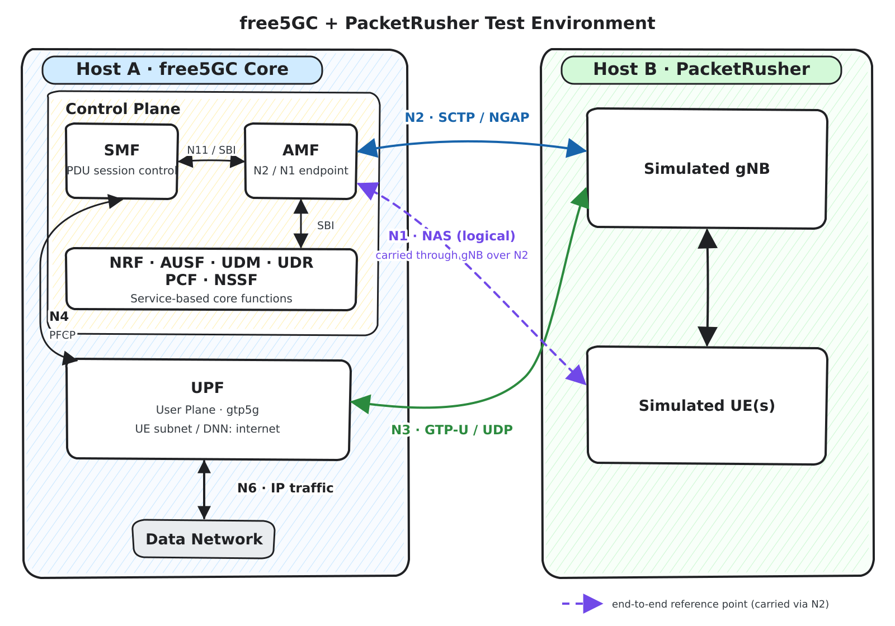
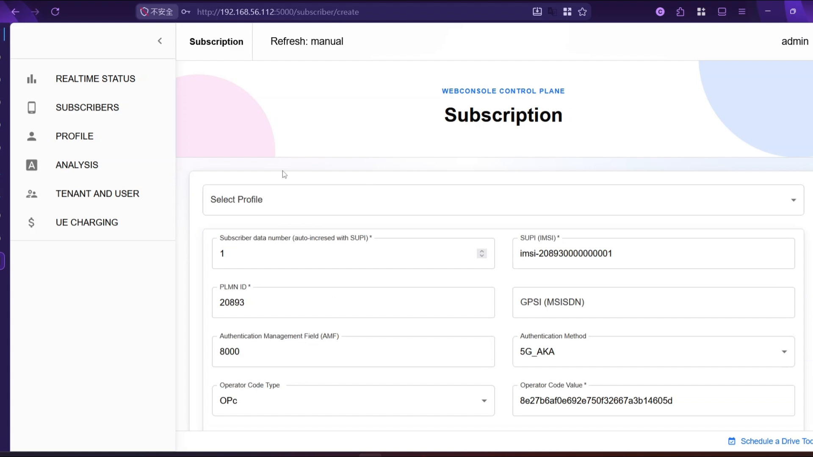
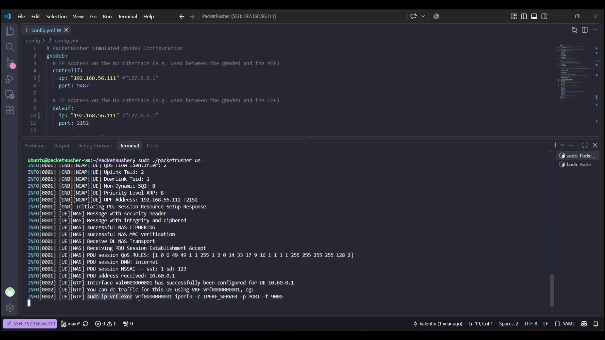
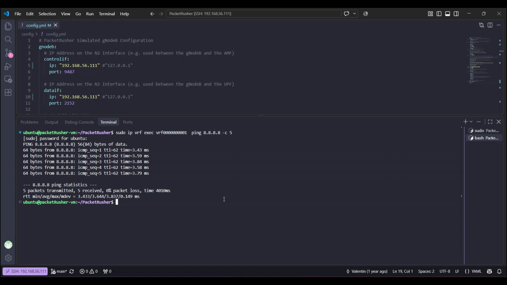
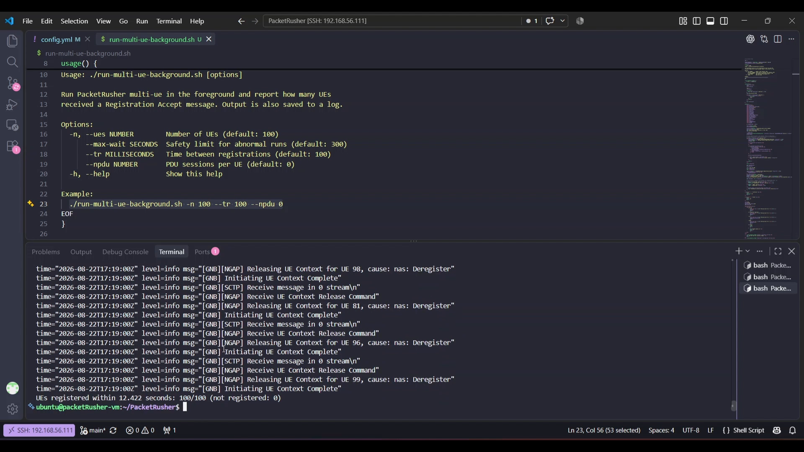
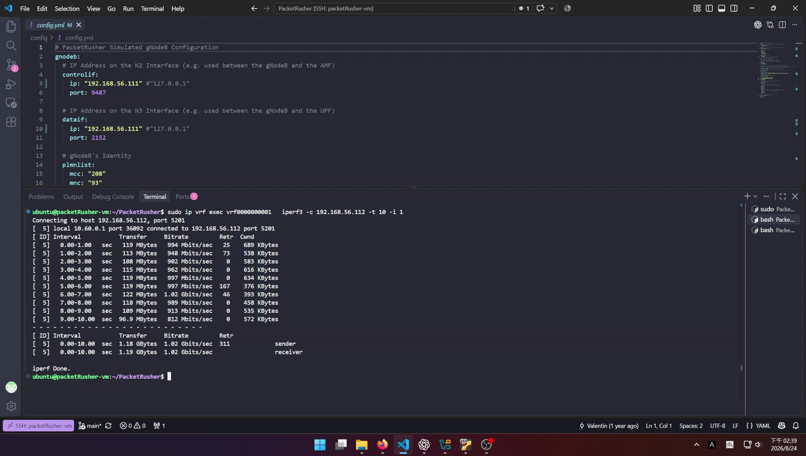
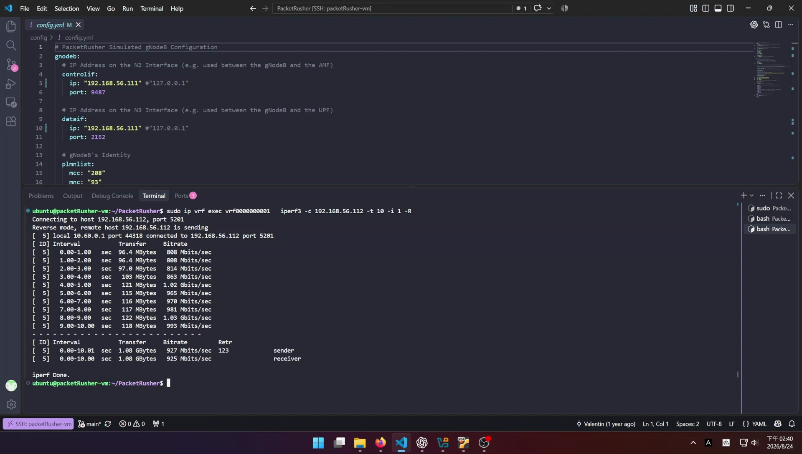

# Building and Testing a free5GC and PacketRusher Lab
> [!NOTE]
> Author: Kai-Hung, Hu
> Date: 2026/07/29

<iframe width="100%" height="500" src="https://www.youtube.com/embed/_l1hc_ZxntM?start=1" title="YouTube video player" frameborder="0" allow="accelerometer; autoplay; clipboard-write; encrypted-media; gyroscope; picture-in-picture; web-share" referrerpolicy="strict-origin-when-cross-origin" allowfullscreen></iframe>

## Introduction

This tutorial builds a small 5G lab with [free5GC](https://github.com/free5gc/free5gc) as the core network and [PacketRusher](https://github.com/HewlettPackard/PacketRusher) as the simulated gNodeB and UE. The two components run on separate virtual machines connected through a VirtualBox host-only network.

By the end of the tutorial, you will be able to:

- install and build PacketRusher;
- connect a simulated gNodeB and UE to free5GC;
- register a subscriber and establish a PDU session;
- verify user-plane connectivity with `ping`;
- measure the registration time of multiple UEs;
- run an `iperf3` bandwidth test and distinguish the underlay result from GTP-U user-plane throughput.

Installing the free5GC VM itself is outside the scope of this article. If you do not already have a working free5GC installation, follow the [free5GC User Guide](https://free5gc.org/guide/) first.

## Architecture



The lab contains two hosts:

- **Host A — free5GC Core:** the AMF terminates the N2 signaling interface from the RAN, while the UPF terminates the N3 user-plane interface and forwards UE traffic toward the Data Network (DN) over N6. The SMF controls the UPF over N4 using PFCP.
- **Host B — PacketRusher:** PacketRusher simulates both the gNodeB and one or more UEs. The gNodeB exchanges NGAP over SCTP with the AMF on N2 and GTP-U over UDP with the UPF on N3. UE NAS signaling is carried transparently through the simulated gNodeB to the AMF.

This tutorial uses the following addressing plan:

Both VMs use the following specification:

- Platform: VirtualBox
- OS: Ubuntu 24.04
- CPUs: 4
- RAM: 4096 MB

 > The IP addresses listed below are assigned to the VMs' host-only adapter interfaces.

| Component | Address or value | Purpose |
| --- | --- | --- |
| PacketRusher VM | `192.168.56.111` | gNodeB N2 and N3 endpoint |
| free5GC VM | `192.168.56.112` | AMF N2 and UPF N3 endpoint |


Before continuing, verify that the two VMs can reach each other. On the free5GC VM, the AMF and UPF configurations must bind N2 and N3 to `192.168.56.112`, and the SMF configuration must bind N3 to `192.168.56.112`. Any firewall between the VMs must allow SCTP port 38412 and UDP port 2152.

```bash
# Run on the PacketRusher VM
ping -c 3 192.168.56.112
ip route get 192.168.56.112
```

## Install PacketRusher

PacketRusher provides an official [Installation Wiki](https://github.com/HewlettPackard/PacketRusher/wiki/Installation). At the time of writing, its documented requirements include Ubuntu 20.04–24.04, Linux kernel 5.4 or newer, Go 1.23 or newer, root privileges, and Secure Boot disabled for the custom `gtp5g` kernel module. PacketRusher is not currently supported on Windows or Docker.

The following copy-and-paste block gathers the dependency installation, Go installation, repository download, `gtp5g` build, and PacketRusher build into one Bash session:

> [!WARNING]
> This block replaces an existing Go installation under `/usr/local/go`. Review it before running if that location contains a Go version you need to keep.

```bash
#!/usr/bin/env bash
set -euo pipefail

# Install build dependencies and headers for the running kernel.
sudo apt update
sudo apt install -y \
  build-essential \
  linux-headers-generic \
  make \
  git \
  wget \
  tar \
  "linux-modules-extra-$(uname -r)"

# Install Go.
wget https://go.dev/dl/go1.24.1.linux-amd64.tar.gz && sudo rm -rf /usr/local/go && sudo tar -C /usr/local -xzf go1.24.1.linux-amd64.tar.gz

# Add go binary to the executable PATH variable.
export PATH=$PATH:/usr/local/go/bin
source $HOME/.profile

# Download PacketRusher source code.
git clone https://github.com/HewlettPackard/PacketRusher
# Enter the PacketRusher directory, save its path in $HOME/.profile, and load it into the current shell.
cd PacketRusher && echo "export PACKETRUSHER=$PWD" >> $HOME/.profile && source $HOME/.profile

# Build and install the gtp5g kernel module.
cd "$PACKETRUSHER/lib/gtp5g"
make clean && make -j && sudo make install

# Build the PacketRusher CLI.
cd $PACKETRUSHER
go mod download
go build cmd/packetrusher.go
./packetrusher --help
```

If `modprobe gtp5g` fails after a kernel update, install the headers and `linux-modules-extra` package for the new running kernel, then rebuild the module. A Secure Boot policy can also prevent an unsigned custom kernel module from loading.

## Configure the Simulated gNodeB and UE

PacketRusher reads its gNodeB, UE, and AMF settings from `$PACKETRUSHER/config/config.yml`. The example below is the configuration used in this lab.

> The IP addresses and subscriber credentials below are examples for an isolated lab. Replace them with values that match your own environment.

```yaml
# PacketRusher Simulated gNodeB Configuration
gnodeb:
  # IP address on N2 between the gNodeB and AMF
  controlif:
    ip: "192.168.56.111"
    port: 9487

  # IP address on N3 between the gNodeB and UPF
  dataif:
    ip: "192.168.56.111"
    port: 2152

  # gNodeB identity
  plmnlist:
    mcc: "208"
    mnc: "93"
    tac: "000001"
    gnbid: "000008"

  # Supported slice
  slicesupportlist:
    sst: "01"
    sd: "010203" # Optional; remove it if SD is not used.

# PacketRusher Simulated UE Configuration
ue:
  # IMSI/SUPI identity
  # SUPI in this example: imsi-208930000000001
  hplmn:
    mcc: "208"
    mnc: "93"
  msin: "0000000001"

  # SUCI configuration
  # SUCI with the null scheme:
  # suci-0-208-93-0000-0-0-0000000001
  routingindicator: "0000"
  protectionScheme: 0

  # Ignored when protectionScheme is 0, but retained for other schemes.
  homeNetworkPublicKey: "5a8d38864820197c3394b92613b20b91633cbd897119273bf8e4a6f4eec0a650"
  homeNetworkPublicKeyID: 1

  # SIM credentials; these must match the free5GC subscriber.
  key: "8baf473f2f8fd09487cccbd7097c6862"
  opc: "8e27b6af0e692e750f32667a3b14605d"
  amf: "8000"
  # Same numeric SQN as WebConsole value 000000000023.
  sqn: "00000023"

  # Requested PDU session
  dnn: "internet"
  snssai:
    sst: "01"
    sd: "010203" # Optional; remove it if SD is not used.

  # UE security capabilities advertised to the AMF
  integrity:
    nia0: false
    nia1: false
    nia2: true
    nia3: false
  ciphering:
    # NEA0 keeps NAS messages readable in Wireshark for debugging.
    nea0: true
    nea1: false
    nea2: true
    nea3: false

# AMFs that PacketRusher will try to reach
amfif:
  - ip: "192.168.56.112"
    port: 38412

logs:
  level: 4
```

Keep values with leading zeroes quoted. In particular:

- `gnodeb.controlif.ip` and `gnodeb.dataif.ip` must be addresses on the PacketRusher VM;
- `amfif.ip` must be the free5GC AMF's reachable N2 address;
- MCC, MNC, TAC, DNN, SST, and SD must match the corresponding free5GC configuration; and
- SUPI, `key`, `opc`, `amf`, and `sqn` must match the subscriber created in WebConsole.

For a detailed explanation of every field, see the PacketRusher [Configuration Wiki](https://github.com/HewlettPackard/PacketRusher/wiki/Configuration).

## Start free5GC and Provision the Subscriber

### 1. Start the core network

On the free5GC VM, start all network functions and leave the terminal running:

```bash
cd ~/free5gc
./run.sh
```

Do not start PacketRusher until the AMF and UPF are ready. In particular, confirm that the SMF has established its PFCP association with the UPF and that the AMF is listening on the configured N2 address.

### 2. Create a matching subscriber in WebConsole

If WebConsole is not already running, start it in another terminal using the command provided by your free5GC installation. A current source installation created by the quick-setup guide uses:

```bash
cd ~/free5gc/webconsole
go run server.go
```

Open `http://192.168.56.112:5000`, sign in, and select **SUBSCRIBERS → CREATE**. The official [Create Subscriber via WebConsole](https://free5gc.org/guide/Webconsole/Create-Subscriber-via-webconsole/) guide documents the complete workflow.

Enter values that match `config.yml`:

| WebConsole field | Value |
| --- | --- |
| SUPI (IMSI) | `imsi-208930000000001` |
| PLMN ID | `20893` |
| Authentication Method | `5G_AKA` |
| Authentication Management Field (AMF) | `8000` |
| Operator Code Type | `OPc` |
| Operator Code Value | `8e27b6af0e692e750f32667a3b14605d` |
| Permanent Authentication Key (K) | `8baf473f2f8fd09487cccbd7097c6862` |
| SQN | `000000000023` |
| SST / SD | `1` / `010203` |
| DNN | `internet` |



WebConsole displays SQN as a 12-digit (48-bit) hexadecimal value. Its `000000000023` value is the left-padded form of PacketRusher's `00000023` setting.

The K and OPc values above are test credentials. Do not reuse production SIM credentials in a public or shared lab.

## Test 1: Single-UE Registration and Connectivity

On the PacketRusher VM, start the simulated gNodeB and UE from the repository root:

```bash
cd "$PACKETRUSHER"
sudo ./packetrusher ue
```

A successful run should show a Registration Accept followed by a PDU Session Establishment Accept. PacketRusher then prints the assigned UE address and creates a Linux VRF for that UE. In this lab, the UE received `10.60.0.1` and PacketRusher created `vrf0000000001`.



Keep PacketRusher running. Open another shell on the PacketRusher VM and send traffic from the UE's VRF:

```bash
# Replace <vrf_name> with the name printed by PacketRusher.
sudo ip vrf exec <vrf_name> ping -c 5 8.8.8.8

# Example from this lab:
sudo ip vrf exec vrf0000000001 ping -c 5 8.8.8.8
```



Successful replies confirm that the UE can send user-plane packets through the PacketRusher GTP tunnel, the free5GC UPF, and the N6 data network. If registration succeeds but `ping` fails, check UPF forwarding, N6 routing/NAT, IP forwarding, and firewall rules.

## Test 2: Multi-UE Registration Time

PacketRusher's `multi-ue` command increments the MSIN for each simulated UE. Before running the 100-UE test with base MSIN `0000000001`, use the free5GC WebConsole to create 100 subscriber records for the sequential IMSIs. Use the same PLMN, K, OPc, AMF, SQN, DNN, and slice settings for all subscribers. Stop the single-UE process first so that it does not compete for the same subscriber identity.

This article uses a helper script named `run-multi-ue-background.sh` that:

- starts `packetrusher multi-ue`;
- counts `Receive Registration Accept` messages;
- stops when every UE registers, the result becomes stable, or the safety timeout expires;
- saves the complete output to a timestamped log; and
- prints the registered and unregistered totals with elapsed wall-clock time.

Save the following script as `run-multi-ue-background.sh` in the PacketRusher repository root:

```bash
#!/usr/bin/env bash

set -u

SCRIPT_DIR=$(cd -- "$(dirname -- "${BASH_SOURCE[0]}")" && pwd)
PACKETRUSHER_BIN="$SCRIPT_DIR/packetrusher"

usage() {
    cat <<'EOF'
Usage: ./run-multi-ue-background.sh [options]

Run PacketRusher multi-ue in the foreground and report how many UEs
received a Registration Accept message. Output is also saved to a log.

Options:
  -n, --ues NUMBER        Number of UEs (default: 100)
      --max-wait SECONDS  Safety limit for abnormal runs (default: 300)
      --tr MILLISECONDS   Time between registrations (default: 100)
      --npdu NUMBER       PDU sessions per UE (default: 0)
  -h, --help              Show this help

Example:
  ./run-multi-ue-background.sh -n 100 --tr 100 --npdu 0
EOF
}

is_non_negative_integer() {
    [[ "$1" =~ ^[0-9]+$ ]]
}

controller() {
    local stop_file=$1
    shift
    local child_pid

    "$@" &
    child_pid=$!

    stop_child() {
        kill -INT "$child_pid" 2>/dev/null || true
    }
    trap stop_child INT TERM

    while kill -0 "$child_pid" 2>/dev/null; do
        if [[ -e "$stop_file" ]]; then
            stop_child
            break
        fi
        sleep 0.1
    done

    wait "$child_pid"
}

worker() {
    local total=$1
    local max_wait=$2
    local registration_interval=$3
    local pdu_sessions=$4
    local log_file=$5
    local quiet_period=5
    local control_dir
    local stop_file
    local process_pid
    local exit_status
    local launched=0
    local registered=0
    local previous_registered=0
    local not_registered
    local all_started=false
    local stable_since=0
    local start_ms
    local start_seconds
    local now
    local elapsed_ms
    local elapsed_seconds
    local message

    cd "$SCRIPT_DIR" || exit 1

    start_ms=$(date +%s%3N)
    start_seconds=$(date +%s)

    control_dir=$(mktemp -d /tmp/packetrusher-control.XXXXXX)
    stop_file="$control_dir/stop"
    trap 'touch "$stop_file" 2>/dev/null || true' EXIT
    trap 'exit 130' INT TERM

    : >"$log_file"
    "$SCRIPT_DIR/run-multi-ue-background.sh" --controller "$stop_file" "$PACKETRUSHER_BIN" multi-ue -n "$total" --tr "$registration_interval" --nPdu "$pdu_sessions" 2>&1 | tee -a "$log_file" &
    process_pid=$!

    # Finish immediately when all UEs register. After all registration
    # attempts have started, a five-second period with no new Registration
    # Accept is treated as a stable partial result.
    while kill -0 "$process_pid" 2>/dev/null; do
        launched=$(grep -cF "[TESTER] TESTING REGISTRATION USING IMSI " "$log_file" || true)
        registered=$(grep -cF "[UE][NAS] Receive Registration Accept" "$log_file" || true)
        now=$(date +%s)

        if [[ $registered -ge $total ]]; then
            break
        fi

        if [[ $launched -ge $total ]]; then
            if [[ $all_started == false ]]; then
                all_started=true
                stable_since=$now
            elif [[ $registered -ne $previous_registered ]]; then
                stable_since=$now
            elif ((now - stable_since >= quiet_period)); then
                break
            fi
        fi

        previous_registered=$registered

        if ((now - start_seconds >= max_wait)); then
            echo "Safety limit of ${max_wait} seconds reached." >>"$log_file"
            break
        fi

        sleep 0.2
    done

    touch "$stop_file"

    wait "$process_pid"
    exit_status=$?

    trap - EXIT INT TERM
    rm -f "$stop_file"
    rmdir "$control_dir"

    registered=$(grep -cF "[UE][NAS] Receive Registration Accept" "$log_file" || true)
    if [[ $registered -gt $total ]]; then
        registered=$total
    fi
    not_registered=$((total - registered))
    elapsed_ms=$(($(date +%s%3N) - start_ms))
    printf -v elapsed_seconds "%d.%03d" "$((elapsed_ms / 1000))" "$((elapsed_ms % 1000))"
    message="UEs registered within ${elapsed_seconds} seconds: ${registered}/${total} (not registered: ${not_registered})"

    echo "$message" | tee -a "$log_file"

    # This works for a logged-in Linux desktop. On a headless/SSH system, the
    # result remains available in the log file and in the system log.
    if command -v notify-send >/dev/null 2>&1; then
        notify-send "PacketRusher" "$message" >/dev/null 2>&1 || true
    fi
    if command -v logger >/dev/null 2>&1; then
        logger -t packetrusher "$message" || true
    fi

    if [[ $exit_status -ne 0 && $exit_status -ne 130 ]]; then
        echo "PacketRusher exited with status ${exit_status}; check ${log_file}"
    fi
}

if [[ ${1:-} == '--controller' ]]; then
    shift
    controller "$@"
    exit $?
fi

if [[ ${1:-} == '--worker' ]]; then
    shift
    worker "$@"
    exit 0
fi

total=100
max_wait=300
registration_interval=100
pdu_sessions=0

while [[ $# -gt 0 ]]; do
    case "$1" in
        -n|--ues)
            [[ $# -ge 2 ]] || { echo "Missing value for $1" >&2; exit 2; }
            total=$2
            shift 2
            ;;
        -d|--duration|--max-wait)
            [[ $# -ge 2 ]] || { echo "Missing value for $1" >&2; exit 2; }
            max_wait=$2
            shift 2
            ;;
        --tr)
            [[ $# -ge 2 ]] || { echo "Missing value for $1" >&2; exit 2; }
            registration_interval=$2
            shift 2
            ;;
        --npdu)
            [[ $# -ge 2 ]] || { echo "Missing value for $1" >&2; exit 2; }
            pdu_sessions=$2
            shift 2
            ;;
        -h|--help)
            usage
            exit 0
            ;;
        *)
            echo "Unknown option: $1" >&2
            usage >&2
            exit 2
            ;;
    esac
done

if ! is_non_negative_integer "$total" || [[ $total -eq 0 ]]; then
    echo 'UE count must be a positive integer.' >&2
    exit 2
fi
if ! is_non_negative_integer "$max_wait" || [[ $max_wait -eq 0 ]]; then
    echo 'Maximum wait must be a positive integer.' >&2
    exit 2
fi
if ! is_non_negative_integer "$registration_interval"; then
    echo 'Registration interval must be a non-negative integer.' >&2
    exit 2
fi
if ! is_non_negative_integer "$pdu_sessions" || [[ $pdu_sessions -gt 16 ]]; then
    echo 'PDU session count must be an integer from 0 to 16.' >&2
    exit 2
fi
if [[ ! -x "$PACKETRUSHER_BIN" ]]; then
    echo "PacketRusher executable not found: $PACKETRUSHER_BIN" >&2
    exit 1
fi

timestamp=$(date +'%Y%m%d-%H%M%S')
log_file="$SCRIPT_DIR/packetrusher-${timestamp}.log"
printf "Log: %s\n" "$log_file"
worker "$total" "$max_wait" "$registration_interval" "$pdu_sessions" "$log_file"

```

Make it executable and run it:

```bash
cd "$PACKETRUSHER"
chmod +x run-multi-ue-background.sh

./run-multi-ue-background.sh \
  --ues 100 \
  --tr 100 \
  --npdu 0 \
  --max-wait 300
```

The options used here mean:

- `--ues 100`: launch 100 UEs;
- `--tr 100`: wait 100 ms between registration starts;
- `--npdu 0`: test registration only, without creating PDU sessions; and
- `--max-wait 300`: stop an abnormal run after 300 seconds.

The recorded run completed with the following summary:

```text
UEs registered within 12.422 seconds: 100/100 (not registered: 0)
```



This is an example result, not a universal performance claim. It depends on VM resources, logging level, core-network load, database performance, and the registration interval.

## Test 3: Bandwidth with iperf3

This test measures end-to-end user-plane throughput through the PacketRusher UE's GTP-U tunnel. The `iperf3` client must run inside the UE VRF; running it directly on the PacketRusher VM would measure only the VM underlay network.

### Install iperf3

Install `iperf3` on both the free5GC VM and the PacketRusher VM:

```bash
sudo apt update
sudo apt install -y iperf3
```

### Start the server on the free5GC VM

Bind the `iperf3` server to the free5GC VM address:

```bash
iperf3 -s -B 192.168.56.112
```

The server listens on TCP port `5201` by default. If `iperf3` reports that the address is already in use, stop the existing `iperf3` server or continue using that server instance.

### Start the PacketRusher UE

On the PacketRusher VM, start a simulated UE and keep this process running:

```bash
cd "$PACKETRUSHER"
sudo ./packetrusher ue
```

After registration and PDU session establishment succeed, note the VRF name printed by PacketRusher. In this example, the VRF is `vrf0000000001` and the UE address is `10.60.0.1`. Open another shell on the PacketRusher VM for the bandwidth commands below.

### Uplink: UE to free5GC VM

Run the `iperf3` client inside the UE VRF. Replace `vrf0000000001` with the VRF name from your PacketRusher output if it is different:

```bash
sudo ip vrf exec vrf0000000001 \
  iperf3 -c 192.168.56.112 -t 10 -i 1
```

The client sends traffic from the simulated UE toward the free5GC VM. In the recorded test, the connection uses the UE address `10.60.0.1` and reaches approximately `1.02 Gbit/s`.



### Downlink: free5GC VM to UE

Repeat the test with `-R` (reverse mode):

```bash
sudo ip vrf exec vrf0000000001 \
  iperf3 -c 192.168.56.112 -t 10 -i 1 -R
```

In reverse mode, the server on the free5GC VM sends traffic back to the client inside the UE VRF. The recorded test reports approximately `927 Mbit/s` at the sender and `925 Mbit/s` at the receiver.



The address shown after `local` should be a UE address such as `10.60.0.1`. If it is the PacketRusher VM address (`192.168.56.111`), the command did not use the UE VRF and measured only the underlay path. Throughput varies with VM resources, CPU scheduling, logging level, MTU, and host-network configuration, so treat these figures as example results rather than universal performance limits.

## Troubleshooting Checklist

| Symptom | What to check |
| --- | --- |
| SCTP/NGAP connection fails | `amfif.ip`, AMF N2 bind address, SCTP port 38412, VM routing, and firewall rules |
| Registration is rejected | SUPI, MCC/MNC, K, OPc, AMF, SQN, and Authentication Method in WebConsole |
| PDU session is rejected | DNN, SST, SD, SMF selection, and subscriber slice configuration |
| `gtp5g` does not load | Running-kernel headers, `linux-modules-extra`, Secure Boot, and a rebuild after kernel upgrades |
| Registration succeeds but `ping` fails | The correct UE VRF, UPF/N6 routing, NAT, IP forwarding, and DNS-independent testing with `8.8.8.8` |
| `iperf3` server sees source `192.168.56.111` | The client ran on the underlay; rerun it with `sudo ip vrf exec <vrf_name> ...` |
| Some multi-UE registrations fail | Sequential subscriber provisioning, AMF/UDM logs, MongoDB performance, registration interval, and the saved PacketRusher log |

## Conclusion

You now have a repeatable two-VM environment in which PacketRusher connects to free5GC over N2 and N3. The single-UE test validates registration, PDU session establishment, and Internet reachability; the multi-UE script reports registration completion time; and the `iperf3` procedure separates raw VM-network capacity from actual GTP-U user-plane throughput.

## Reference

- [free5GC Repository](https://github.com/free5gc/free5gc)
- [free5GC User Guide](https://free5gc.org/guide/)
- [free5GC Quick Setup Guide](https://free5gc.org/guide/quick-setup/)
- [Create Subscriber via WebConsole](https://free5gc.org/guide/Webconsole/Create-Subscriber-via-webconsole/)
- [PacketRusher Repository](https://github.com/HewlettPackard/PacketRusher)
- [PacketRusher Installation Wiki](https://github.com/HewlettPackard/PacketRusher/wiki/Installation)
- [PacketRusher Configuration Wiki](https://github.com/HewlettPackard/PacketRusher/wiki/Configuration)
- [iperf3 Documentation](https://software.es.net/iperf/)
- [PacketRusher: A New UE/gNB Simulator and CP/UP Load Tester](https://free5gc.org/blog/20240110/20240110/)

## About

Hello! I'm Kai-Hung Hu. I hope this blog post has been informative. If you have ideas for further discussion, please don't hesitate to get in touch.

## Connect with Me

- GitHub: [carlhus](https://github.com/carlhus)
