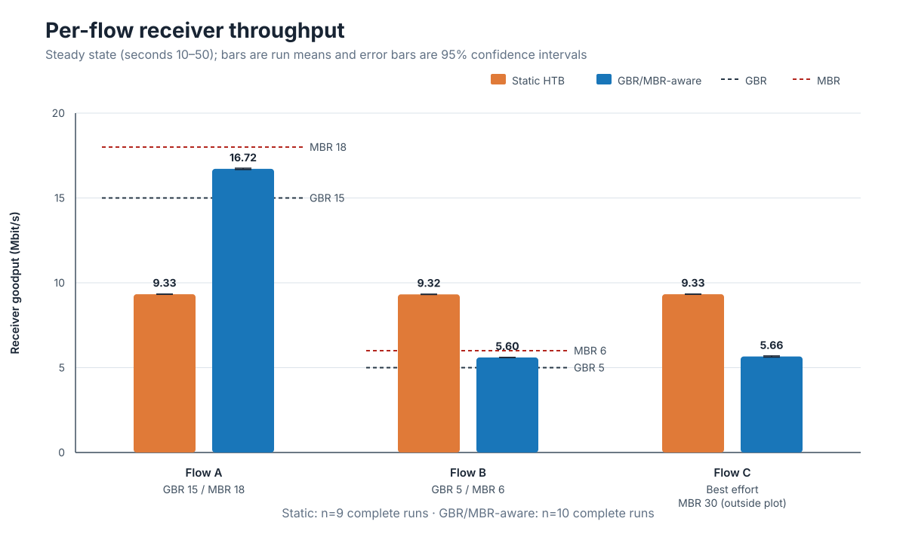
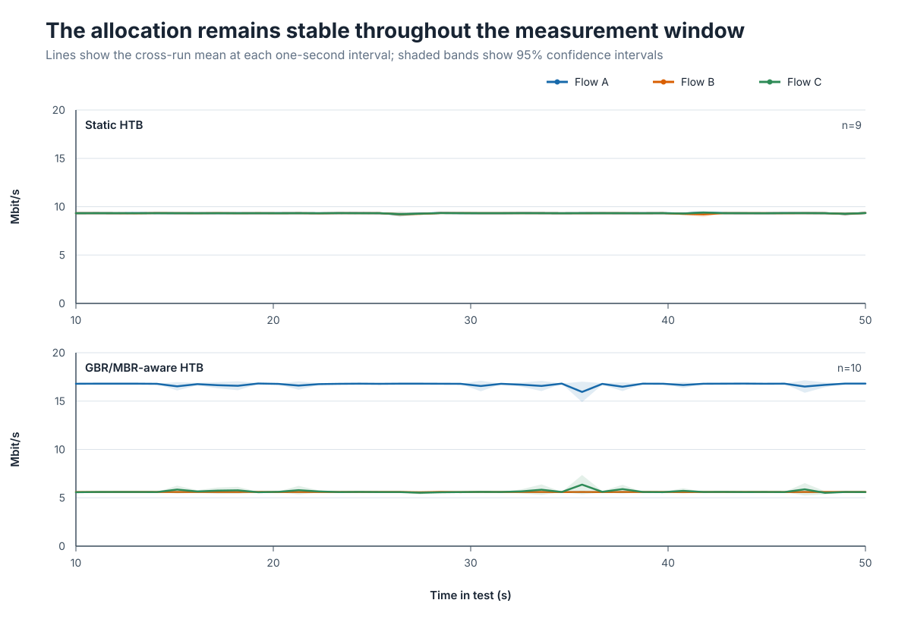
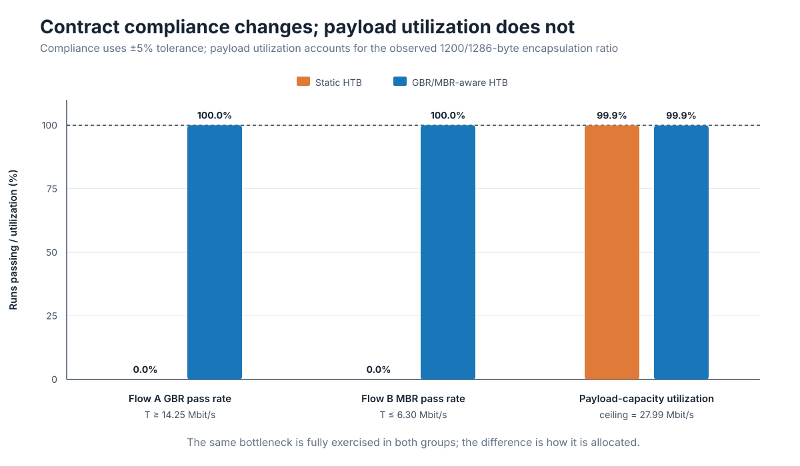
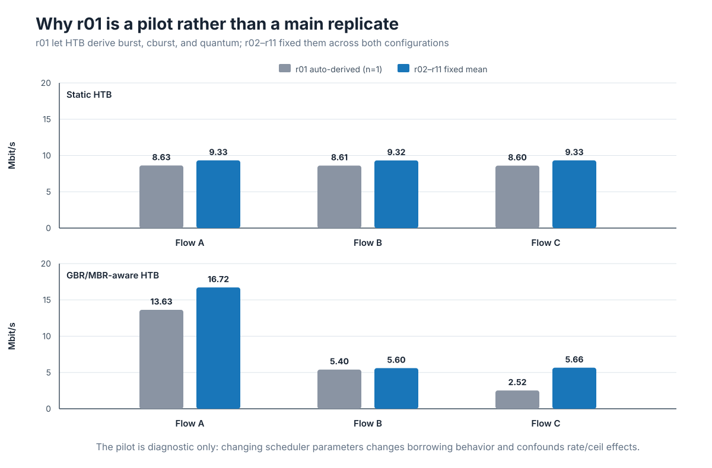

# From QFI Classification to QoS Enforcement: Translating 5G GBR and MBR into Linux HTB in free5GC

>[!NOTE]
> Author: [Yuan-Chun Huang](https://github.com/roundspring2003)
> Date: 2026/08/04
---

## Reference

This article builds upon the following work:

> **[From 5G QoS Flows to Linux TC](../20260805/20260805.md)**
>
> Author: Kai-Xu, Zhan

## Objective

This article asks a narrow but important question: after a free5GC User Plane Function (UPF) has classified QoS Flows correctly, does Linux automatically enforce their different bitrate contracts?

The short answer is no. Classification tells Linux *which* traffic belongs to each class; it does not tell the scheduler *how much* bandwidth each class should receive. In this experiment, three downlink flows were already separated through the following path:

```text
WebConsole Flow Rules
  -> PCF/SMF policy processing
  -> PFCP PDR and QER installation in the UPF
  -> gtp5g flow match and QFI selection
  -> skb->mark = QFI
  -> tc fw filter
  -> HTB class
```

That path had been validated in earlier work. This experiment starts from that result and studies the next problem: the parameters assigned to each HTB class.

We compare two configurations:

1. **QoS-unaware static HTB**, in which every flow class receives the same fixed `rate` and `ceil`.
2. **GBR/MBR-aware per-flow HTB**, in which the Guaranteed Bit Rate (GBR) and Maximum Bit Rate (MBR) carried by the QoS policy are manually translated into the HTB `rate` and `ceil` parameters.

The goal is not to present the final FlowQoS-UPF mechanism. It is to establish the motivation for an explicit semantic translation layer between 5G QoS policy and Linux traffic-control parameters.

## Why classification alone is insufficient

The 5G QoS model uses QoS Flows as the finest granularity of traffic differentiation within a PDU Session. For a GBR QoS Flow, 3GPP defines a guaranteed flow bitrate and a maximum flow bitrate. In PFCP, the control plane can provision a QoS Enforcement Rule (QER) containing GBR and MBR information to the UPF.

Linux HTB uses different terminology. Its most relevant class parameters are:

- `rate`: the bandwidth guaranteed to a class;
- `ceil`: the maximum rate a class may reach when it can borrow unused bandwidth from its parent;
- `burst` and `cburst`: token-bucket burst allowances; and
- `quantum`: the number of bytes served before the scheduler moves to another class.

The `tc fw` classifier can send a packet with a given firewall mark to a class, but the mark contains no intrinsic bitrate meaning. Therefore, the following mapping has to be made explicitly:

```text
QER GBR -> HTB rate
QER MBR -> HTB ceil
QFI     -> skb->mark -> tc fw filter -> HTB class
```

In this motivation experiment the mapping is applied manually. Automating it is a later implementation step.

## Experiment design

### Downlink path and bottleneck

Only the downlink direction was tested so that a single egress queue determined the result:

```text
Data Network / iperf3 servers
  -> UPF N6
  -> PDR and QER match
  -> gtp5g GTP-U encapsulation
  -> skb->mark = QFI
  -> N3 egress HTB on enp0s8
  -> gNB
  -> UE / iperf3 receivers
```

The parent HTB class on the UPF N3 interface was fixed at 30 Mbit/s. Each of the three UDP flows offered 30 Mbit/s, producing an aggregate offered load of 90 Mbit/s. The bottleneck was therefore continuously congested.

The receiver-side result files report iperf 3.16 on Linux 6.8.0-136-generic. Each run lasted 60 seconds and used 1200-byte UDP datagrams in reverse mode, so the server sent downlink data to the UE.

### Flow contracts

| Flow | DN endpoint | QFI / mark | GBR | MBR | Offered load | Role |
|---|---|---:|---:|---:|---:|---|
| A | `192.168.100.2:5201` | 2 | 15 Mbit/s | 18 Mbit/s | 30 Mbit/s | High-GBR flow |
| B | `192.168.100.4:5202` | 3 | 5 Mbit/s | 6 Mbit/s | 30 Mbit/s | Low-MBR flow |
| C | `192.168.100.5:5203` | 4 | 0 | 30 Mbit/s | 30 Mbit/s | Best effort |

Flow C was assigned an HTB `rate` of 1 Mbit/s in the aware configuration to provide a local minimum service level. This value is an operator-side scheduling choice; it is not a 3GPP GBR for Flow C.

### Configuration A: QoS-unaware static HTB

All three classes received the same parameters, irrespective of their QERs:

```bash
tc class replace dev enp0s8 parent 1:1 classid 1:10 \
  htb rate 10mbit ceil 30mbit prio 0 \
  burst 32k cburst 32k quantum 12500

tc class replace dev enp0s8 parent 1:1 classid 1:20 \
  htb rate 10mbit ceil 30mbit prio 0 \
  burst 32k cburst 32k quantum 12500

tc class replace dev enp0s8 parent 1:1 classid 1:30 \
  htb rate 10mbit ceil 30mbit prio 0 \
  burst 32k cburst 32k quantum 12500
```

This is called a *static* or *QoS-unaware* baseline, not an HTB default. HTB does not infer 5G QoS semantics by itself, and `rate` is a required class parameter.

### Configuration B: GBR/MBR-aware per-flow HTB

The second configuration translated the flow contracts into class parameters:

```bash
# Flow A: GBR 15, MBR 18
tc class replace dev enp0s8 parent 1:1 classid 1:10 \
  htb rate 15mbit ceil 18mbit prio 0 \
  burst 32k cburst 32k quantum 12500

# Flow B: GBR 5, MBR 6
tc class replace dev enp0s8 parent 1:1 classid 1:20 \
  htb rate 5mbit ceil 6mbit prio 0 \
  burst 32k cburst 32k quantum 12500

# Flow C: best effort with a local minimum
tc class replace dev enp0s8 parent 1:1 classid 1:30 \
  htb rate 1mbit ceil 30mbit prio 0 \
  burst 32k cburst 32k quantum 12500
```

Both configurations used the same root class, priority, token-bucket settings, DRR quantum, filters, and leaf qdisc:

```bash
tc qdisc replace dev enp0s8 root handle 1: htb default 40 r2q 100
tc class replace dev enp0s8 parent 1: classid 1:1 \
  htb rate 30mbit ceil 30mbit burst 32k cburst 32k

tc qdisc replace dev enp0s8 parent 1:10 handle 10: \
  fq_codel limit 1000 target 5ms interval 100ms
tc qdisc replace dev enp0s8 parent 1:20 handle 20: \
  fq_codel limit 1000 target 5ms interval 100ms
tc qdisc replace dev enp0s8 parent 1:30 handle 30: \
  fq_codel limit 1000 target 5ms interval 100ms

tc filter replace dev enp0s8 parent 1: protocol ip \
  prio 10 handle 0x2 fw flowid 1:10
tc filter replace dev enp0s8 parent 1: protocol ip \
  prio 20 handle 0x3 fw flowid 1:20
tc filter replace dev enp0s8 parent 1: protocol ip \
  prio 30 handle 0x4 fw flowid 1:30
```

The native gtp5g QoS policer was disabled in both groups. This isolated the effect of the HTB configuration rather than combining two independent enforcement mechanisms.

### Traffic generation and analysis window

The UE started all three reverse UDP tests concurrently:

```bash
iperf3 -u -c 192.168.100.2 -p 5201 -R \
  -b 30M -l 1200 -t 60 -i 1 -B 10.60.0.1 --json &
iperf3 -u -c 192.168.100.4 -p 5202 -R \
  -b 30M -l 1200 -t 60 -i 1 -B 10.60.0.1 --json &
iperf3 -u -c 192.168.100.5 -p 5203 -R \
  -b 30M -l 1200 -t 60 -i 1 -B 10.60.0.1 --json &
wait
```

For each flow and run, the analysis uses the receiver throughput from seconds 10 through 50. The first ten seconds are treated as warm-up, while the final ten seconds are excluded to avoid stop-boundary effects.

Run `r01` is treated separately as a pilot because HTB automatically derived `burst`, `cburst`, and `quantum` in that run.

## Results

### Static classes divide the bottleneck, but ignore the contracts



*Figure 1. Mean receiver goodput during seconds 10–50. Error bars show 95% confidence intervals across complete runs. The dashed markers show the relevant GBR and MBR thresholds.*

| Configuration | Flow A | Flow B | Flow C | Aggregate |
|---|---:|---:|---:|---:|
| Static HTB | 9.327 Mbit/s | 9.321 Mbit/s | 9.327 Mbit/s | 27.975 Mbit/s |
| GBR/MBR-aware HTB | 16.716 Mbit/s | 5.598 Mbit/s | 5.659 Mbit/s | 27.973 Mbit/s |

The Static configuration produced an almost exact equal share. That behavior is internally consistent with its three identical 10/30 Mbit/s classes, but it violates the heterogeneous QoS contracts:

- Flow A received only 62.2% of its 15 Mbit/s GBR and failed the experiment's 5% tolerance criterion.
- Flow B exceeded its 6 Mbit/s MBR by 55.3%.
- The classes were correctly selected, but the selected parameters did not express the QER policy.

After the translation, Flow A reached 16.716 Mbit/s, above its GBR and below its MBR. Flow B reached 5.598 Mbit/s, above its GBR and below its MBR. Flow C used the remaining payload capacity.

The confidence intervals are narrow. For example, Flow A measured 9.319–9.335 Mbit/s under Static HTB and 16.678–16.754 Mbit/s under the aware configuration. The effect is therefore persistent across runs rather than the result of a single outlier.

### The behavior remains stable over time



*Figure 2. Cross-run mean throughput for each one-second receiver interval. Shaded regions are 95% confidence intervals.*

The Static panel remains near equal share throughout the 40-second analysis window. In the aware panel, Flow A consistently receives the largest allocation, Flow B remains capped near its configured MBR after encapsulation overhead, and Flow C receives the residual capacity. The result is a steady scheduling policy, not a transient average created by different start times.

### Contract compliance improves without reducing utilization



*Figure 3. Flow A GBR pass rate, Flow B MBR pass rate, and aggregate payload-capacity utilization.*

With a 5% tolerance, none of the Static runs satisfied Flow A's GBR and none complied with Flow B's MBR. All complete aware runs passed both tests.

The aggregate receiver goodput was essentially identical: 27.975 Mbit/s for Static HTB and 27.973 Mbit/s for GBR/MBR-aware HTB. The N3 TC snapshots reported a maximum packet size of 1286 bytes for a 1200-byte iperf payload. The corresponding receiver-payload ceiling is approximately:

```text
30 Mbit/s × 1200 / 1286 = 27.994 Mbit/s
```

Both configurations reached 99.93% of this expected payload ceiling. The improvement therefore comes from reallocating the same bottleneck capacity according to the contracts, not from increasing total link usage.

## Why the r01 pilot is not included in the main comparison



*Figure 4. The single r01 pilot compared with the mean of the controlled runs. r01 is diagnostic only and has no confidence interval.*

In `r01`, Linux derived small token-bucket values of approximately 1600 bytes. In the aware configuration it also derived different quantum values from each class rate. With `r2q=100`, the nominal values were approximately 18,750 bytes for Flow A, 6,250 bytes for Flow B, and 1,250 bytes for Flow C. The last value was smaller than the approximately 1286-byte N3 packet observed in the test.

The aware `r01` pilot consequently measured only 13.632, 5.399, and 2.521 Mbit/s for Flows A, B, and C. Once `burst=32k`, `cburst=32k`, and `quantum=12500` were fixed for both groups, the corresponding means became 16.716, 5.598, and 5.659 Mbit/s.

This pilot is a useful methodological result: when testing the semantic effect of `rate` and `ceil`, all other HTB scheduler parameters must be controlled. Otherwise, token-bucket size and DRR borrowing behavior become alternative explanations for the observed difference.

## What this experiment demonstrates

The result supports three conclusions.

First, **QFI-based marking solves classification, not enforcement**. The `skb->mark` value can reliably select a Linux class, but Linux cannot infer GBR or MBR from the QFI number.

Second, **GBR and MBR have direct functional counterparts in a per-flow HTB baseline**. Mapping GBR to `rate` allows the high-GBR flow to receive its required minimum allocation, while mapping MBR to `ceil` prevents the low-MBR flow from consuming excess capacity.

Third, **policy-aware allocation does not require sacrificing bottleneck utilization**. Once the GBR and MBR constraints are satisfied, the best-effort class can borrow the remaining capacity.

## What this experiment does not demonstrate

The scope is deliberately limited:

- The aware classes were installed manually; this is not yet an automatic QER-to-TC translator.
- The experiment evaluates downlink throughput at one 30 Mbit/s bottleneck. It does not prove end-to-end 5G QoS, Packet Delay Budget compliance, or behavior across other loads and topologies.
- The native gtp5g QoS policer was disabled, so the result isolates HTB rather than evaluating combined enforcement.
- Each QoS Flow received its own HTB class. This is a useful functional baseline, but the number of classes grows with the number of active flows.
- UDP loss is expected because every sender offered 30 Mbit/s into a shared 30 Mbit/s bottleneck and each leaf had a finite queue. The primary outcomes here are receiver throughput, GBR satisfaction, MBR compliance, and aggregate goodput—not loss reduction.
- One Static run is absent because `A-r03` has TC snapshots but no receiver JSON. It was excluded rather than mixing TC outer-byte counters with iperf receiver goodput.

## From this baseline to FlowQoS-UPF

Per-flow HTB shows that the QoS contract can be enforced when each flow receives a dedicated class. It also exposes the scalability problem: HTB class count grows linearly with active flows.

The next stage of FlowQoS-UPF therefore separates responsibilities:

```text
HTB             -> aggregate class guarantees and slice isolation
EDT/eBPF pacing -> per-flow GBR and MBR behavior inside shared classes
sch_fq          -> timestamp-aware dequeue and per-flow queuing
```

The motivation experiment establishes the semantic requirement for this design. A kernel-based UPF needs more than flow identification; it needs an explicit translation from 5G QoS policy into data-plane scheduling and pacing parameters.

## Conclusion

Correct packet classification is necessary, but it is not sufficient for 5G QoS enforcement. In the QoS-unaware Static HTB configuration, all three flows received equal bandwidth even though their contracts were different. The high-GBR flow was under-served, and the low-MBR flow exceeded its cap.

Manually translating QER GBR and MBR into HTB `rate` and `ceil` eliminated both violations in every complete run while keeping aggregate payload utilization unchanged. This result motivates a QoS-to-TC translation layer in free5GC and provides a functionally correct per-flow baseline for the next comparison with shared-class EDT dual-rate pacing.

## References

1. 3GPP, [TS 23.501: System architecture for the 5G System, Release 16](https://www.etsi.org/deliver/etsi_ts/123500_123599/123501/16.18.00_60/ts_123501v161800p.pdf).
2. 3GPP, [TS 29.244: Interface between the Control Plane and the User Plane nodes](https://www.etsi.org/deliver/etsi_ts/129200_129299/129244/16.05.00_60/ts_129244v160500p.pdf).
3. free5GC, [Introduction to 5G Quality of Service (QoS)](https://free5gc.org/blog/20240628/20240628/).
4. free5GC, [free5GC source repository](https://github.com/free5gc/free5gc).
5. free5GC, [gtp5g: 5G-compatible GTP-U Linux kernel module](https://github.com/free5gc/gtp5g).
6. Linux `iproute2`, [`tc-htb(8)`](https://man7.org/linux/man-pages/man8/tc-htb.8.html).
7. Linux `iproute2`, [`tc-fw(8)`](https://man7.org/linux/man-pages/man8/tc-fw.8.html).
8. Linux `iproute2`, [`tc-fq_codel(8)`](https://man7.org/linux/man-pages/man8/tc-fq_codel.8.html).
9. ESnet, [iperf3 documentation](https://software.es.net/iperf/).

## About Me

Hi, I am Yuan-Chun Huang, a member of the free5GC community. My current work focuses on implementing Quality of Service (QoS) mechanisms in the Linux networking stack and exploring how they can be integrated with free5GC to enforce 5G QoS policies in the user plane.
