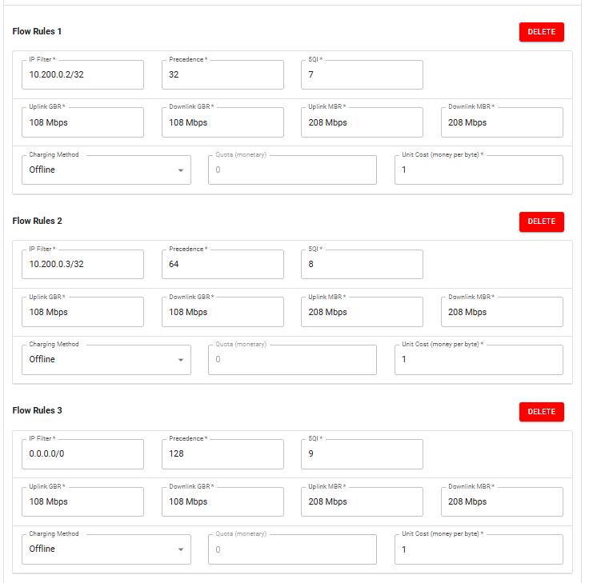

# From 5G QoS Flows to Linux TC

>[!NOTE]
> Author: Kai-Xu, Zhan
> Date: 2026/08/05

---

## 1. The Question That Started This Work

free5GC can establish multiple QoS Flows within one PDU Session. Their identities and QoS characteristics are represented by the QoS Flow Identifier (QFI) and 5G QoS Identifier (5QI), while PFCP installs Packet Detection Rules (PDRs) and QoS Enforcement Rules (QERs) in the UPF.

Linux Traffic Control (TC) cannot directly reuse QFI unless it is exposed through Linux packet metadata.

One option is to classify packets again in TC by IP address or port, but that duplicates logic already represented by the 5G QoS policy and PFCP rules.

This work uses a different path:

```text
5G QoS policy
→ PDR / QER and assigned QFI
→ gtp5g maps QFI to skb->mark
→ TC maps the mark to a class
```

The goal is to let free5GC define the QoS Flow classification, let gtp5g expose the selected QFI through `skb->mark`, and let Linux TC apply the scheduling policy.

This post first validates that path through WebConsole, MongoDB, NGAP, PFCP, GTP-U, gtp5g, and TC, then compares Baseline and QFI-aware TC under congestion.

---

## 2. Test Environment and Three-VM Architecture

The lab uses three virtual machines.

### VM 1: free5GC

Clone free5GC and its pinned submodules:

```bash
git clone \
  --branch flow-to-tc \
  --recurse-submodules \
  https://github.com/KASHZKX/free5gc.git
```

Clone the gtp5g branch used in this experiment:

```bash
cd ~

git clone \
  --branch feat/flow-to-tc \
  https://github.com/KASHZKX/gtp5g.git
```

The important interfaces are:

```text
enp0s8 → N2/N3 network toward the UERANSIM VM
enp0s9 → N6 network toward the Data Network VM
```

### VM 2: UERANSIM

Clone UERANSIM:

```bash
git clone https://github.com/aligungr/UERANSIM.git
```

This VM runs both the UERANSIM gNB and UE. After PDU Session establishment, the UE is assigned `10.60.0.1` through `uesimtun0`.

N2 carries control-plane signaling over SCTP, while N3 carries GTP-U user-plane traffic between the gNB and UPF.

### VM 3: Data Network

The third VM provides the iperf3 endpoints:

```text
10.200.0.2 → Stable Flow
10.200.0.3 → Normal Flow
```

`Stable Flow` and `Normal Flow` are experiment-specific labels. The Data Network VM connects through N6 and routes return traffic to the UE subnet through the UPF.

```text
┌────────────────────┐
│ UERANSIM VM       │
│ gNB + UE          │
│ UE: 10.60.0.1     │
└─────────┬──────────┘
          │ N2 / SCTP
          │ N3 / GTP-U
┌─────────▼──────────┐
│ free5GC VM        │
│ enp0s8: N2 / N3   │
│ enp0s9: N6        │
└─────────┬──────────┘
          │ N6
┌─────────▼──────────┐
│ Data Network VM   │
│ 10.200.0.2 Stable │
│ 10.200.0.3 Normal │
└────────────────────┘
```

TC is attached to the UPF egress path:

```text
Uplink   → enp0s9 egress
Downlink → enp0s8 egress
```

---

## 3. Creating the QoS Flow Policies

Start free5GC and WebConsole, then configure the default UE subscription with three Flow Rules.

| Role | IP filter | Precedence | 5QI |
|---|---|---:|---:|
| Stable | `10.200.0.2/32` | 32 | 7 |
| Normal | `10.200.0.3/32` | 64 | 8 |
| Catch-all | `0.0.0.0/0` | 128 | 9 |



---

## 4. Following the Policy Through free5GC

Verify that WebConsole stored the policy in MongoDB:

```bash
mongosh
```

```javascript
use free5gc

db.getCollection("policyData.ues.flowRule").find().pretty()
db.getCollection("policyData.ues.qosFlow").find().pretty()
```

The two collections are linked by `qosRef`:

```text
10.200.0.2/32 → qosRef 1 → 5QI 7
10.200.0.3/32 → qosRef 2 → 5QI 8
0.0.0.0/0     → qosRef 3 → 5QI 9
```

`qosRef` is not a QFI. It only links `flowRule` and `qosFlow` records in the policy database. The SMF assigns the actual QFI when it creates the QoS Flow.

Before PDU Session establishment, capture NGAP traffic:

```bash
sudo tcpdump -i enp0s8 -nn -s 0 \
  -w ngap-qos-flow-validation.pcap \
  sctp port 38412
```

The NGAP capture used in this validation: [ngap-qos-flow-validation.pcap](ngap-qos-flow-validation.pcap).

In Wireshark, inspect:

```text
PDUSessionResourceSetupRequest
→ QoSFlowSetupRequestList
```

The capture used in this validation showed:

| QFI | 5QI | Role |
|---:|---:|---|
| 1 | 9 | PDU Session default QoS Flow |
| 2 | 7 | Stable Flow |
| 3 | 8 | Normal Flow |
| 4 | 9 | Catch-all Flow Rule |

Next, capture PFCP traffic:

```bash
sudo tcpdump -i any -nn -s 0 \
  -w pfcp-qfi-validation.pcap \
  udp port 8805
```

The PFCP capture used in this validation: [pfcp-qfi-validation.pcap](pfcp-qfi-validation.pcap).

The PFCP Session Establishment Request contained eight Create PDR entries: one Access-side and one Core-side PDR for each logical Flow. In this capture, the key mappings were:

```text
Stable:
10.200.0.2/32
→ PDR 3 / PDR 4
→ QER 3
→ QFI 2

Normal:
10.200.0.3/32
→ PDR 5 / PDR 6
→ QER 4
→ QFI 3
```

PDR and QER identifiers are specific to this capture; the Flow Description, QFI, and rule relationships are the important evidence.

---

## 5. Mapping QFI to a Linux TC Mark in gtp5g

The gtp5g modification bridges 5G QoS Flow information to Linux TC by copying the selected QFI into `skb->mark`:

```text
QFI N → skb->mark N
```

Its core behavior can be summarized as:

```c
static void gtp5g_apply_skb_label(struct sk_buff *skb, u8 qfi)
{
    skb->mark = qfi;
}
```

For uplink traffic, gtp5g decapsulates the GTP-U packet, matches the Access PDR, selects `pdr->qfi` when available or falls back to the incoming QFI, and writes the value before N6 egress:

```text
GTP-U decapsulation
→ matched Access PDR
→ select QFI
→ write skb->mark
→ N6 egress TC
```

For downlink traffic, gtp5g matches the Core PDR, creates the GTP-U packet, and writes the PDR QFI before N3 egress:

```text
Matched Core PDR
→ create GTP-U packet
→ write pdr->qfi into skb->mark
→ N3 egress TC
```

free5GC defines the QoS Flow classification, gtp5g exposes the selected identity, and TC maps it to a scheduling class.

---

## 6. Preparing the Two TC Modes

Use `setup-tc.sh` to select a direction and mode:

```bash
#!/usr/bin/env bash
set -Eeuo pipefail

usage() {
    cat <<'USAGE'
Usage:
  sudo ./setup-tc.sh uplink baseline
  sudo ./setup-tc.sh uplink qfi
  sudo ./setup-tc.sh downlink baseline
  sudo ./setup-tc.sh downlink qfi

Arguments:
  direction
    uplink    Apply TC to the UPF N6 egress interface.
    downlink  Apply TC to the UPF N3 egress interface.

  mode
    baseline  HTB bottleneck with one shared fq_codel.
    qfi       HTB bottleneck with Default, Stable, and Normal classes.

Environment variables:
  N3_IF                 UPF N3 interface. Default: enp0s8
  N6_IF                 UPF N6 interface. Default: enp0s9
  BOTTLENECK_RATE       Per-direction HTB bottleneck. Default: 10mbit

  STABLE_MARK           Stable Flow skb mark. Default: 2
  NORMAL_MARK           Normal Flow skb mark. Default: 3

  STABLE_CLASS_RATE     Stable class guaranteed rate. Default: 5mbit
  NORMAL_CLASS_RATE     Normal class guaranteed rate. Default: 1mbit
  DEFAULT_CLASS_RATE    Default class guaranteed rate. Default: 128kbit

  FQ_LIMIT              fq_codel packet limit. Default: 10240
  FQ_FLOWS              fq_codel flow buckets. Default: 1024
  FQ_QUANTUM            fq_codel DRR quantum. Default: 1514
  FQ_TARGET             fq_codel target delay. Default: 5ms
  FQ_INTERVAL           fq_codel interval. Default: 100ms
USAGE
}

log() {
    printf '[%s] %s\n' "$(date '+%Y-%m-%d %H:%M:%S')" "$*"
}

fail() {
    printf '[ERROR] %s\n' "$*" >&2
    exit 1
}

require_root() {
    if (( EUID != 0 )); then
        fail "Run this script as root, for example: sudo $0 uplink baseline"
    fi
}

require_command() {
    local command_name="$1"
    command -v "${command_name}" >/dev/null 2>&1 \
        || fail "Required command not found: ${command_name}"
}

require_interface() {
    local iface="$1"
    ip link show dev "${iface}" >/dev/null 2>&1 \
        || fail "Network interface does not exist: ${iface}"
}

add_fq_codel() {
    local iface="$1"
    local parent="$2"
    local handle="$3"

    tc qdisc add dev "${iface}" parent "${parent}" handle "${handle}" fq_codel \
        limit "${FQ_LIMIT}" \
        flows "${FQ_FLOWS}" \
        quantum "${FQ_QUANTUM}" \
        target "${FQ_TARGET}" \
        interval "${FQ_INTERVAL}" \
        ecn
}

clear_existing_tc() {
    local iface="$1"

    # Deleting a missing root qdisc is expected on a clean interface.
    tc qdisc del dev "${iface}" root 2>/dev/null || true
}

apply_baseline() {
    local iface="$1"

    log "Applying baseline TC to ${iface}"

    # HTB only enforces the per-direction 10 Mbit/s bottleneck.
    # Both experiment flows share one fq_codel instance.
    tc qdisc add dev "${iface}" root handle 1: htb default 10

    tc class add dev "${iface}" parent 1: classid 1:10 htb \
        rate "${BOTTLENECK_RATE}" \
        ceil "${BOTTLENECK_RATE}"

    add_fq_codel "${iface}" 1:10 10:
}

apply_qfi() {
    local iface="$1"

    log "Applying QFI-aware TC to ${iface}"

    # Unclassified or unmatched traffic enters Default class 1:10.
    tc qdisc add dev "${iface}" root handle 1: htb default 10

    # Shared parent enforces the per-direction bottleneck.
    tc class add dev "${iface}" parent 1: classid 1:1 htb \
        rate "${BOTTLENECK_RATE}" \
        ceil "${BOTTLENECK_RATE}"

    # Default / unmatched traffic: QFI 0 or any skb mark not matched below.
    tc class add dev "${iface}" parent 1:1 classid 1:10 htb \
        rate "${DEFAULT_CLASS_RATE}" \
        ceil "${BOTTLENECK_RATE}" \
        prio 2

    # Stable Flow: QFI 2 -> skb mark 2 -> class 1:20.
    # QFI identifies the flow; the HTB class assigns the scheduling policy.
    tc class add dev "${iface}" parent 1:1 classid 1:20 htb \
        rate "${STABLE_CLASS_RATE}" \
        ceil "${BOTTLENECK_RATE}" \
        prio 0

    # Normal Flow: QFI 3 -> skb mark 3 -> class 1:30.
    tc class add dev "${iface}" parent 1:1 classid 1:30 htb \
        rate "${NORMAL_CLASS_RATE}" \
        ceil "${BOTTLENECK_RATE}" \
        prio 1

    # Identical fq_codel parameters isolate the effect of class separation,
    # guaranteed rates, and the configured HTB scheduling policy.
    add_fq_codel "${iface}" 1:10 10:
    add_fq_codel "${iface}" 1:20 20:
    add_fq_codel "${iface}" 1:30 30:

    # Filter priority controls evaluation order only; it is separate from
    # the HTB class prio values above.
    tc filter add dev "${iface}" parent 1: protocol ip \
        prio 10 handle "0x${STABLE_MARK}" fw flowid 1:20

    tc filter add dev "${iface}" parent 1: protocol ip \
        prio 20 handle "0x${NORMAL_MARK}" fw flowid 1:30
}

show_summary() {
    local iface="$1"

    echo
    echo "========== qdisc: ${iface} =========="
    tc -s qdisc show dev "${iface}"

    echo
    echo "========== class: ${iface} =========="
    tc -s class show dev "${iface}"

    echo
    echo "========== filter: ${iface} =========="
    tc -s filter show dev "${iface}" parent 1: || true
}

main() {
    if (( $# != 2 )); then
        usage >&2
        exit 2
    fi

    local direction="$1"
    local mode="$2"
    local iface

    case "${direction}" in
        uplink)   iface="${N6_IF}" ;;
        downlink) iface="${N3_IF}" ;;
        *)
            printf '[ERROR] Invalid direction: %s\n' "${direction}" >&2
            usage >&2
            exit 2
            ;;
    esac

    case "${mode}" in
        baseline|qfi) ;;
        *)
            printf '[ERROR] Invalid mode: %s\n' "${mode}" >&2
            usage >&2
            exit 2
            ;;
    esac

    require_root
    require_command tc
    require_command ip
    require_interface "${iface}"

    log "Direction=${direction} Mode=${mode} Interface=${iface} Bottleneck=${BOTTLENECK_RATE}"
    clear_existing_tc "${iface}"

    case "${mode}" in
        baseline) apply_baseline "${iface}" ;;
        qfi)      apply_qfi "${iface}" ;;
    esac

    log "TC configuration applied successfully"
    show_summary "${iface}"
}

N3_IF="${N3_IF:-enp0s8}"
N6_IF="${N6_IF:-enp0s9}"
BOTTLENECK_RATE="${BOTTLENECK_RATE:-10mbit}"

STABLE_MARK="${STABLE_MARK:-2}"
NORMAL_MARK="${NORMAL_MARK:-3}"

STABLE_CLASS_RATE="${STABLE_CLASS_RATE:-5mbit}"
NORMAL_CLASS_RATE="${NORMAL_CLASS_RATE:-1mbit}"
DEFAULT_CLASS_RATE="${DEFAULT_CLASS_RATE:-128kbit}"

FQ_LIMIT="${FQ_LIMIT:-10240}"
FQ_FLOWS="${FQ_FLOWS:-1024}"
FQ_QUANTUM="${FQ_QUANTUM:-1514}"
FQ_TARGET="${FQ_TARGET:-5ms}"
FQ_INTERVAL="${FQ_INTERVAL:-100ms}"

main "$@"
```

```bash
sudo ./setup-tc.sh uplink baseline
sudo ./setup-tc.sh uplink qfi
sudo ./setup-tc.sh downlink baseline
sudo ./setup-tc.sh downlink qfi
```

### Baseline

```text
10 Mbit/s HTB root
└── Shared class 1:10
    rate 10 Mbit/s, ceil 10 Mbit/s
    └── Shared fq_codel 10:
```

### QFI-aware

```text
10 Mbit/s HTB root
└── Parent class 1:1
    rate 10 Mbit/s, ceil 10 Mbit/s
    │
    ├── mark 2 → Stable class 1:20
    │            rate 5 Mbit/s, ceil 10 Mbit/s, prio 0
    │            └── fq_codel 20:
    │
    ├── mark 3 → Normal class 1:30
    │            rate 1 Mbit/s, ceil 10 Mbit/s, prio 1
    │            └── fq_codel 30:
    │
    └── unmatched marks → Default class 1:10
                         rate 128 kbit/s, ceil 10 Mbit/s, prio 2
                         └── fq_codel 10:
```

QFI identifies the Flow; the HTB class supplies the rate guarantee, borrowing priority, and queue isolation.

---

## 7. Validating the Downlink Path

Apply downlink QFI-aware TC and start one iperf3 server for each endpoint:

```bash
sudo ./setup-tc.sh downlink qfi
```

```bash
iperf3 -s -B 10.200.0.2 -p 5201 &
iperf3 -s -B 10.200.0.3 -p 5201 &
```

Run each client separately from the UE.

Stable:

```bash
iperf3 -u -c 10.200.0.2 -p 5201 -R \
  -b 100k -t 5 -B 10.60.0.1
```

Normal:

```bash
iperf3 -u -c 10.200.0.3 -p 5201 -R \
  -b 100k -t 5 -B 10.60.0.1
```

The expected mappings are:

```text
10.200.0.2 → UE → QFI 2 → mark 2 → class 1:20
10.200.0.3 → UE → QFI 3 → mark 3 → class 1:30
```

Check `enp0s8`:

```bash
sudo tc -s class show dev enp0s8
```

| Flow | N3 QFI | TC class | Packets | Drops |
|---|---:|---|---:|---:|
| Stable | 2 | `1:20` | 63 | 0 |
| Normal | 3 | `1:30` | 63 | 0 |

---

## 8. Validating the Uplink Path

Keep the same iperf3 servers running, then apply uplink QFI-aware TC:

```bash
sudo ./setup-tc.sh uplink qfi
```

Run each client separately from the UE.

Stable:

```bash
iperf3 -u -c 10.200.0.2 -p 5201 \
  -b 100k -t 5 -B 10.60.0.1
```

Normal:

```bash
iperf3 -u -c 10.200.0.3 -p 5201 \
  -b 100k -t 5 -B 10.60.0.1
```

The expected mappings are:

```text
UE → 10.200.0.2 → QFI 2 → mark 2 → class 1:20
UE → 10.200.0.3 → QFI 3 → mark 3 → class 1:30
```

Check `enp0s9`:

```bash
sudo tc -s class show dev enp0s9
```

| Flow | QFI | TC class | Packets | Drops |
|---|---:|---|---:|---:|
| Stable | 2 | `1:20` | 66 | 0 |
| Normal | 3 | `1:30` | 66 | 0 |

The low-rate tests confirm the same QoS Flow-to-class mapping in both directions.

---

## 9. Validation Summary

The completed evidence chain is:

```text
Stable Flow Rule
→ 5QI 7
→ QFI 2
→ mark 2
→ class 1:20

Normal Flow Rule
→ 5QI 8
→ QFI 3
→ mark 3
→ class 1:30
```

With this relationship verified, the experiment can use the two Flow Rules to apply different scheduling treatment under congestion.

---

## 10. Congestion Experiment

The experiment compares Baseline and QFI-aware TC under the same 10 Mbit/s uplink bottleneck on `enp0s9`.

```text
Stable offered load: 6 Mbit/s
Normal offered load: 6 Mbit/s
Combined offered load: 12 Mbit/s
Bottleneck capacity: 10 Mbit/s
```

Each run uses:

```bash
DURATION=120
OMIT=2
INTERVAL=1
UDP_LENGTH=1200
START_DELAY=1
```

Start one server for each Data Network address. Before each run, reapply the selected TC mode to reset its counters:

```bash
sudo ./setup-tc.sh uplink baseline
# or
sudo ./setup-tc.sh uplink qfi
```

Start both UDP clients from the UE:

```bash
iperf3 -u -c 10.200.0.2 -p 5201 \
  -b 6M -t 120 -O 2 -i 1 -l 1200 \
  -B 10.60.0.1 &

iperf3 -u -c 10.200.0.3 -p 5201 \
  -b 6M -t 120 -O 2 -i 1 -l 1200 \
  -B 10.60.0.1 &

wait
```

Each mode was repeated three times with the same topology, traffic parameters, QoS configuration, and VM resources.

### Results

Throughput and jitter are reported as the mean ± sample standard deviation across three runs. Loss is calculated from the pooled receiver-side lost and total datagram counts.

| Mode | Flow | Throughput | Jitter | Loss |
|---|---|---:|---:|---:|
| Baseline | Stable | 4.717 ± 0.015 Mbit/s | 0.826 ± 0.126 ms | 21.53% |
| Baseline | Normal | 4.713 ± 0.021 Mbit/s | 0.817 ± 0.138 ms | 21.52% |
| QFI-aware | Stable | 5.997 ± 0.006 Mbit/s | 1.021 ± 0.142 ms | 0.055% |
| QFI-aware | Normal | 3.433 ± 0.023 Mbit/s | 1.474 ± 0.141 ms | 42.91% |

Baseline gives both flows almost identical throughput and loss because they share one HTB class and one fq_codel instance.

QFI-aware TC changes the allocation:

```text
Stable → QFI 2 → mark 2 → class 1:20
Normal → QFI 3 → mark 3 → class 1:30
```

The Stable Flow remains close to its full 6 Mbit/s offered load, and its loss falls from about 21.5% to 0.055%. The Normal Flow uses the remaining capacity and experiences higher loss.

Combined receiver throughput remains approximately 9.43 Mbit/s in both modes:

```text
Baseline:  4.717 + 4.713 ≈ 9.43 Mbit/s
QFI-aware: 5.997 + 3.433 ≈ 9.43 Mbit/s
```

The QFI-aware design therefore does not increase bottleneck capacity. It redistributes that capacity according to the HTB policy associated with each QoS Flow.

Receiver-reported jitter did not improve: Stable jitter increased from 0.826 ms to 1.021 ms. The measured benefit is therefore throughput preservation and packet-loss protection for the Stable Flow, not a general improvement across every metric.

---

## 11. Closing Thoughts

The validation established a working path from a free5GC Flow Rule to a Linux TC class. Under congestion, the same mapping allowed TC to protect the Stable Flow without changing the total bottleneck capacity.

Across three runs, QFI-aware TC kept the Stable Flow near 6 Mbit/s and reduced its pooled loss to 0.055%, while the Normal Flow absorbed most of the congestion loss. This trade-off came from the configured HTB rates, priorities, and separate fq_codel queues—not from the numeric QFI values themselves.

The result demonstrates how Linux scheduling can reuse 5G QoS Flow identity, while also showing the trade-off: protecting one Flow changes how limited capacity and loss are distributed.

---

## References

- [3GPP TS 29.244](https://www.etsi.org/deliver/etsi_ts/129200_129299/129244/15.05.00_60/ts_129244v150500p.pdf)
- [3GPP TS 29.281](https://www.etsi.org/deliver/etsi_ts/129200_129299/129281/15.07.00_60/ts_129281v150700p.pdf)
- [3GPP TS 38.415](https://www.etsi.org/deliver/etsi_TS/138400_138499/138415/15.02.00_60/ts_138415v150200p.pdf)
- [linux tc](https://www.man7.org/linux/man-pages/man8/tc.8.html)

---

## About

Hello, I'm Kai-Xu Zhan. I'm honored to be a new member of the free5GC project under the Linux Foundation. As someone who is still learning and growing in the field of 5G core network development, I'm enthusiastic about contributing to the community and expanding my knowledge in telecommunications technologies. I welcome any guidance or feedback as I continue to familiarize myself with the project.

## Connect with Me
- GitHub: [KASHZKX](https://github.com/KASHZKX)