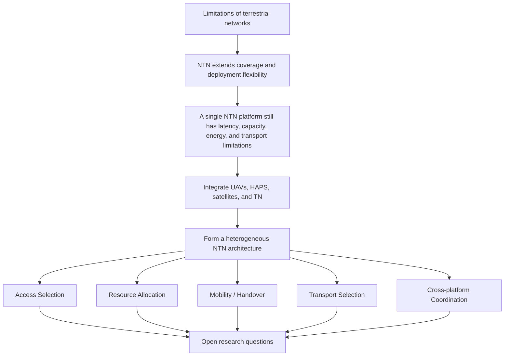
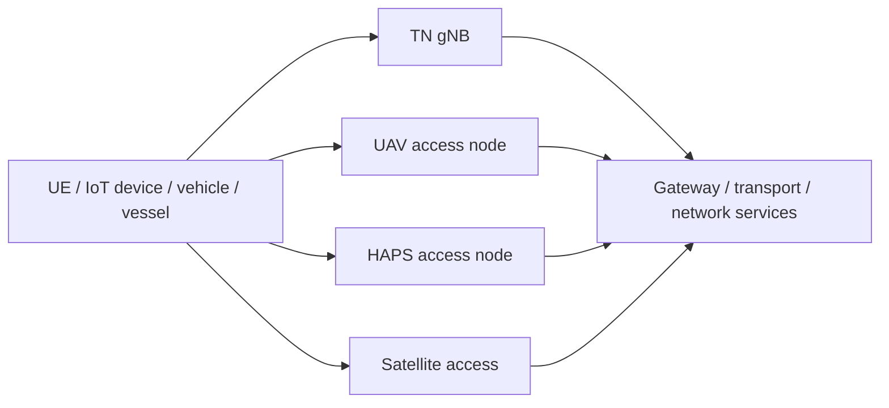

# From NTN to Heterogeneous NTN: Architecture and Challenges

>[!NOTE]
> Author: Wei, Chang
> Date: 2026/08/31

---

## 1. Why Do We Need Heterogeneous NTN?

Mobile networks have traditionally relied on terrestrial base stations, fiber or microwave backhaul, and fixed core-network infrastructure. This architecture works very well in cities and other densely populated areas. However, its limitations become increasingly visible when connectivity must be extended to mountains, oceans, deserts, remote rural areas, or disaster sites.

A simple example illustrates the problem. Providing stable 5G coverage everywhere requires base stations, power, backhaul, and maintenance systems. Terrain, site acquisition, energy supply, construction time, and operating cost can be more difficult to solve than the radio technology itself. In large events or disaster-response scenarios, demand may also appear suddenly, while fixed infrastructure cannot always be deployed quickly enough.

This motivates the use of communication platforms beyond the ground. Non-Terrestrial Networks (NTN) extend network coverage through airborne or spaceborne platforms, complementing terrestrial networks where coverage, deployment speed, or disaster resilience is insufficient.

3GPP treats NTN as an extension of the 5G system. Release 17 introduced normative support for NR NTN and satellite access, covering radio interfaces, 5G Core architecture, procedures, and the effects of long propagation delay, Doppler shift, and platform movement. The overall standardization context is summarized in the [3GPP NTN Overview](https://www.3gpp.org/technologies/ntn-overview).

However, adding NTN does not make every networking problem disappear. A single platform is usually effective only under a particular set of conditions. The next logical step is to combine multiple platforms and select the most suitable one according to location, service requirements, and network state.

In this article, **Heterogeneous NTN**, or **H-NTN**, refers to a research architecture that integrates UAVs, HAPS, satellites, and traditional terrestrial networks (TN) as a multi-layer system for access and transport. This is an architectural and research term; not every UAV deployment should automatically be considered a 3GPP NTN deployment.

## 2. From Terrestrial Network Limitations to NTN Complementarity

### 2.1 Limitations of Terrestrial Networks

Terrestrial networks offer mature technology, low latency, scalable capacity, and well-established spectrum and operational procedures. Nevertheless, several situations make terrestrial deployment expensive or impractical:

- **Difficult geographical coverage:** Population density is often low in mountains, at sea, in deserts, and near borders, making the return on investment of fixed base stations uncertain.
- **Dependence on infrastructure:** Base stations require reliable power and backhaul. When fiber, electricity, or roads are damaged, the radio equipment may remain operational but the service can still be unavailable.
- **Rapidly changing demand:** Disaster recovery, large events, and temporary work sites may need additional capacity within a short time. Fixed base stations are not always fast enough to deploy.
- **Coverage-capacity trade-off:** Wide coverage generally requires fewer high-power nodes, while high capacity requires denser deployment. It is difficult to optimize both at the same time.

This does not mean that TN will be replaced by NTN. A more useful view is that TN provides a stable foundation with high capacity and low latency, while NTN supplements areas where terrestrial deployment is uneconomical, difficult, or temporarily unavailable.

### 2.2 What NTN Can Add

NTN can place access or relay equipment on satellites, aircraft, or high-altitude platforms, reducing the dependence on ground infrastructure. Typical applications include broadband connectivity in remote regions, maritime and aviation connectivity, disaster recovery, temporary coverage, and additional backhaul paths for terrestrial networks.

## 3. Why Is No Single Platform Enough?

Different platforms have different physical environments, mobility patterns, energy constraints, and network roles. Choosing only one platform usually changes the question from “Is coverage available?” to a different set of limitations.

| Platform | Main strengths | Typical limitations |
| --- | --- | --- |
| UAV | Fast deployment, mobility toward demand hotspots, suitable for temporary coverage | Limited battery and payload, short flight time, weather and regulatory constraints |
| HAPS | Large coverage, lower latency than many satellite links, useful for aerial backhaul | Station keeping, energy balance, equipment cost, and deployment complexity |
| LEO / MEO / GEO satellite | Wide coverage for oceans and remote regions | Propagation delay, Doppler, visibility time, satellite capacity, gateways, and feeder-link constraints |
| TN | Low latency, mature capacity planning and operations | Geographic, power, backhaul, construction, and maintenance constraints |

The term HAPS is used in several different contexts, so its definition should be checked against the relevant document. ITU Radio Regulations describe HAPS as radio stations located on an object at approximately 20–50 km altitude and maintained at a nominally fixed position relative to the Earth. ITU also identifies access and backhaul as HAPS applications; see the [ITU HAPS overview](https://www.itu.int/en/mediacentre/backgrounders/Pages/High-altitude-platform-systems.aspx).

These differences explain the motivation for H-NTN: different platforms should cooperate at the right time and place instead of expecting one platform to simultaneously provide low latency, wide coverage, high capacity, low energy consumption, and high reliability.

## 4. A Basic Heterogeneous NTN Architecture

In an H-NTN system, a UE may have access to one or more TN, UAV, HAPS, or satellite connectivity options. The selected platform then relies on a corresponding transport path to reach network services. The exact path may use terrestrial fiber, microwave, aerial relays, satellite feeder links, or inter-satellite links.

The same platforms may also serve as relays or transport nodes, but those roles are not shown separately in this simplified diagram.

The main difficulty is that access selection, resource allocation, and transport selection are no longer independent decisions. For example, a satellite beam with the strongest signal may have a congested feeder link. A nearby UAV may provide excellent radio quality but soon become unavailable because of limited battery capacity. Optimizing only the radio link does not necessarily optimize the end-to-end service.

## 5. New Problems Created by Integration

### 5.1 Access Selection: The Strongest Signal Is Not Always the Best Choice

In a conventional TN, access and mobility decisions often consider radio measurements and cell priorities. In H-NTN, candidate platforms also have different temporal and spatial characteristics:

- A satellite beam may be approaching the end of its visibility window.
- A UAV's position, remaining energy, and mission may change.
- A HAPS may offer better latency and capacity than a satellite, but may not have enough available bandwidth.
- A TN signal may be weaker while its transport path remains more stable.

Access selection should therefore move from a single-time-point signal comparison to a multi-objective decision with temporal prediction. Candidate scoring may include latency, expected visibility time, remaining capacity, energy, transport availability, and service requirements. The algorithm must also avoid **ping-pong** behavior: rapidly alternating metrics can cause frequent switching, increasing signaling and service interruption.

### 5.2 Resource Allocation: Resources Are More Than PRBs

Resource allocation in H-NTN may jointly involve:

- Radio spectrum, PRBs, beams, and transmit power.
- UAV battery, flight time, and payload capacity.
- HAPS energy, platform capacity, and backhaul bandwidth.
- Satellite beams, feeder links, and inter-satellite-link capacity.
- Gateway and transport capacity.

This makes resource allocation a cross-layer problem. Assigning many UEs to one platform affects the radio scheduler and transport queue at the same time. Throughput, fairness, latency, energy consumption, reliability, and service priority can all conflict with one another.

### 5.3 Mobility and Handover: The UE Is Not the Only Moving Entity

Terrestrial handover is mainly driven by UE movement and neighboring-cell relationships. In H-NTN, cells, beams, satellites, UAVs, and transport paths may all move or change state. A transition may occur:

- Between beams on the same satellite.
- Between different satellites.
- Between a UAV, HAPS, and TN.
- Between different radio layers, while their transport paths may change independently.

These transitions are not all the same procedure. Radio handover, feeder-link switching, gateway changes, and route changes may occur at different times, but they must still be coordinated to maintain service continuity.

H-NTN handover may also benefit from predictive information such as satellite ephemeris, UE location, UAV trajectory, weather, and transport availability. An incorrect prediction can trigger an unnecessary early switch, while a late switch can cause handover failure, packet loss, or service interruption.

### 5.4 Transport Selection: Choosing the Access Point Is Not Enough

In this article, transport is used as a broad term covering terrestrial backhaul, feeder links, relays, and inter-satellite links. After a UE connects to a platform, traffic still needs a path to network services. The available paths differ in latency, capacity, cost, reliability, and expected availability.

Transport selection should not rely only on the shortest path or the current RTT. It should also consider future availability and queue evolution. A path with excellent radio quality but poor transport capacity may be worse than a path with slightly weaker radio quality and more stable end-to-end connectivity.

### 5.5 Cross-platform Coordination: How Should Platforms Share State?

Cross-platform coordination is one of the most fundamental H-NTN problems. Different platforms may use different control periods, operators, and data models. Satellite orbit information may be updated at a seconds-to-minutes scale, while UAV energy and trajectory can change more rapidly.

The shared state may include platform position and predicted trajectory, coverage, load, energy, link status, service priority, gateway availability, and handover candidates. If too little state is exchanged, decisions become stale. If too much state is exchanged, control traffic and synchronization overhead increase.

When platforms belong to different operators, additional issues arise: trust, authorization, data privacy, cross-domain SLAs, and responsibility for failures. These problems cannot be solved by a better scheduler alone.

## 6. Open Research Questions

Several research directions remain important:

1. **Predictive access and mobility management:** How can orbit, location, traffic, energy, weather, and transport predictions be combined for access selection and handover? How should the system degrade safely when predictions are wrong?
2. **Joint access and transport optimization:** How can we avoid optimizing the radio and transport paths independently and then obtaining a poor end-to-end connection?
3. **Multi-connectivity and make-before-break:** Can maintaining two platform connections during a transition reduce interruption? Are the additional power, spectrum, and packet-reordering costs acceptable?
4. **Cross-platform coordination:** What information should different platforms or operators exchange, and how fresh must that information be?
5. **Energy and reliability:** How should UAV batteries, HAPS energy, satellite power limits, and link failures influence platform selection?

## 7. Conclusion

NTN extends connectivity to places that are difficult for terrestrial networks to serve. However, after UAVs, HAPS, satellites, and TN are combined into one system, the key question is no longer simply “Which platform has the strongest signal?” Platform position, mobility, energy, capacity, transport state, and service requirements jointly determine the best connection for a UE.

The central H-NTN research question can be summarized as follows:

**How can an end-to-end path remain reliable, affordable, and sustainable when the available aerial, space, and terrestrial resources are dynamic and only partially observable?**

## References

- [3GPP: Non-Terrestrial Networks (NTN)](https://www.3gpp.org/technologies/ntn-overview)
- [3GPP TR 38.811: Study on New Radio (NR) to support non-terrestrial networks](https://portal.3gpp.org/desktopmodules/Specifications/SpecificationDetails.aspx?specificationId=3234)
- [3GPP TR 38.821: Solutions for NR to support Non-Terrestrial Networks (NTN)](https://portal.3gpp.org/desktopmodules/Specifications/SpecificationDetails.aspx?specificationId=3525)
- [ITU: HAPS – High-altitude platform systems](https://www.itu.int/en/mediacentre/backgrounders/Pages/High-altitude-platform-systems.aspx)
- [free5GC: NTN Overview](../20240626/20240626.md)
- [free5GC: Handover in Non-Terrestrial Networks](../20250903/index.md)

## About

I am Wei, Chang. This article introduces the motivation, architecture, integration challenges, and open research questions of heterogeneous NTN. Feedback and discussion are welcome in the free5GC community.
