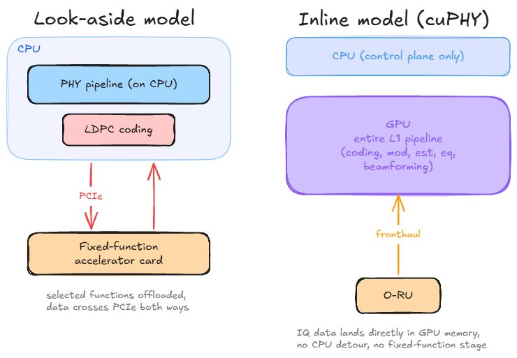
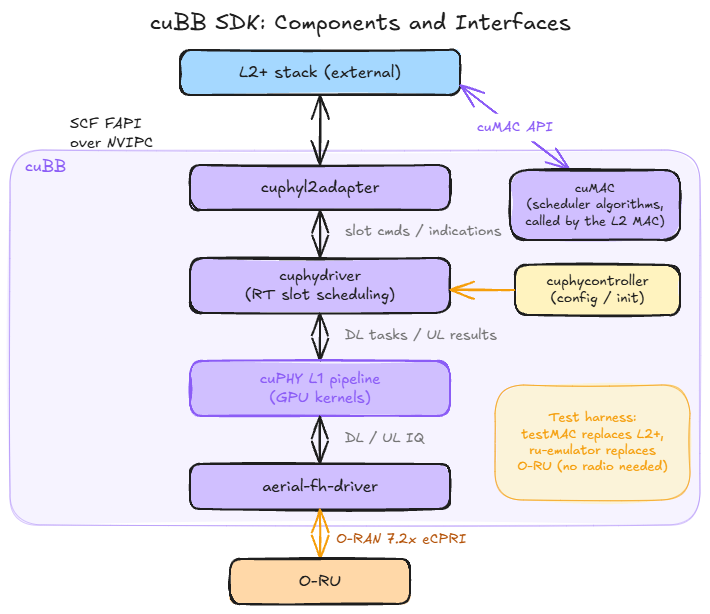
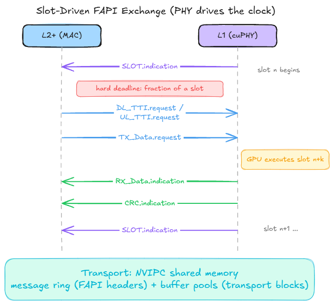
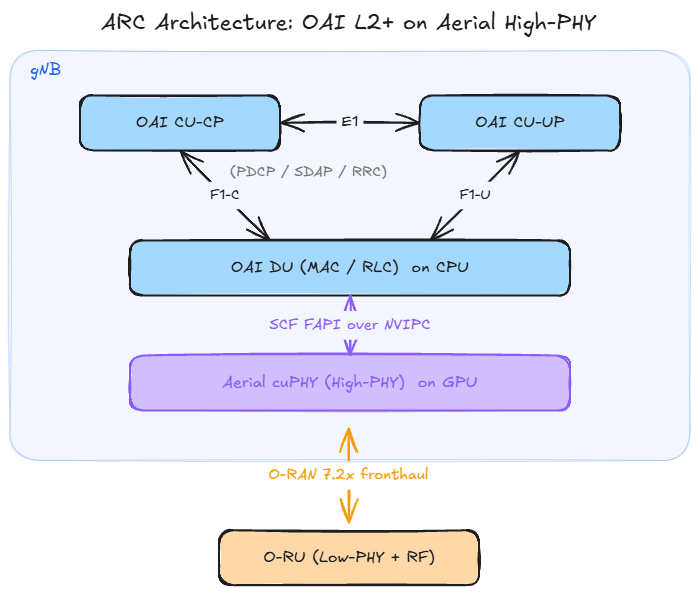
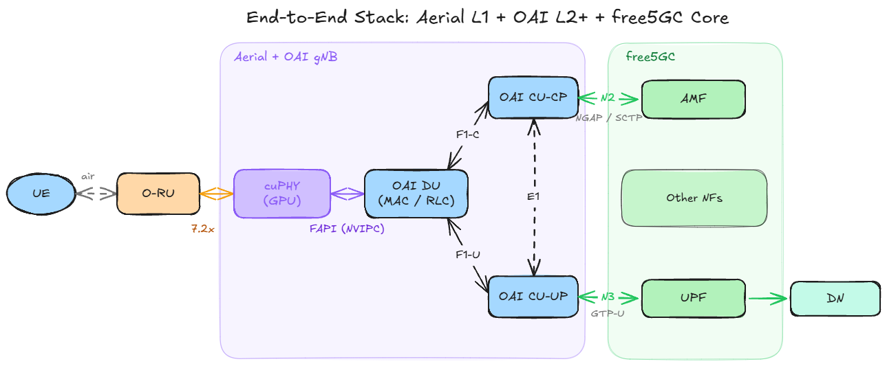

# From cuPHY to free5GC: GPU-Accelerated RAN with NVIDIA Aerial and OAI

>[!NOTE]
> Author: Chen Kuan Lin
> Date: 2026/09/02

---
## 1. Introduction

Most people who deploy free5GC today pair it with one of three kinds of RAN: a simulator such as UERANSIM, a software-defined radio stack such as srsRAN or OAI running on a USRP, or a commercial gNB. Each step up that ladder trades convenience for realism. Simulators are perfect for exercising the core network in isolation. SDR stacks add a real air interface but run the entire PHY on general-purpose CPU cores, which limits bandwidth, antenna configurations, and cell counts to far below what commercial deployments use.

NVIDIA Aerial sits at the top of that ladder while remaining software. It is a CUDA-accelerated, 3GPP and O-RAN compliant RAN platform in which the entire 5G physical layer runs as software on a GPU. The pitch is simple: carrier-grade L1 performance, but delivered as code you can study, modify, and connect to other open components. For a community built around an open source 5G core, that combination is worth understanding.

One thing should be stated clearly up front. free5GC and Aerial never talk to each other directly. Aerial covers the physical layer and parts of the MAC scheduler; free5GC covers the core. Between them sits an entire L2+ protocol stack (MAC, RLC, PDCP, RRC) that must come from a third project, and the choice of that middle piece defines the whole integration. This article walks through that architecture from the bottom up: what Aerial actually is, how its L1 talks to a MAC, how OAI fills the L2+ role in NVIDIA's validated stack, and where free5GC fits at the top. It is a conceptual guide, not a validated deployment recipe. No installation steps, hardware bills of materials, or configuration files appear here.

## 2. NVIDIA Aerial Architecture Overview

### 2.1 What cuBB Is

The heart of Aerial is the cuBB (CUDA Baseband) SDK, which contains two main pieces. **cuPHY** is a complete 5G NR physical layer implemented in CUDA: channel coding, modulation, channel estimation, equalization, beamforming, all of it executing as GPU kernels. **cuMAC** is a library of GPU-accelerated MAC scheduler algorithms, covering problems such as UE selection, PRB allocation, and MCS selection across multiple cells.

A common misreading is worth correcting early: cuMAC is not a MAC layer. The MAC protocol itself, along with RLC and everything above it, still runs on CPUs inside the L2+ stack. cuMAC accelerates the scheduling decisions that the MAC hands off to it, nothing more. If you remember one sentence from this section, make it this one: Aerial provides the L1 and offers to speed up L2 scheduling math, but it is not a gNB by itself.

### 2.2 Inline, Not Look-Aside

The most interesting design decision in cuPHY is *how* the acceleration happens. Traditional vRAN accelerators follow a look-aside model: the PHY runs on the CPU and offloads a few expensive functions, typically LDPC coding, to a dedicated accelerator card. Data crosses the PCIe bus to the accelerator, gets processed, and crosses back. Each round trip costs latency, and only the offloaded function benefits from the hardware.

cuPHY instead follows an inline model. The entire L1 pipeline executes on the GPU, and fronthaul traffic is delivered straight into GPU memory, so uplink samples arriving from the radio do not detour through CPU memory at all. There is no fixed-function accelerator anywhere in the design. The practical consequence is flexibility: because every stage of the PHY is software, any stage can be modified, instrumented, or replaced, which is exactly what makes the platform attractive for research on AI-native signal processing.

Figure 1. Look-aside acceleration versus the inline model used by cuPHY

### 2.3 The Components Around cuPHY

The cuBB SDK ships a control-plane layer, usually called cuPHY-CP, that turns the kernel library into a runnable L1. Four components matter for the conceptual picture. The **cuphycontroller** handles configuration and brings the L1 up. The **cuphydriver** is the real-time workhorse that schedules PHY tasks onto GPU streams slot by slot. The **cuphyl2adapter** exposes the standard FAPI interface northbound, and is covered in detail in Section 3. The **aerial-fh-driver** handles the O-RAN fronthaul southbound, moving packets between the NIC and GPU memory.

Two more components exist purely for testing, and knowing their names helps when reading Aerial documentation: **testMAC** plays the role of an L2 stack, and the **ru-emulator** plays the role of a radio unit. Together they let the L1 run end-to-end tests with no radio hardware and no real L2, which is also how most people encounter Aerial for the first time.

Figure 2. Main components of the cuBB SDK and their interfaces

Finally, Aerial includes **pyAerial**, a set of Python bindings that exposes cuPHY signal processing blocks to notebook-style experimentation, and the **Aerial Data Lake**, a capture pipeline for collecting over-the-air data to train machine learning models. Both target the AI-RAN research loop rather than the runtime data path, so this article leaves them at a mention. For a free5GC reader, the takeaway is that the same L1 that serves a live cell can double as a dataset generator and an ML testbed.

## 3. The L1-L2 Boundary: SCF FAPI and NVIPC

### 3.1 FAPI in One Paragraph

The Small Cell Forum's FAPI specification defines how a MAC talks to a PHY. It is a slot-driven, message-based contract. Each slot, the MAC sends the PHY a batch of requests describing what to transmit and what to receive: DL_TTI.request for downlink channels, UL_TTI.request for uplink ones, TX_Data.request carrying the actual downlink payload. The PHY answers with indications: RX_Data.indication for decoded uplink data, CRC.indication for decoding results, and above all SLOT.indication, the heartbeat by which the PHY tells the MAC that a new slot has begun. FAPI is deliberately vendor-neutral, and that neutrality is what makes the whole architecture in this article possible.

### 3.2 The L2 Adapter and the Timing Contract

Inside Aerial, the cuphyl2adapter terminates FAPI on the L1 side. It receives the per-slot request messages from the MAC, translates them into the slot command structures that the cuphydriver executes on the GPU, and sends the resulting indications back up. The timing relationship is worth spelling out because it inverts what one might expect: the PHY drives the clock. Every slot, the L1 emits a SLOT.indication, and the MAC has a hard deadline, a fraction of a slot, to respond with the requests for an upcoming slot. A MAC that misses the deadline does not degrade gracefully; the slot simply goes unserved. This is the real-time contract any L2+ stack must honor to sit on top of cuPHY, and it shapes everything about how the two processes communicate.

Figure 3. The slot-driven FAPI exchange between the L2+ stack and cuPHY

### 3.3 Why NVIPC Exists

That deadline is the reason Aerial ships its own inter-process transport, NVIPC, instead of using sockets or a generic message queue. The L2 stack and the L1 run as separate processes, and NVIPC connects them over shared memory with lock-free queues, so a message send is essentially a memory write plus a notification. NVIPC also separates small control messages from large data payloads: FAPI headers travel through the message ring while transport blocks sit in dedicated buffer pools, which avoids copying megabytes of user data through a control channel every slot. None of this is conceptually exotic. It is the standard playbook for hard real-time IPC, applied so that a third-party MAC written against FAPI can keep up with a GPU-speed PHY.

### 3.4 Southbound: O-RAN 7.2x Fronthaul

Below cuPHY, the aerial-fh-driver implements the O-RAN open fronthaul interface toward the O-RU, exchanging IQ data as standardized eCPRI packet flows that land directly in GPU memory, as Section 2.2 described. With FAPI above and open fronthaul below, both borders of the L1 are open interfaces, which is precisely why third-party stacks can attach to either side.

## 4. OAI as the L2+ Stack: The NVIDIA-Validated Path

### 4.1 A Quick Recap: The O-RAN CU/DU Split

Before looking at how OAI connects to Aerial, it helps to recall how O-RAN decomposes a gNB. The Centralized Unit (CU) hosts PDCP, SDAP, and RRC. It is further divided into a control-plane part (CU-CP) and a user-plane part (CU-UP), which talk to each other over the E1 interface. Below the CU sits the Distributed Unit (DU), which hosts RLC, MAC, and the upper part of PHY. CU and DU communicate over F1, split into F1-C and F1-U.

O-RAN then applies a second split inside the PHY itself. In the 7.2x split, High-PHY stays in the DU while Low-PHY moves into the Radio Unit (O-RU), and the two are connected by the open fronthaul interface.

In this decomposition, Aerial's cuPHY occupies exactly one slot: it is the High-PHY of the DU, accelerated on the GPU. Everything above it still has to come from somewhere. MAC, RLC, PDCP, and RRC are not part of Aerial. That missing piece is the L2+ stack, and this is where OAI comes in.

### 4.2 The ARC Architecture: OAI Meets cuPHY

OpenAirInterface (OAI) is the L2+ stack that NVIDIA has officially integrated and validated with Aerial, packaged as the Aerial RAN CoLab (ARC-OTA) platform. ARC-OTA combines Aerial's L1 with OAI's DU and CU and a 5G core, forming a 3GPP Release 15 compliant, O-RAN 7.2x split, 4T4R standalone 5G stack.

What makes the integration work is that neither side needed a proprietary interface. OAI's MAC produces standard SCF FAPI messages, the same slot-based commands described in Section 3, and Aerial's L2 Adapter consumes them over NVIPC shared memory. To OAI, cuPHY looks like any FAPI-compliant PHY that happens to run on a GPU. All the CUDA machinery stays hidden below the FAPI boundary.

Figure 4. The ARC architecture: OAI provides the L2+ layers, Aerial provides the GPU-accelerated High-PHY

### 4.3 OCUDU: An Emerging Alternative

A newer entrant in the L2+ landscape is OCUDU (Open CU/DU), an open-source CU/DU stack that describes its ambition as becoming the "Linux of RAN". It is not a from-scratch effort: OCUDU builds on the proven srsRAN Project codebase, transferred to a permissive license under Linux Foundation governance. OCUDU splits the gNB into CU-CP, CU-UP, DU-High, and DU-Low components. The mapping onto the architecture above is direct: OCUDU provides the layers above the FAPI boundary, and Aerial's cuPHY takes the place of DU-Low.

Compared with OAI, OCUDU treats the CU-CP/CU-UP/DU separation as a first-class design decision rather than a deployment option, which fits cloud-native orchestration well. The codebase inherits srsRAN's maturity, but the project around it is young. As of this writing, publicly documented end-to-end deployments with Aerial are still scarce, and there is no equivalent of the ARC validation program behind it yet. For now, OAI is the path with an established validation trail, while OCUDU is worth following as it matures.

## 5. Bringing free5GC into the Picture

### 5.1 Replacing the Core in the Validated Stack

The ARC-OTA reference stack ships with OAI's own core network, OAI CN5G. Nothing about that choice is architecturally load-bearing. The RAN faces the core through exactly two reference points: N2, carrying NGAP over SCTP between the CU-CP and the AMF, and N3, carrying user traffic as GTP-U tunnels between the CU-UP and the UPF. Both are 3GPP-standardized interfaces, and neither reaches below the CU. From the core's point of view, a gNB whose physical layer runs on a GPU is indistinguishable from any other gNB; from cuPHY's point of view, the core does not exist at all.

This is the pivot on which the whole article turns. Because the CN attaches above the CU, swapping OAI CN5G for free5GC changes nothing in the Aerial or FAPI layers described in Sections 2 through 4. The integration question reduces to a familiar one that the free5GC community has answered many times before: connecting free5GC to an OAI-based gNB over N2 and N3.

### 5.2 What free5GC Brings to a GPU-Accelerated Testbed

If the swap is architecturally neutral, why make it? Because the core is where free5GC adds the value that a RAN-centric reference stack leaves on the table.

First, completeness of the service-based architecture. free5GC implements the full set of network functions as independent services, including NRF, PCF, NSSF, and UDR, each exposing standard SBI APIs. A testbed built to study end-to-end behavior, rather than just RAN throughput, benefits from a core in which every control-plane interaction is present and observable.

Second, network slicing. free5GC supports S-NSSAI-based slicing through its NSSF and per-slice UPF deployment, and slicing is the kind of end-to-end feature that becomes far more interesting to study when a capable RAN sits below the core. A GPU-accelerated L1 that can sustain many cells makes multi-slice scenarios worth studying rather than merely configuring.

Third, the cloud-native ecosystem. free5GC already has mature Helm charts, operator patterns, and Nephio-based automation, all documented in earlier posts on this blog. The Aerial architecture, with its containerized L1 and disaggregated CU/DU, is heading toward the same Kubernetes-shaped world. A core network that already lives comfortably in that world is the natural counterpart.

Finally, observability and experimentation. The webconsole, the Go codebase, and the community's habit of using free5GC as a research vehicle mean that questions arising at the core (mobility, session management, policy) can be investigated in source code rather than treated as a black box. That mirrors exactly what Aerial offers at L1, and the symmetry is the point: an end-to-end 5G system in which every layer, from GPU kernels to the AMF, is open to inspection.

### 5.3 The Resulting End-to-End Picture

Figure 5. The complete stack: Aerial L1, OAI L2+, and free5GC joined at standard interfaces

Putting all the pieces together, Figure 5 traces the full path of a packet. A UE transmits over the air to the O-RU, which forwards IQ data over O-RAN 7.2x fronthaul into cuPHY on the GPU. Decoded transport blocks cross the FAPI boundary through NVIPC into the OAI DU, climb through RLC and PDCP in the DU and CU, and leave the CU-UP as GTP-U packets on N3, terminating at the free5GC UPF. Control signaling follows the parallel path through the CU-CP and N2 into the free5GC AMF. Three open projects, two standard seams (FAPI and N2/N3), one continuous stack.

## 6. Conclusion

The integration described in this article is best understood as three layers joined at two standard interfaces. Aerial contributes a physical layer that runs entirely on a GPU and speaks FAPI upward and O-RAN fronthaul downward. OAI contributes the validated L2+ stack that turns that L1 into a complete gNB, with OCUDU emerging as a possible alternative worth watching. free5GC contributes a complete, cloud-native core that attaches over N2 and N3, indifferent to and undisturbed by everything below the CU.

None of the seams required anything proprietary, and that is the real lesson. The two seams this article traced, FAPI and N2/N3, are open specifications, and so are F1 and E1 inside the gNB itself. Each open interface is a place where one component can be swapped without renegotiating the rest of the stack. The same property that let NVIDIA validate OAI on top of cuPHY is the property that lets free5GC replace the reference core.

Looking forward, the interesting work sits at both ends of the stack. At the bottom, pyAerial and the Data Lake open the L1 to machine learning research, in line with the broader AI-RAN direction in which signal processing blocks are learned rather than hand-designed. At the top, a fully featured core makes it possible to study how slicing, policy, and mobility behave when the RAN underneath is no longer the bottleneck. An open GPU-accelerated RAN paired with an open core is the kind of platform on which 6G research will plausibly be built, and both halves of it already exist today.

## References

1. [NVIDIA Aerial CUDA-Accelerated RAN documentation.](https://docs.nvidia.com/aerial/cuda-accelerated-ran/latest/)
2. NVIDIA Aerial RAN CoLab Over-the-Air (ARC-OTA) documentation.
3. Small Cell Forum, *5G FAPI: PHY API Specification*.
4. D. Villa et al., *X5G: An Open, Programmable, Multi-vendor, End-to-end, Private 5G O-RAN Testbed with NVIDIA ARC and OpenAirInterface*.
5. OCUDU project repository.
6. [free5GC documentation and blog.](https://free5gc.org/)
7. 3GPP TS 38.401; 3GPP TS 23.501.

## About Me

Grad student by day, grad student by night. There's no other version of me right now. My work is interesting, my schedule is not, and my relationship with deadlines is best described as complicated. Ask me again after I graduate.
- GitHub: [DBGR](https://github.com/DBGR18)

