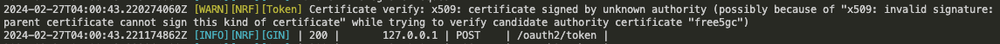

# Enable OAuth2 on SBI

In this demo, we will practice:

- Enable OAuth2 on SBI
- Configuring NRF and NFs


## 1. Enable OAuth2 in NRF

In the NRF configuration file ```nrfcfg.yaml```:

```yaml
configuration:
  sbi: # Service-based interface information
    oauth: true   # false
```
Set ```oauth``` from ```false``` to ```true```. 


## 2. Set NRF Certificate path in Each NF

In each NF configuration file, we need to specify the path to the NRF certificate.

```yaml
configuration:
    nrfCertPem: cert/nrf.pem # NRF Certificate
```

If the OAuth is set to enable but there is no ```nrfCertPem``` set in NF, this would lead to the following error:


## 3. Run free5GC

Use ```run.sh``` to start 5GC.

```shell
./run.sh
```

For now, the free5GC SBI runs the service with OAuth2. 


## Note

Since the default certificates we provide in ```cert/``` are auto-generated by code which didn't signed by known authority,  we would lead to the following warning:



```
2024-02-27T04:00:43.217044025Z [WARN][NRF][Token] Certificate verify: x509: certificate signed by unknown authority (possibly because of "x509: invalid signature: parent certificate cannot sign this kind of certificate" while trying to verify candidate authority certificate "free5gc")
```


## Appendix

- [Design Document](./OAuth2Design.md)
