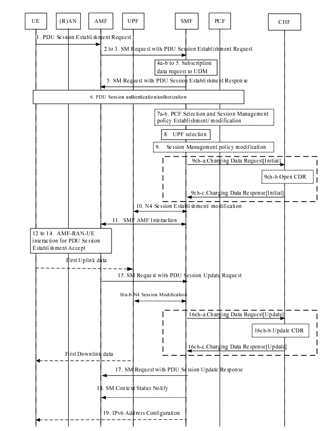

# PCF Charging Software Design Architecture

>[!NOTE]
> Author: [Andy Chen (CTFang)](https://www.linkedin.com/in/tsung-fang-chen-437a71191/)
> Date: 2024/05/07

**PCF:  Policy Control Function**

Relative specs:

- *TS 29.507 Access and Mobility Policy Control Service*
- *TS 23.503 Policy and Charging Control Framework for the 5G System (5GS)*
- *Ts 29.513 Policy and Charging Control Signalling flows and QoS parameter mapping*
- *Ts 23.255 Telecommunication management; Charging management; 5G data connectivity domain charging* 

The 3GPP defines the FBC(Flow-Based Charging) and QBC (QoS-Based Charging). 

However, *free5GC v3.4.1* supports **FBC** only. 

## RatingGroup Allocate

> PDU session establishment, described in *3GPP TS 32.255 clause 5.2.2.2.2*

Charging on PDU Session is achieved by **FBC charging, with specific rating group/service identifier**:

- The **rating group** would be allocated by PCF during SM Policy Authorization (Step 6).
    - Get chargingData from MongoDB collection `policyData.ues.chargingData`.
    - Allocate **rating group** to each charging rule.
    - Create new chargingData with rating group in MongoDB. 
    - Create PCC Rule for charging with rating group, SDF template, and charging method.
    - Make Decision from PCC Rule to SMF. 

- When PCF `HandleDeleteSmPolicyContextRequest`, the new chargingData with rating group would be deleted. 

## CHF

CHF would use rating group from MongoDB (`policyData.ues.chargingData`) to calculate the usage and grant quota. 

- ABMF (Account Balance Management Function)
- Rating Function

## Others

- [CHF design document](./../Chf/design.md)
