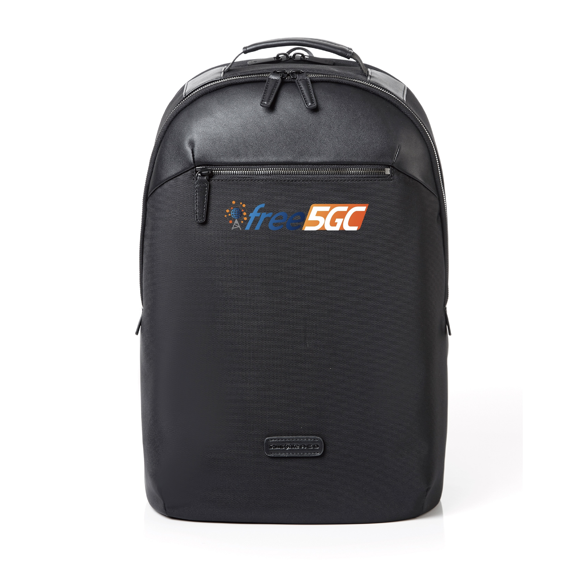
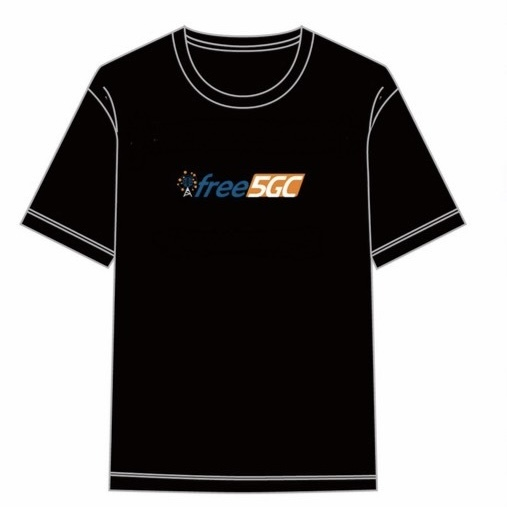
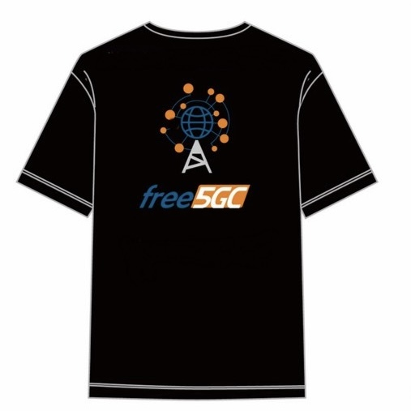

# Registration

## Non-author Registration

| Category | Fee (NTD) |
| - | - |
| Non-ACM/SIGSAC Member | 15,000 |
| ACM/SIGSAC Member | 12,000 |
| Student | 2,000 |

## Author Registration

| Category | Fee (NTD) |
| - | - |
| Non-ACM/SIGSAC Member | 15,000 |
| ACM/SIGSAC Member | 12,000 |
| Student Non-ACM/SIGSAC Member | 15,000 |
| Student ACM/SIGSAC Member | 12,000 |

To register, click the “Register Now” button below and follow the prompts. If you have any questions or need assistance, please contact us at [free5gc2026@gmail.com](mailto:free5gc2026@gmail.com).

[Register Now](https://www.accupass.com/event/2609210731261628701645){ .md-button .register-btn target="_blank" rel="noopener" }

## Notes

1. **All full registrants (paying NTD 15,000 or NTD 12,000) who register before October 31, 2026, will receive a Samsonite free5GC backpack valued at NTD 6,000.**

    { width="254" }

2. Attendees may also enjoy a complimentary English-guided visit to the TSMC Museum of Innovation. This exclusive tour is limited to the first 20 full registrants (paying NTD 15,000 or NTD 12,000).
3. All registration fees include a free5GC T-shirt.

    { width="254" } { width="254" }

4. At least one author of each accepted paper must register for the conference. Each author registration can be used for one paper only.
5. If an author registers as a non-author before their paper is accepted, please email the author list, paper title, and paper ID to [free5gc2026@gmail.com](mailto:free5gc2026@gmail.com) once the paper has been accepted.
6. Student registrants must present proof of student status, such as a student ID, upon arrival.
7. Additional T-shirts are available for NTD 600 each.
8. Additional backpacks are available for NTD 6,000 each.
9. **Cancellation and Refund Policy**: Please review the following terms before making payment:

    a. **Authors**: Registration fees are strictly non-refundable.
    b. **Non-authors**: A 50% refund is available for requests submitted at least 30 days before the event (November 16, 2026). No refunds will be issued for requests submitted within 30 days of the event.
    c. **Event cancellation due to force majeure**: If the forum is cancelled due to natural disasters, government orders, or other force majeure events, a 90% refund will be issued. A non-refundable administrative fee of 10% will apply.
    d. **How to apply**: Email [nycucs2023@gmail.com](mailto:nycucs2023@gmail.com) with the subject line: `[Refund Request] free5GC Forum – [Attendee Name]`. Please include your Order ID and bank account details. Any interbank transfer fees will be deducted from the refund amount.

10. **Receipt Issuance Policy**: The organizer will issue an official receipt (not a Uniform Invoice/Government Uniform Invoice). If you require a receipt, please contact the organizer in advance at [nycucs2023@gmail.com](mailto:nycucs2023@gmail.com) and provide your institution or school name (Buyer's Title) and Tax ID number (Unified Business Number).
