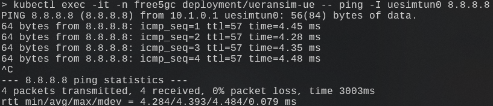

# free5gc-helm

## Prerequirements

- Install

    - MicroK8s

        ```bash
        sudo snap install microk8s --classic --channel=1.28/stable
        ```

    - kubectl

        ```bash
         sudo snap install kubectl --classic
        ```

    - helm

        ```bash
        sudo snap install helm --classic
        ```

    - k9s (Optional)

        We recommend using [k9s](https://github.com/derailed/k9s). It provides a terminal UI to interact with your Kubernetes cluster.
        For other details, see: [k9s-installation-guide](https://github.com/derailed/k9s#installation)
        ```bash
        snap install k9s --devmode
        ```

- Set `sudo` group and join

    ```bash
    sudo groupadd microk8s
    sudo usermod -aG microk8s $USER
    newgrp microk8s
    ```

- Set [`microk8s` work with local `kubectl`](https://microk8s.io/docs/working-with-kubectl)

    ```bash
    mkdir -p ~/.kube
    chmod 0700 ~/.kube
    microk8s config > ~/.kube/config
    ```


## IP Forward Configuration

> [!NOTE]
> Reference: [Calico CNI Docs](https://docs.tigera.io/calico/latest/reference/configure-cni-plugins#container-settings).

- Starting from version 1.19, MicroK8s clusters use the **Calico CNI** by default.

    - To enable IP forwarding on UPF, Calico CNI needs some necessary configurations.
    - Some CNI plugin, like Flannel, kube-ovn, allow this funtionality by default.

- Setup Calico CNI for IP forwarding:

    - Edit `/var/snap/microk8s/current/args/cni-network/cni.yaml`

        ```yaml
        ...
        kind: ConfigMap
        ...
        data:
            ...
            cni_network_config: |-
                {
                    ...
                    "plugins": [
                        {
                            "type": "calico",
                            ...
                            "kubernetes": {
                                "kubeconfig": "__KUBECONFIG_FILEPATH__"
                            },
                            # append IP forwarding settings
                            "container_settings": {
                                "allow_ip_forwarding": true
                            },
                        }
                    ]
                }
        ```

- Setup kubelet args for IP fowarding:

    - Edit `/var/snap/microk8s/current/args/kubelet`

        ```bash
        # append this arg
        --allowed-unsafe-sysctls "net.ipv4.ip_forward"
        ```

- Apply settings and restart MicroK8s

    ```bash
    # apply cni configuration
    kubectl apply -f /var/snap/microk8s/current/args/cni-network/cni.yaml
    # restart MicroK8s
    microk8s stop
    microk8s start
    ```

## Addons Enable

> [!Note]
> Reference:
>
> - [MicroK8s multus addons](https://microk8s.io/docs/addon-multus)
> - [Multus - Create Network Definitions](https://github.com/k8snetworkplumbingwg/multus-cni/blob/v3.9/docs/how-to-use.md#create-network-attachment-definition)
> - [Multus - Tell pods to use those networks via annotations](https://github.com/k8snetworkplumbingwg/multus-cni/blob/v3.9/docs/how-to-use.md#run-pod-with-network-annotation)

```bash
# required
microk8s enable hostpath-storage

# optional: only required when deploying with multus mode
microk8s enable community
microk8s enable multus
```

## Create Persistent Volumn


> [!NOTE]
> CNTI best practice removes cert PVC usage and uses Secrets/ConfigMaps for certs.
> You only need to configure MongoDB PV parameters in the chart values file.

- Update MongoDB PV settings in `free5gc-helm/charts/free5gc/charts/mongodb-15.6.0/values.yaml` under `extraDeploy`.
- Set your local storage path and node name in the embedded PV manifest.

```yaml
extraDeploy:
    - |
        apiVersion: v1
        kind: PersistentVolume
        metadata:
            name: free5gc-pv-mongo
        spec:
            local:
                path: <mongo_storage_dir> # edit to your own path, e.g. /home/usr/mongo
            nodeAffinity:
                required:
                    nodeSelectorTerms:
                        - matchExpressions:
                                - key: kubernetes.io/hostname
                                    operator: In
                                    values:
                                        - <worker-node-name> # edit to your own node name, e.g. : ubuntu
```

## Helm Chart

- Clone from github

    ```bash
    git clone https://github.com/free5gc/free5gc-helm.git
    ```

## Network configuration

> [!Note]
> Reference: [Toward5Gs -- Network Configuration](https://github.com/Orange-OpenSource/towards5gs-helm/tree/main/charts/free5gc#networks-configuration)

- In summary, the `value.yaml` in each configuration should be set up correctly.

    - **free5gc-helm** offered a network configuration YAML file at `free5gc-helm/charts/free5gc/value.yaml`.
    - For `N2`/`N3`/`N4`/`N6`/`N9` interfaces, the `masterIf` and other `IP` field should be modified for customized deployment.
    
- **(Optional)** These values could also be setup by using `helm install --set`.

    ```bash
    helm install -n free5gc free5gc-helm ./free5gc/ \
        --set global.upf.multus.n6network.subnetIP="x.x.x.x" \
        --set global.upf.multus.n6network.gatewayIP="y.y.y.y" \
        --set global.upf.multus.upf.n6if.ipAddress="z.z.z.z"
    ```

## How to deploy & test

### Non-Multus Deploy (Default)

1. **Prerequisites:** Follow [Prerequirements](#prerequirements).
2. **Node Setup:** Follow [IP Forward Configuration](#ip-forward-configuration).
3. **Addons:** Follow [Addons Enable](#addons-enable).
4. **PV Setup:** Follow [Create Persistent Volumn](#create-persistent-volumn).
5. **Install:** Run `helm install`.

    ```bash
    cd free5gc-helm/charts
    kubectl create ns free5gc

    helm install -n free5gc free5gc-helm ./free5gc/ 

    helm install -n free5gc ueransim ./ueransim/
    ```

### Multus Deploy

1. **Prerequisites:** Follow [Prerequirements](#prerequirements), [IP Forward Configuration](#ip-forward-configuration), and [Addons Enable](#addons-enable).
2. **PV Setup:** Follow [Create Persistent Volumn](#create-persistent-volumn).
3. **Configuration (charts/free5gc/values.yaml):**
    - Set `amf/smf/upf: multus.enabled` -> `true`.
    - Set `amf.service.ngap` -> `false`.
4. **UERANSIM:** Set `multus.enabled` -> `true` in `charts/ueransim/values.yaml`.
5. **Network:** Configure `masterIF`, `n6 ip pool`, and subnets as usual.
6. **Install:** Run `helm install`.

### Single UPF Deploy

*Applicable to both Multus and Non-Multus modes.*

1. **Configuration:** In `charts/free5gc/values.yaml`, set `global.userPlaneArchitecture` -> `single`.
2. **File Overwrites:**
    - Copy `free5gc-smf/smf-configmap-single-upf.yaml` to `free5gc-smf/templates/smf-configmap.yaml`.
    - Copy `free5gc-smf/single-upf-values.yaml` to `free5gc-smf/values.yaml`.
3. **Install:** Run `helm install`.

    ```bash
    cd free5gc-helm/charts
    kubectl create ns free5gc

    cp free5gc/charts/free5gc-smf/single-upf-values.yaml \
       free5gc/charts/free5gc-smf/values.yaml
    cp free5gc/charts/free5gc-smf/smf-configmap-single-upf.yaml \
       free5gc/charts/free5gc-smf/templates/smf-configmap.yaml

    helm install -n free5gc free5gc-helm ./free5gc/ 
    helm install -n free5gc ueransim ./ueransim/ 
    ```

### Check installation

- Check installed charts

    ```bash
    helm ls -A
    ```

- Check services, pods, replicas, and deployments

    ```bash
    # status at each pod is expected as "Running"
    kubectl get all -n free5gc
    ```

- Check IP forwarding is available at UPF

    ```bash
    # output should be '1'
    kubectl exec -it -n free5gc deployment/free5gc-helm-free5gc-upf-upf \
        -- cat /proc/sys/net/ipv4/ip_forward
    ```

## Test

- Add subscribers via web console

    - Access ``<external_ip>:30500`

        

- Ping external network with GTP-Tunnel

    ```bash
    kubectl exec -it -n free5gc deployment/ueransim-ue \
        -- ping -I uesimtun0 8.8.8.8
    ```

    
