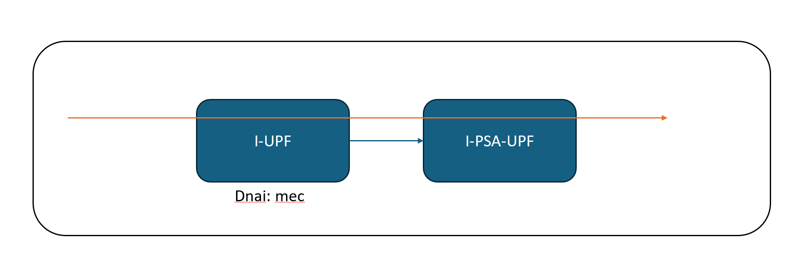
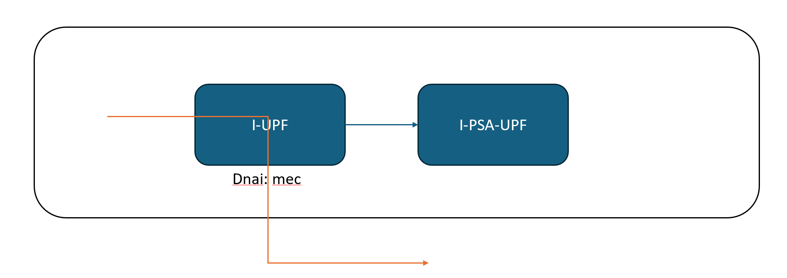
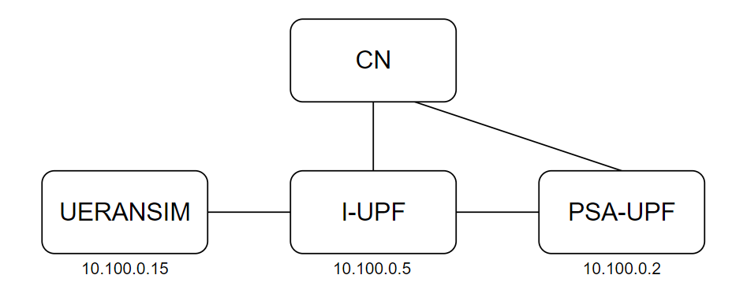
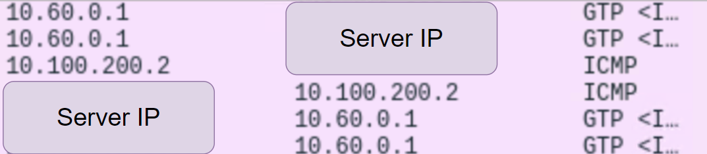
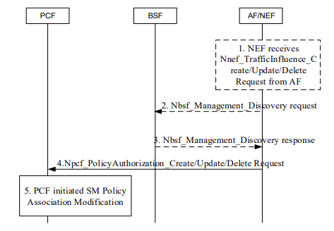

# Influence Traffic Routing
- The SMF may control the data path of a PDU Session so that the PDU Session may simultaneously correspond to multiple N6 interfaces.
- We have provided some smaple scripts under the free5gc-compose, you can test the content in this note with
    ```sh
    sudo docker run --rm --network <free5gc-nw-name> \
        -v "$(pwd):/mnt" -w /mnt curlimages/curl <script.sh>
    ```
## Influence traffic routing by UDR
- Traffic routing can be triggered by storing/updating/removing the information in UDR.
### Example usage of traffic influence
- In the [free5gc-compose](https://github.com/free5gc/free5gc-compose/tree/master), we have [a compose file for ulcl](https://github.com/free5gc/free5gc-compose/blob/master/docker-compose-ulcl.yaml), with two default UPFs: I-UPF and PSA-UPF.
- Suppose that we want to let mec traffic go through the I-UPF, others go through the PSA-UPF.

    | Others (Default) | MEC (after TI) |
    | -------- | -------- |
    |  |  |

- We could put the influence data to UDR, triggering traffic influence process and influence the traffic routing.
    - Sample traffic influence data: `ti_data.json`
        ```json
        {
            "dnn": "internet",
            "snssai": {
                "sst": 1,
                "sd": "010203"
            },
            "interGroupId": "AnyUE",
            "trafficFilters": [
            {
                "flowId": 1,
                "flowDescriptions": [
                    "permit out ip from <server-cidr> to 10.60.0.0/16"
                ]
            }
            ],
            "trafficRoutes": [
                {
                    "dnai": "mec"
                }
            ]
        }
        ```
    - Use curl to put the data to the UDR.
        ```sh
        curl -X PUT -H "Content-Type: application/json" --data @./ti_data.json \
            http://<udr-interface>:8000/nudr-dr/v1/application-data/influenceData/1
        ```
    - To check the created influence data, use the following command.
        ```sh
        curl -X GET -H "Content-Type: application/json" \
	        http://<udr-interface>:8000/nudr-dr/v1/application-data/influenceData?dnns=internet
        ```
    - You can also remove the traffic influence data by the following command.
        ```sh
        curl -X DELETE -H "Content-Type: application/json" \
	        http://<udr-interface>:8000/nudr-dr/v1/application-data/influenceData/1
        ```
### Screenshots
- We use this sample topology to show the example usage of traffic influence
    
- Traffic routing before influence
    - ping `1.1.1.1` (UERANSIM <-> I-UPF <-> PSA-UPF <-> Server)
        
    - ping `remote server` (UERANSIM <-> I-UPF <-> PSA-UPF <-> Server)
        
- Traffic routing after influence
    - ping `1.1.1.1` (UERANSIM <-> I-UPF <-> PSA-UPF <-> Server)
        
    - ping `remote server` (UERANSIM <-> I-UPF <-> Server)
        
## Influence traffic routing by NEF
- An Application Function (AF) may send requests to influence SMF routing decisions for User Plane traffic of PDU Sessions. 
- The AF requests may influence UPF (re)selection and allow routing of user traffic to a local access (identified by a DNAI) to a Data Network.

### AF requests targeting a group of UE

> TS 23.502 figure 4.3.6.2-1 Processing AF requests to influence traffic routing for Sessions not identified by an an UE address

- Example usage in free5GC
    - AF send JSON data to NEF, e.g. `af_ti_anyUE.json`
        ```json
        {
            "afServiceId": "Service1",
            "dnn": "internet",
            "snssai": {
                "sst": 1,
                "sd": "010203"
            },
            "anyUeInd": true,
            "notificationDestination": "http://af:8000/test123",
            "trafficFilters": [{
                "flowId": 1,
                "flowDescriptions": [
                    "permit out ip from <server-cidr> to 10.60.0.0/16"
                ]
            }],
            "trafficRoutes": [
                {
                    "dnai": "mec"
                }
            ]
        }
        ```
    - Use curl to POST the data to NEF.
        ```sh
        curl -X POST -H "Content-Type: application/json" --data @./af_ti_anyUE.json \
            http://<nef-interface>:8000/3gpp-traffic-influence/v1/af001/subscriptions
        ```

### AF requests targeting an individual UE 

> TS 23.502 figure 4.3.6.4-1 Handling an AF request targeting an individual UE address to the relevant PCF

- Example usage in free5GC
    - Provide PFDs in `uerouting.yaml` before SMF start up
        ```yaml
        //...
        pfdDataForApp: # PFDs for an Application
            - applicationId: app1 # Application identifier
                pfds: # PFDs for the Application
                  - pfdID: pfd1 # PFD identifier
                    flowDescriptions: 
                      - permit out ip from <server-cidr> to 10.60.0.0/16
        ```
        - Packet Flow Description (PFD): A set of information enabling the detection of application traffic provided by a 3rd party service provider. 
    
    - AF send JSON data to NEF, e.g. `af_ti_singleUE.json`
        ```json
        {
            "afServiceId": "Service1",
            "AfAppId": "app1",
            "dnn": "internet",
            "snssai": {
                "sst": 1,
                "sd": "010203"
            },
            "ipv4Addr": "10.60.0.1",
            "notificationDestination": "http://af:8000/test123",
            "trafficRoutes": [{
                "dnai": "mec"
            }],
            "suppFeat": "01"
        }
        ```
    - Use curl to POST the data to NEF.
        ```sh
        curl -X POST -H "Content-Type: application/json" --data @./af_ti_singleUE.json \
            http://<nef-interface>:8000/3gpp-traffic-influence/v1/af001/subscriptions
        ```
