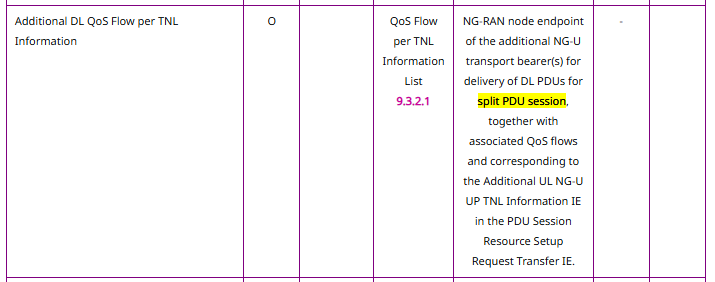

# NR-DC(New Radio-Dual Connectivity)

> [!Note]
> Introduction for NR-DC, please refer to: [Introducing NR-DC: Dual Connectivity for Next-Gen 5G Capabilities](https://free5gc.org/blog/20250219/20250219/)


## Types

In real 5G networks, the NR-DC feature can be implemented in two ways:

1.[**Static Approach**](#static-approach): Two tunnels are established when the gNB and UE's PDU session starts.
2. [**Dynamic Approach**](#dynamic-approach): After the PDU session is established, the gNB can dynamically offload QoS traffic to the secondary gNB or retrieve the traffic at any time.

## Static Approach

### Expected Behavior

- After PDU session established, there will be **TWO TUNNEL** in this PDU session:
    1. The first tunnel(handled by Master-gNB): forward the default(non-specified QoS traffic) traffic.
    2. The second tunnel(handled by Secondary-gNB): forward the specified QoS traffic configured via [webconsole](https://free5gc.org/guide/Webconsole/Create-Subscriber-via-webconsole/).

### Implementation Details

As mentioned above, static approach stands for two tunnels will be established during PDU session stablishment. So, in the procedure of PDU session establishment, we need to do some modification.

According to [TS 23.502 4.3.2.2](https://www.tech-invite.com/3m23/tinv-3gpp-23-502.html), the steps 11 to 16 will be the PDU session's tunnels configuration procedure:

<!-- ```mermaid
sequenceDiagram
    participant UE
    participant Master-gNB
    participant AMF
    participant SMF
    participant UPF

    SMF->>AMF: 11. N1N2 Message Transfer
    AMF->>Master-gNB: 12. N2 PDU Session Request
    Master-gNB<<->>UE: 13. PDU Session Establishment Accept
    Master-gNB->>AMF: 14. N2 PDU Session Response
    AMF->>SMF: 15. Update SMContext Request
    SMF<<->>UPF: 16. N4 Session Modification
``` -->


In the general case, step 11 (N1N2 Message Transfer) contains a single UPLINK TEID and related information, allowing the gNB to determine where to forward the packet.
However, in NR-DC, the SMF generates **TWO UPLINK TEIDs** for the two tunnels. Both are stored as `ngapType.PDUSessionResourceSetupRequestTransferIEs`: one `under ngapType.ProtocolIEIDULNGUUPTNLInformation`, and the other under `ngapType.ProtocolIEIDAdditionalULNGUUPTNLInformation`.

> [!Note]
> According to [TS 38.413 9.4.3.1](https://www.tech-invite.com/3m38/tinv-3gpp-38-413.html), `AdditionalULNGUUPTNLInformation` can carry the secondary UPLINK TEID for the second tunnel using.
> 

After receiving these two UPLINK TEIDs, if the Master-gNB is configured as turning on the DC function, it should save the first UPLINK TEID for itself using and send the additional(second) UPLINK TEID to the Secondary-gNB via Xn-interface. Once the Secondary-gNB get the UPLINK TEID, it returns its DOWNLINK TEID back to the Master-gNB.

<!-- ```mermaid
sequenceDiagram
    participant Master-gNB
    participant Secondary-gNB
    participant AMF

    AMF->>Master-gNB: 12. N2 PDU Session Request
    
    Note over Master-gNB, Secondary-gNB: Xn-interface
    Master-gNB->>Secondary-gNB: Second UPLINK TEID
    Secondary-gNB->>Master-gNB: Second DOWNLINK TEID
    Note over Master-gNB, Secondary-gNB: Xn-interface

    Master-gNB->>AMF: 14. N2 PDU Session Response
``` -->


Finally, Master-gNB will encapsolate these **TWO DOWNLINK TEIDs** into the data type of `ngapType.PDUSessionResourceSetupResponseTransfer`, the first one is under `DLQosFlowPerTNLInformation` and the other is under `AdditionalDLQosFlowPerTNLInformation`. Then, these IEs will be send back to core network as N2 PDU Session Response in step 14.

> [!Note]
> Accordint to [TS 38.413 9.3.4.2](https://www.tech-invite.com/3m38/tinv-3gpp-38-413.html), `AdditionalDLQosFlowPerTNLInformation` can carry the secondary DOWNLINK TEID for the second tunnel using.
> 

Here we take [PacketRusher](https://github.com/HewlettPackard/PacketRusher)'s `buildPDUSessionResourceSetupResponseTransfer` function as example:

- For basic, no NR-DC, it only contains **FIRST_DOWNLINK_TEID** and **MASTER_GNB_IP**:

    ```go
    func buildPDUSessionResourceSetupResponseTransfer() (data customNgapType.PDUSessionResourceSetupResponseTransfer) {
        // QoS Flow per TNL Information
        qosFlowPerTNLInformation := &data.QosFlowPerTNLInformation
        qosFlowPerTNLInformation.UPTransportLayerInformation.Present = ngapType.UPTransportLayerInformationPresentGTPTunnel
        // UP Transport Layer Information in QoS Flow per TNL Information
        upTransportLayerInformation := &qosFlowPerTNLInformation.UPTransportLayerInformation
        upTransportLayerInformation.Present = ngapType.UPTransportLayerInformationPresentGTPTunnel
        upTransportLayerInformation.GTPTunnel = new(ngapType.GTPTunnel)
    =>  dowlinkTeid := binary.BigEndian.AppendUint32(nil, <FIRST_DOWNLINK_TEID>)
        upTransportLayerInformation.GTPTunnel.GTPTEID.Value = dowlinkTeid
    =>  upTransportLayerInformation.GTPTunnel.TransportLayerAddress = ngapConvert.IPAddressToNgap(<MASTER_GNB_IP>, "")
        // Associated QoS Flow List in QoS Flow per TNL Information
        associatedQosFlowList := &qosFlowPerTNLInformation.AssociatedQosFlowList
        associatedQosFlowItem := ngapType.AssociatedQosFlowItem{}
        associatedQosFlowItem.QosFlowIdentifier.Value = qosId
        associatedQosFlowList.List = append(associatedQosFlowList.List, associatedQosFlowItem)
        return
    }
    ```

- For NR-DC, we need to add the **SECOND_DOWNLINK_TEID** and **SECONDARY_GNB_IP**(ignore the basic part which is same with above):

    ```go
    func buildPDUSessionResourceSetupResponseTransfer() (data customNgapType.PDUSessionResourceSetupResponseTransfer) {
        // QoS Flow per TNL Information
        ...
        // UP Transport Layer Information in QoS Flow per TNL Information
        ...
        // Associated QoS Flow List in QoS Flow per TNL Information
        ...
        // DC QoS Flow per TNL Information
        DCQosFlowPerTNLInformationItem := ngapType.QosFlowPerTNLInformationItem{}
        DCQosFlowPerTNLInformationItem.QosFlowPerTNLInformation.UPTransportLayerInformation.Present = ngapType.UPTransportLayerInformationPresentGTPTunnel
        // DC Transport Layer Information in QoS Flow per TNL Information
        DCUpTransportLayerInformation := &DCQosFlowPerTNLInformationItem.QosFlowPerTNLInformation.UPTransportLayerInformation
        DCUpTransportLayerInformation.Present = ngapType.UPTransportLayerInformationPresentGTPTunnel
        DCUpTransportLayerInformation.GTPTunnel = new(ngapType.GTPTunnel)
    =>  DCUpTransportLayerInformation.GTPTunnel.GTPTEID.Value = aper.OctetString(<SECOND_DOWNLINK_TEID>)
    =>  DCUpTransportLayerInformation.GTPTunnel.TransportLayerAddress = ngapConvert.IPAddressToNgap(<SECONDARY_GNB_IP>, "")
        // DC Associated QoS Flow List in QoS Flow per TNL Information
        DCAssociatedQosFlowList := &DCQosFlowPerTNLInformationItem.QosFlowPerTNLInformation.AssociatedQosFlowList
        DCAssociatedQosFlowItem := ngapType.AssociatedQosFlowItem{}
        DCAssociatedQosFlowItem.QosFlowIdentifier.Value = qosId
        DCAssociatedQosFlowList.List = append(DCAssociatedQosFlowList.List, DCAssociatedQosFlowItem)
        // Additional DL QoS Flow per TNL Information
        data.AdditionalDLQosFlowPerTNLInformation = new(ngapType.QosFlowPerTNLInformationList)
        data.AdditionalDLQosFlowPerTNLInformation.List = append(data.AdditionalDLQosFlowPerTNLInformation.List, DCQosFlowPerTNLInformationItem)
        return
    }
    ```

After the response received by AMF, core network will create the **DC Tunnel** for specifed QoS traffics and update the corresponding forwarding rules in UPF via N4 session.

## Dynamic Approach

Under development, expected to support dynamic traffic offloading in future SMF releases.

## Code Implementation

- [SMF: feat/nr-dc(static version)](https://github.com/free5gc/smf/pull/156)
- [free5GC: feat/nr-dc(static version)](https://github.com/free5gc/free5gc/pull/674)

## Reference

- [PacketRusher](https://github.com/HewlettPackard/PacketRusher)
- [TS 23.502 Procedure for the 5G System](https://www.tech-invite.com/3m23/tinv-3gpp-23-502.html)
- [TS 37.340 E-UTRA and NR – Multi-connectivity – Overall description – Stage 2](https://www.tech-invite.com/3m37/tinv-3gpp-37-340.html)
- [TS 38.413 NG-RAN — NG interface – NG Application Protocol (NGAP)](https://www.tech-invite.com/3m38/tinv-3gpp-38-413.html)
