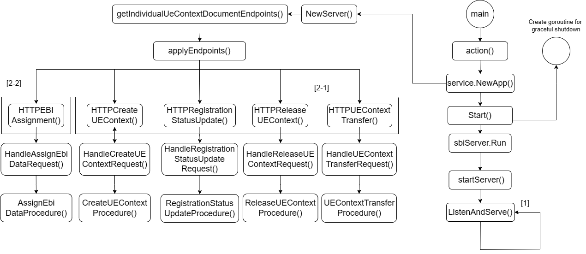

# AMF Design Document

>[!NOTE]
> Author: TungHao Shih
> Date: 2024/04/25

## Introduction
The Access & Mobility Management Function (AMF) plays a critical role in managing User Equipment(UE) registration, connectivity, reachability, mobility. It interacts with other network functions (NF)  such as Unified Data Management (UDM), Session Management Function (SMF), and Authentication Server Function (AUSF).

The main purpose of writing this article is to share the software architecture of how the AMF in free5GC handles UE Context Operations in AMF Communication.

### <u>Description</u>

In 5G networks, UE context refers to a collection of data maintained by the Access and Mobility Management Function (AMF) about a specific User Equipment (UE). This data is essential for managing the UE's connection to the network. Namf_Communication service enables an NF to communicate with the UE through N1 NAS messages or with the AN.

The following diagram illustrates the flow of UE Context Operations within the AMF in the free5GC implementation:

[1] **Listen and Serve :** 

   - The AMF monitors UE Context Operations Requests from NF Service Consumers and provides a response through the ListenandServe function.

[2] **Service-based interface handler :**

   1. [2-1] ***UE Context Operations   :***

      - CreateUEContext : The CreateUEContext operation is invoked by a NF Service Consumer, like a source AMF, towards the target AMF during a handover process when the source AMF cannot serve the UE. Its purpose is to establish the UE Context in the target AMF. The NF Service Consumer sends a HTTP PUT request to the target AMF, it creates the UEContext. The payload body of the PUT request should include a UeContextCreateData structure, which contains an N2 Information Notification callback URI.

      - RegistrationStatusUpdate : The RegistrationStatusUpdate operation is invoked by a NF Service Consumer, like a target AMF, towards the source AMF. It updates the UE registration status at the target AMF, indicating the result of the previous UE Context transfer for a given UE. The NF Service Consumer, send a HTTP POST request to invoke the "transfer-update" custom operation on the URI of an "Individual ueContext" resource, to update the source AMF with the UE registration status at the target AMF.

      - ReleaseUEContext  : The ReleaseUEContext operation is invoked by a NF Service Consumer, like a source AMF, towards the target AMF, when the source AMF receives the Handover Cancel from the 5G-AN during the handover procedure, to release the UE Context in the target AMF. The NF Service Consumer send a HTTP POST request to release the UEContext in the target AMF. The payload body of the POST request shall contain any data that needs to be passed to the target AMF. 

      - UEContextTransfer : The UEContextTransfer operation is invoked by a NF Service Consumer, like a target AMF, towards the source AMF when the target AMF receives a Registration Request with the UE's 5G-GUTI included, and the serving AMF has changed since last registration, to retrieve the UE Context. The NF Service Consumer send a HTTP POST request to invoke "transfer" custom method on an "Individual ueContext" resource URI. The payload of the request shall be an object of "UeContextTranferReqData" data type.

   2. [2-2] ***EBIAssignment :*** 
      - EBIAssignment : The EBIAssignment service operation is invoked by a NF Service Consumer(such as SMF), towards the NF Service Producer(the AMF). This request asks the AMF to assign EPS bearer IDs to EPS bearers, which are mapped from QoS flows, for an existing PDU Session associated with a specific UE.

## Reference

- *3GPP TS 23.502*: Procedures for the 5G System (5GS)
- *3GPP TS 23.518*: Access and Mobility Management Services (5G System)

## About
Thank you for reading. I am a member of the free5GC team. If you come across any errors in the article or have questions about the content, please feel free to reach out. Your insights and feedback are highly appreciated.

### Connect with Me

- Linkedin: [https://www.linkedin.com/in/tunghao-shih-b8a3b323b/](https://www.linkedin.com/in/tunghao-shih-b8a3b323b/)
- Github: [https://github.com/donald1218](https://github.com/donald1218)
