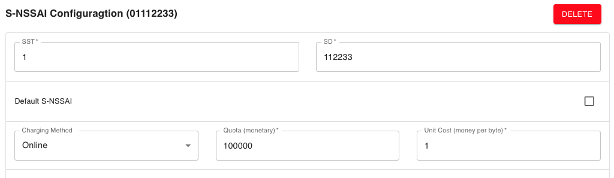
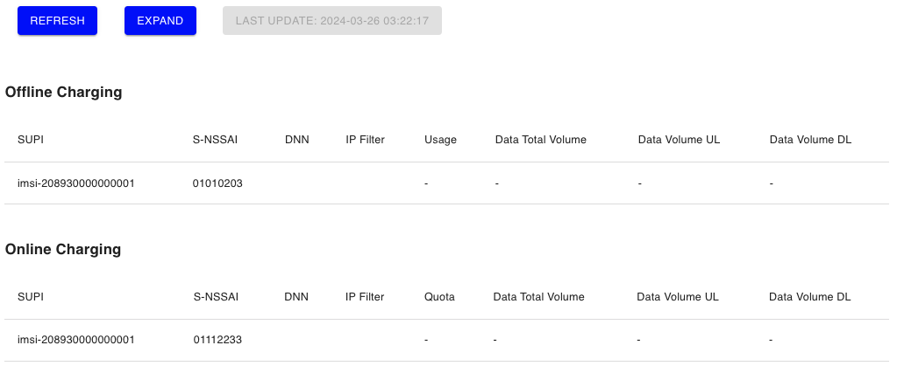

# Setup Charing for UE

In this demo, we will practice:

- Set Slice-level and Flow-level **Offline charging** in webconsole.
- Set Slice-level and Flow-level **Offline charging** in webconsole.
- Test with UERANSIM 


> Notice:
> The charging function was released in *free5GC v3.4.1*.


## 0. Preface

- *free5GC* provides Converge Charging, which includes **Online** and **Offline**.  
- Support Slice-level and Flow-level Charging.
- **Offline**
    - **After network resource usage**, charging information is transmitted from the network to the Billing Domain (BD).
- **Online**
    - **Before network resource usage**, the network sends an authentication request to the Online Charging System (OCS) and gets **quota**.


## 1. Create Subscriber

- The basic setting for subscribers will be ignored in this article; you can refer to [this](./../Webconsole/Create-Subscriber-via-webconsole.md) if you needed. 

- The default would create two slices, *01010203* and *01112233*.

    ### 01010203

    

    - We could change the charging Method from Offline to Online if you needed. 

        

    - We keep using **Offline** for now.

    - By default, there would be one flow rule to *1.1.1.1/32*.

        

    - Remember to use the same Charing Method as slice-level charing. 

    - For now, we will keep it **Offline**. 

    ### 01112233

    

    - We use **Online** Charging for this slice.

    - Create flow rules.

        - Remember to use the same charging method as Slice-level.

        

- Click Create.

    

## 2. Check Charging Data in Webconsole

- Click **UE CHARGING** in webconsole sidebar

    

- We would see the Charging Data we set in Step 1. 

    - Expand

    

    - Fold

    

​    

​		

## 3. Test with UERANSIM 

- Refer to [this](./../5-install-ueransim.md) to set up your environment.

- Provide `free5gc-ue.yaml` I use for your reference.

    ```yaml
    # IMSI number of the UE. IMSI = [MCC|MNC|MSISDN] (In total 15 digits)
    supi: 'imsi-208930000000001'
    # Mobile Country Code value of HPLMN
    mcc: '208'
    # Mobile Network Code value of HPLMN (2 or 3 digits)
    mnc: '93'
    # SUCI Protection Scheme : 0 for Null-scheme, 1 for Profile A and 2 for Profile B
    protectionScheme: 0
    # Home Network Public Key for protecting with SUCI Profile A
    homeNetworkPublicKey: '5a8d38864820197c3394b92613b20b91633cbd897119273bf8e4a6f4eec0a650'
    # Home Network Public Key ID for protecting with SUCI Profile A
    homeNetworkPublicKeyId: 1
    # Routing Indicator
    routingIndicator: '0000'
    
    # Permanent subscription key
    key: '8baf473f2f8fd09487cccbd7097c6862'
    # Operator code (OP or OPC) of the UE
    op: '8e27b6af0e692e750f32667a3b14605d'
    # This value specifies the OP type and it can be either 'OP' or 'OPC'
    opType: 'OPC'
    # Authentication Management Field (AMF) value
    amf: '8000'
    # IMEI number of the device. It is used if no SUPI is provided
    imei: '356938035643803'
    # IMEISV number of the device. It is used if no SUPI and IMEI is provided
    imeiSv: '4370816125816151'
    
    # List of gNB IP addresses for Radio Link Simulation
    gnbSearchList:
      - 127.0.0.1
    
    # UAC Access Identities Configuration
    uacAic:
      mps: false
      mcs: false
    
    # UAC Access Control Class
    uacAcc:
      normalClass: 0
      class11: false
      class12: false
      class13: false
      class14: false
      class15: false
    
    # Initial PDU sessions to be established
    sessions:
      - type: 'IPv4'
        apn: 'internet'
        slice:
          sst: 0x01
          sd: 0x010203
      - type: 'IPv4'
        apn: 'internet'
        slice:
          sst: 0x01
          sd: 0x112233
    
    # Configured NSSAI for this UE by HPLMN
    configured-nssai:
      - sst: 0x01
        sd: 0x010203
      - sst: 0x01
        sd: 0x112233
    
    # Default Configured NSSAI for this UE
    default-nssai:
      - sst: 1
        sd: 1
    
    # Supported integrity algorithms by this UE
    integrity:
      IA1: true
      IA2: true
      IA3: true
    
    # Supported encryption algorithms by this UE
    ciphering:
      EA0: true
      EA1: true
      EA2: true
      EA3: true
    
    # Integrity protection maximum data rate for user plane
    integrityMaxRate:
      uplink: 'full'
      downlink: 'full'
    ```

- If you set it up successfully, you will see the UERANSIM create two tunnels, `uesimtun0`, and `uesimtun1`.

- The following is a Demo GIF for Charing

    

- Result

    

- You can try it out for the **Charing Functionality** now!


## Appendix

- [CHF Design Document](./../Chf/design.md)
- [CHarging Function(CHF) Overview](./../../blog/20230913/20230913.md)
