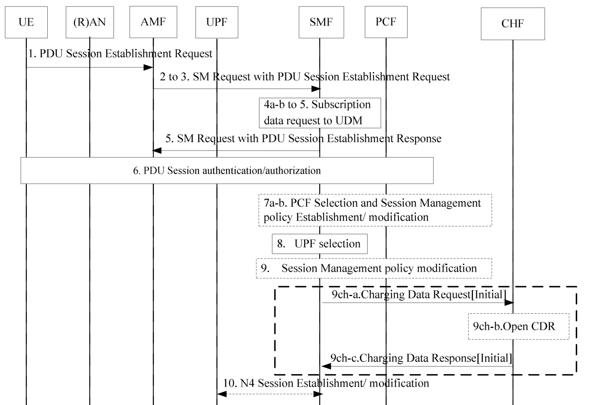

# CHF Design Document

>[!NOTE]
> Author: [Ian Chen](https://www.linkedin.com/in/ian-chen-88b70b1aa/)

If you're interested in a brief overview of the charging system, please refer the previous tech blog: [link](https://free5gc.org/blog/20230913/20230913/)

The charging functionalities have been supported since free5GC v3.4.1.
We implement the converged charging system (CHF) and several changes:

- [Add Billing Domain in webconsole](https://github.com/free5gc/webconsole/pull/58)
- [PCF supports to generate charging info in SM Policy decision](https://github.com/free5gc/pcf/pull/12)
- [SMF supports PDU-Session level Online/Offline charging](https://github.com/free5gc/smf/pull/94)

## Usage Report

Both Online and Offline charging are rely the usage report(s) reported from UPF to SMF via PFCP Session Report (defined in 3GPP TS 29.244).
The feature of the usage report has been supported since v3.3.0, the key points of the design are listed below:

- URR's (Usage Reporting Rules) ID in the range of 1 ~ 6 is preserved for default settings:
    - ID `1` for MBQE (Measurement Before QoS Enforcement) of the single UPF.
    - ID `2` for MAQE (Measurement After QoS Enforcement) of the single UPF.
    - ID `3` for MBQE of the branching UPF (ULCL).
    - ID `4` for MAQE of the branching UPF (ULCL).
    - ID `5` for MBQE of the anchor UPF (ULCL).
    - ID `6` for MAQE of the anchor UPF (ULCL).
- Uplink and Downlink PDRs share with the same URR.
- The URR ID of the charging URR will be 7 or greater number.
- If the charging method is **Online Charging**:
    - The URR has the Start of the SDF (Service Data Flow) trigger.
    - When the first packet of the data flow received by the UPF, then UPF will send the notification to SMF for renewing the transmission quota.
- If the charging method is **Offline Charging**:
    - The URR indicates the volume threshold.
    - Once the usage reaches the threshold, all of the data in the flow will be dropped by UPF.
## Main characters in the charging system

- Webconsole is a Billing Domain system, that can collect the CDR files from CHF via FTP protocol.
- PCF is responsible for allocating the rating group, the rating group generator is global unique.
- SMF is CTF (Charging Trigger Function) in our use case.
    - SMF can find the rating group by using URR ID, it helps SMF can grant the new quota from CHF by triggering the charging data request.

## Charging on PDU Session

Although 3GPP defined the FBC (Flow-Based Charging) and QBC (QoS Flow-Based Charging),
But free5GC now only supports the FBC on the data usage of PDU Session(s), So we will focus on the FBC in this document.

2 level of triggers can be supplied by the CHF:
- [ ] Triggers associated to the PDU session.
- [x] Triggers associated to a rating group within the PDU session.

> PDU session establishment, described in 3GPP TS 32.255 clause 5.2.2.2.2

Charging on PDU Session is achieved by **FBC charging, with specific rating group/service identifier**:

- As we metioned, rating group will be allocated by PCF during the SM Policy Authorization (Step 6 in the figure above).
    - PCC Rule for charging additionally indicates the rating group, SDF template, and charging method.
- After the UPF selection, SMF sends the Charging Data Request to initiate the charging session, and also apply the data plane rules to UPF via N4 Session Establishment/Modification.
-  When first uplink data came to UPF, it will triggers the Charging Data Request [Update] to update the CDR file.

## Others

- For ULCL deployment, only the data usage of the PSA-UPF will be charged (it avoids charging the same data packet twice).
- In our implementations, UPF is composed by the `go-upf` (Controller) and `gtp5g` (Executor).
    - `gtp5g` sends the usage report to `go-upf` via unix socket.
    - `gtp5g` is able to send multiple reports at once, it reduce the communication effort in UPF.