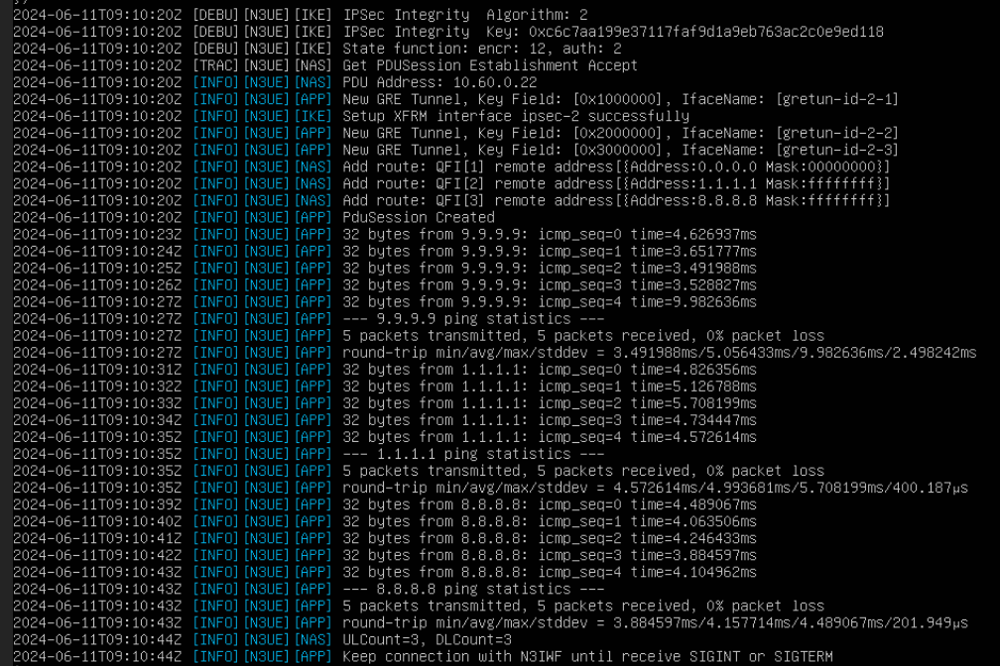

# N3IWUE Design Document

> [!WARNING]
> This document doesn't include all design details about N3IWUE.


## Info

- GitHub Repo [https://github.com/free5gc/n3iwue](https://github.com/free5gc/n3iwue)
- [Installation Guide](./../n3iwue-installation.md)
- [*TS23.502 Procedures for Untrusted non-3GPP access*](https://www.tech-invite.com/3m23/toc/tinv-3gpp-23-502_zn.html)
- [Netlink Go Library](https://github.com/vishvananda/netlink)


## GRE Tunnels

> [!NOTE]
> Author: [Andy Chen (CTFang)](https://www.linkedin.com/in/tsung-fang-chen-437a71191/)
> Date: 2024/06/12


### GRE Tunnel & Spec

Here is part of _TS24.502 Access 5GCN via non-3GPP access networks_ spec:

> #### **8.3.2 Generic routing encapsulation (GRE)**
>
> If a user data packet message is transmitted over non-3GPP access between the UE and the N3IWF for untrusted non3GPP access, the user data packet message shall be encapsulated as a GRE user data packet.
>
> In the GRE encapsulated user data packet:
>
> ​	b) the QFI field of the key field of the GRE header field is set to the QFI associated with the user data packet;

The GRE key field must use the QFI value as its key. 

N3IWUE uses the **Netlink** Go library to create GRE Tunnel. Here is a segment of code for the new GRE Interface. 

```go
greKeyField = (uint32(qfi) & 0x3F) << 24
newGreIfaceName := greIfaceName + "-" + strconv.Itoa(int(qfi))

// New GRE tunnel interface
newGRETunnel := &netlink.Gretun{
  LinkAttrs: netlink.LinkAttrs{
    Name: newGreIfaceName,
    MTU:  1438, // remain for endpoint IP header(most 40 bytes if IPv6) and ESP header (22 bytes)
  },
  Link:   uint32(parent.Attrs().Index), // PHYS_DEV in iproute2; IFLA_GRE_LINK in linux kernel
  Local:  ueTunnelAddr,
  Remote: n3iwfTunnelAddr,
  IKey:   greKeyField,
  OKey:   greKeyField,
}
```

And the default rule always has **QFI = 1**. 


### Procedure

During the N3IWUE PDU session Establishment procedure, when UE receives **PDUSessionEstablishmentAccept**, N3IWUE will try to do the following things: (refer to `n3iwue/internal/nwucp/handler/handler.go > HandleDLNASTransport()`)

- Get PDU Address from NAS
- Setup GRE Tunnels
    - N3IWUE create per tunnel for each QFI
- Add Route for GRE Tunnels 
    - N3IWUE adds routes for each tunnel
    - Remote IPv4 address for each QFI retrieve from NAS message


### Example Scenario

- Two QoS rules
    - QFI = 2, address = 1.1.1.1
    - QFI = 3, address = 8.8.8.8

So, the N3IWUE would create **3 GRE tunnels** and **3 routes**.



After the ping test, use `ifconfig` to see the status for each GRE interfaces:


- **ens18** is the only one interface on that computer 
- **gretun-id-2-1** for QFI = 1, receive 5 ping reply from 9.9.9.9 and send 5 ping request with some others traffics.
- **gretun-id-2-2** for QFI = 2, send 5 ping request to 8.8.8.8 and receive 5 ping reply. 
- **gretun-id-2-3** for QFI = 3, send 5 ping request to 1.1.1.1 and receive 5 ping reply. 


### Related Pull Request

[fix: Add multiple GRE tunnel when have multiple QFI settings #7](https://github.com/free5gc/n3iwue/pull/7)
