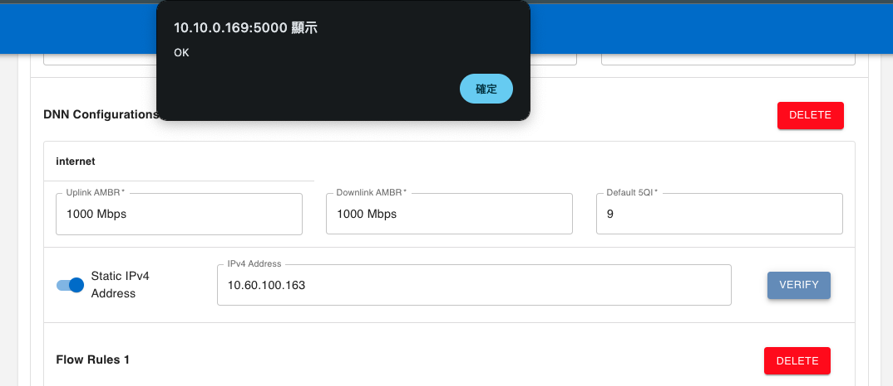
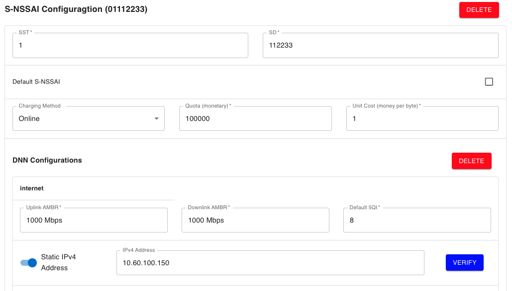
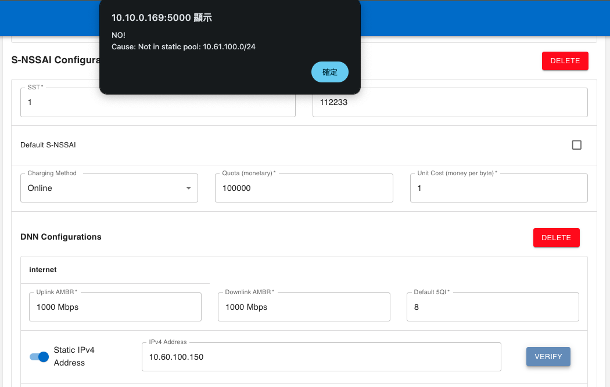
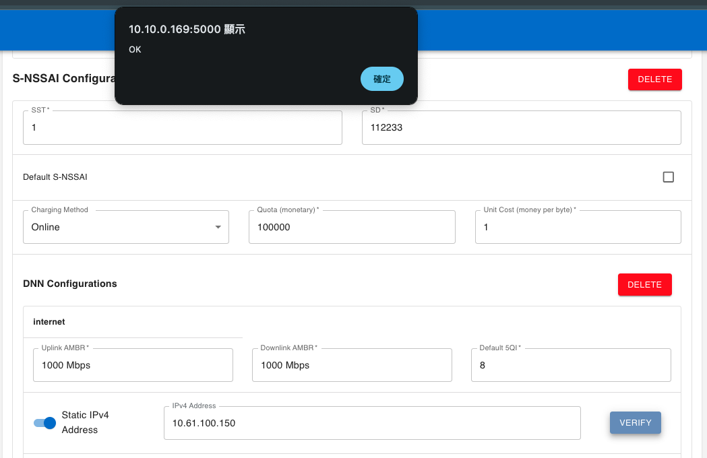

# Set Static IP for UE

In this demo, we will practice:

- Static IP Pool settings
- Set Static IP address for UE in webconsole
- Verify the IP address settings


## 1. Static IP pool settings

We first have to know the static IP pool for specific DNN. 

- In `smfcfg.yaml`, the **userplaneInformation** is what we need now:
    - The following files remove some settings; please refer to the sample configuration file.
    - We set two slices with one DNN each for this demo:
        - 01010203
            - internet
                - pools: 10.60.0.0/16
                - staticPools: **10.60.100.0/24**
        - 01112233
            - internet
                - pools: 10.61.0.0/16
                - staticPools: **10.61.100.0/24**

  ```yaml
  configuration:
    userplaneInformation:         # list of userplane information
      upNodes:                     # information of user-plane node (AN or UPF)
        UPF:                       # the name of the node
          type: UPF                # the type of the node (AN or UPF)
          sNssaiUpfInfos:          # S-NSSAI information list for this UPF
            - sNssai:              # S-NSSAI(Single Network Slice Selection Assistance Information)
                sst: 1             # Slice/Service Type (uinteger, range: 0~255)
                sd: 010203         # Slice Differentiator(3 bytes hex string, range: 000000~FFFFFF)
              dnnUpfInfoList:      # DNN information list for this S-NSSAI
                - dnn: internet
                  pools:
                    - cidr: 10.60.0.0/16
                  staticPools:
                    - cidr: 10.60.100.0/24
            - sNssai:
                sst: 1
                sd: 112233
              dnnUpfInfoList:
                - dnn: internet
                  pools:
                    - cidr: 10.61.0.0/16
                  staticPools:
                    - cidr: 10.61.100.0/24
  ```


## 2. Create Subscribers with Static-IP

In this step, we would go through how to set static IP addresses for subscribers and verify the settings. 

- You could also refer to this for how to create subscribers.](./../Webconsole/Create-Subscriber-via-webconsole.md)
- We would create two subscribers:
    - *imsi-208930000000001*
    - *imsi-208930000000002*
    - Both have slices *010203* and *112233,* but have different IP settings.

### imsi-208930000000001

- **010203** 

    - A Static IPv4 Address toggle under the slices' DNN section would be displayed. 

    

    - Turn it one, and set the IPv4 address you want to use for this UE of this DNN.

        - We set **10.60.100.163**

            
        
        - Click Verify
        
            - If the setting is OK, the webconsole will show **"OK"** in an alert box.
        
            


- **112233** 

    - Set the IPv4 address you want for this UE of this DNN.

        - We set **10.60.100.150**
            - <font color="red">Note that **10.60.100.150** is not in *10.61.100.0/24* (The Static-IP pool for this DNN)</font>

            
        
        - Click Verify
        
            - Since the IP address is not in the Static-IP pool for this DNN, it would pop up **"No"** with the reason.
        
            

        - Correct the IP and Verify again: **10.61.100.150**

            


### imsi-208930000000002

- **010203** 
    - Set **10.60.100.163** for this DNN and click Verify.
        - <font color="red">Note that **10.60.100.163** was set by the other UE</font>

        
        - Change to  **10.60.100.165**


- **112233** 

    - Keep the Static IPv4 Address toggle off, as Dynamic IPv4 address for this DNN.


## Test with UERANSIM

- You can refer to [this](./../5-install-ueransim.md) for instructions on how to use UERANSIM.

### imsi-208930000000001


- This UE gets **10.60.100.163** for slice 010203, which is what we set before
- This UE gets **10.61.100.165** for slice 112233, which is what we set before

### imsi-208930000000002


- This UE gets **10.60.100.165** for slice 010203, which is what we set before
- This UE gets **10.61.0.1** for slice 112233, the IP address in pools.
