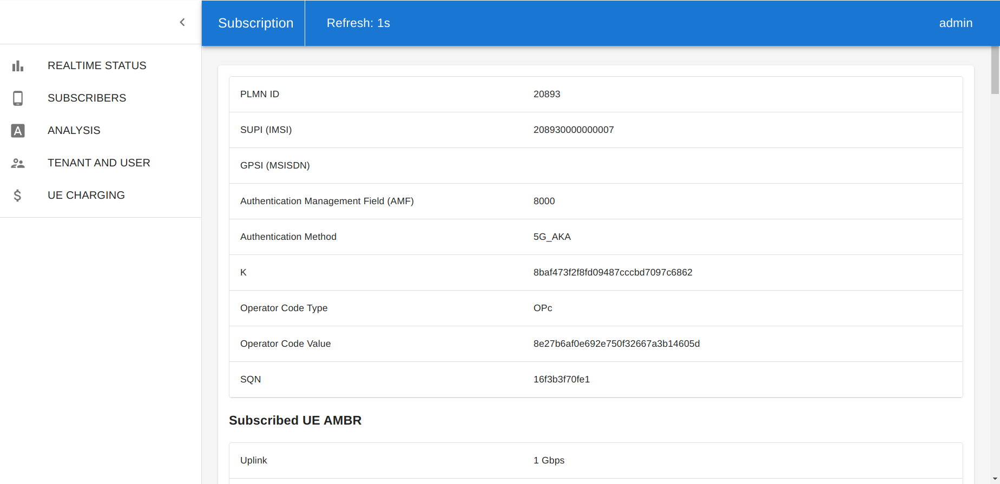
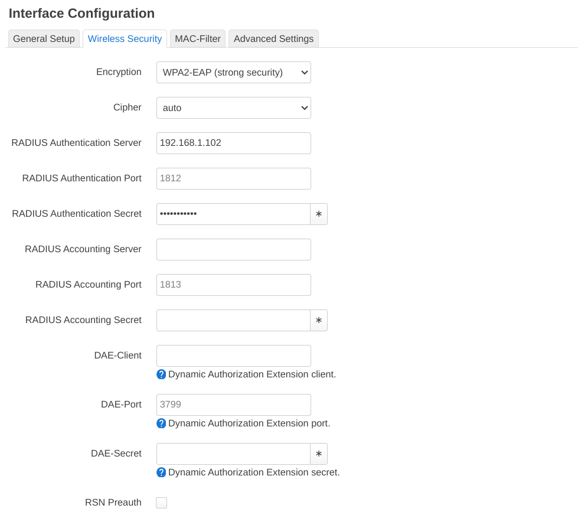
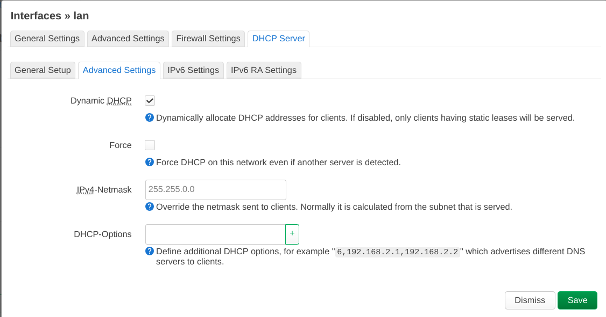

<!-- Google tag (gtag.js) --> <script async src="https://www.googletagmanager.com/gtag/js?id=G-JETJ7TJ805"></script> <script> window.dataLayer = window.dataLayer || []; function gtag(){dataLayer.push(arguments);} gtag('js', new Date()); gtag('config', 'G-JETJ7TJ805'); </script>

## 1. free5GC installation
(Optional) If you install free5GC on a VM, add a network adapter set to bridged mode, and set the card name to your AP. Some additional information on how to configure multiple network interfaces on the VM are available on [the docs](../2-config-vm-en.md#4-setting-static-ip-address) and on [Ubuntu docs page](https://documentation.ubuntu.com/server/explanation/networking/configuring-networks/).

#### Follow the tutorial in free5GC official site: 
- [Installing free5GC and webconsole](https://free5gc.org/guide/3-install-free5gc/)


### Configuration for NFs
Modify `~/free5gc/config/tngfcfg.yaml` file
```yaml
# --- Bind Interfaces ---
IKEBindAddress: <YOUR_FREE5GC_IP> # IP address of Nwu interface (IKE) on this TNGF
RadiusBindAddress: <YOUR_FREE5GC_IP> # IP address of Nwu interface (IKE) on this TNGF
```

## 2. Use WebConsole to Add UE
* Start your webconsole server
    ```sh
    cd ~/free5gc/webconsole/
    make # If webconsole was not previously compiled
    ./bin/webconsole
    ```
* Open your web browser from your host machine, and enter the URL `http://<FREE5GC_IP>:5000`
* On the login page, enter username `admin` and password `free5gc`
* Go to `SUBSCRIBERS` and click on `CREATE`
* Check that the `SUPI (IMSI)` field is unique and modify other fields as necessary to ensure data consistency with [sec.conf file](#security-parameters)

* Then, scroll the page all the way down and click on `CREATE`.

## 3. Access Point Setup

**Note:** The steps of this section were tested using OpenWrt as AP firmware (see screenshot below)

#### AP information


#### Configuring Wi-Fi Network ESSID
> **Network → Wireless → Edit → Interface Configuration → General Setup**
> 

#### Configuring Wi-Fi Network Security
> **Interface Configuration → Wireless Security**
> 

**Note:** `RADIUS Authentication Server` is free5GC's IP. `RADIUS Authentication Secret` must match the one from `RadiusSecret` parameter on [tngfcfg.yaml file](https://github.com/free5gc/free5gc/blob/main/config/tngfcfg.yaml)

**Tip:** If WPA2-EAP isn't available on the OpenWrt firmware installed, check [this troubleshooting section](./../Trouble_Shooting.md#13-unable-to-find-wpa2-eap-encryption-option-in-openwrt-installation).

<!-- The next step is not required. For further details, see: https://forum.free5gc.org/t/running-tngfue-on-another-subnet/2571/4
#### Open Dynamic DHCP
> **Network → Interface → Edit lan →  DHCP server → Advance Setting**
>  -->

## 4. TNGFUE Installation
Install TNGFUE in another device with a Wi-Fi interface available
### Get Source Code
```
git clone https://github.com/free5gc/tngfue.git
cd tngfue
```

### TNGFUE Configuration

#### A. Automated Setup

Use the `prepare` script:

(Optional) Open the script and adjust it with the desired parameters/vars
```
nano prepare.sh
```

**Note:** Confirm the Wi-Fi interface name (i.e. `IFACE_NAME`) is the same as the OS name

Run the script to begin building TNGFUE
```
./prepare.sh
```

#### B. Advanced Manual Setup

**(Alternatively)** To configure and build manually:

**Note:** The `prepare` script executed the steps below, you may skip to the [next section](#5-testing)

##### Build/Compile Configuration

Make sure the flag `CONFIG_EAP_VENDOR_TEST` of the `.config` file inside `wpa_supplicant` folder is enabled as shown below:
```
...
CONFIG_EAP_VENDOR_TEST=y
...
```
**Tip:** This setting is [already enabled](https://github.com/free5gc/tngfue/blob/main/wpa_supplicant/.config#L152)

##### TNGFUE Settings

Modify `~/tngfue/wpa_supplicant.conf`


- `ssid:` your ap/wifi name 
(same as the AP setting part)
- `identity:` identity information for this ue 
(set whatever you want)
- `password:` wifi/ap password
(same as the AP setting part)

```
ctrl_interface=udp
update_config=1
network={
    ssid="<YOUR_AP_NAME>"
    key_mgmt=WPA-EAP
    eap=VENDOR-TEST IKEV2
    identity="<YOUR_IDENTITY_INFO>"
    password="<YOUR_PASSWORD>"
}
```

E.g.
```
ctrl_interface=udp
update_config=1
network={
    ssid="free5gc-ap"
    key_mgmt=WPA-EAP
    eap=VENDOR-TEST IKEV2
    identity="tngfue"
    password="free5gctngf"
}
```

##### Security Parameters
In ```tngfue/wpa_supplicant/sec.conf```:

- `wifiifname:` your wifi interface name 
(you can find this by typing `ifconfig` in terminal)

You can find all the parameters listed below on the Web Console subscriber page.

- `imsi_identity:` SUPI(IMSI)
- `MSIN:` SUPI without the PLMN part

Format: 
```
wifiifname: <YOUR_WIFI_INTERFACE_NAME>
K:<UE_K_IN_WEBCONSOLE>
imsi_identity:<UE_SUPI_IN_WEBCONSOLE>
nai_username:type0.rid61695.schid0.userid<MSIN>
SQN:<UE_SQN_IN_WEBCONSOLE>
AMF:<AMF_IN_WEBCONSOLE>
OPC:<UE_OPCV_IN_WEBCONSOLE>
```

E.g.
```
wifiifname:wlp3s0
K:8baf473f2f8fd09487cccbd7097c6862
imsi_identity:208930000000007
nai_username:type0.rid61695.schid0.userid000000000007
SQN:16f3b3f70fe1
AMF:8000
OPC:8e27b6af0e692e750f32667a3b14605d
```

##### Build binary
```
cd ~/tngfue/wpa_supplicant/
make
```
For more information, see [this troubleshooting section](../Trouble_Shooting.md#14-troubleshooting-missing-packages-when-trying-to-build-tngfue-on-ubuntu)

## 5. Testing
### A. Run free5GC with TNGF

On free5GC's machine:
```
cd ~/free5gc
./run.sh -tngf
```
### B. Run TNGFUE

On TNGFUE's machine:
#### Run using the `run` script
```
./run.sh
```
Then skip to [the next section](#example-output)

#### **(Alternatively)** Run manually

##### Make sure xfrm and greTun0 does not exist
> If you have not successfully connected to TNGF yet, you can skip this step

Delete both interfaces using:
```
sudo ip l del greTun0
sudo ip l del xfrm-1
```
##### Set Wi-Fi interface IP to the same LAN as free5GC
```
ip a add 192.168.1.202/24 brd 192.168.1.255 dev <YOUR_WIFI_INTERFACE_NAME>
ip r add default via 192.168.1.202 dev <YOUR_WIFI_INTERFACE_NAME>
```
##### Run
```
cd ~/tngfue/wpa_supplicant
sudo ./wpa_supplicant -c ../wpa_supplicant.conf -i <YOUR_WIFI_INTERFACE_NAME>
```
#### Example output
When the session successfully connects, it will be possible to see these five interfaces established. 


And TNGFUE will show that connection is completed.


### C. Transfer data over the greTun0 interface

```
ping -I greTun0 8.8.8.8
```

