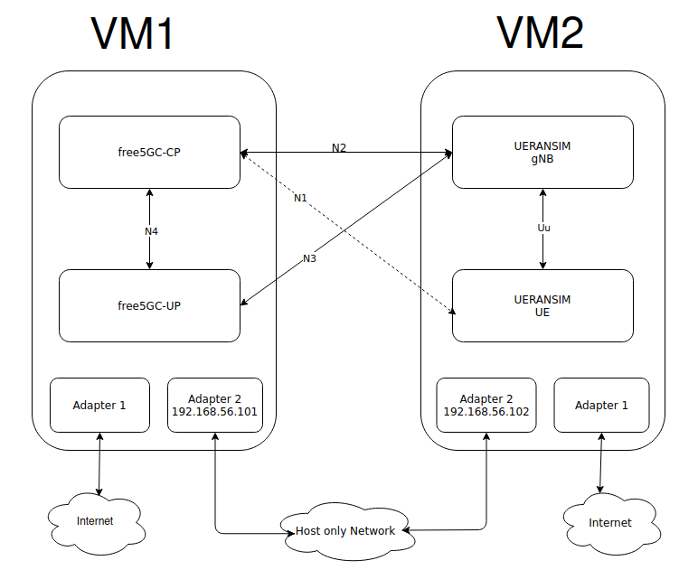

# free5GC and UERANSIM deployment tuorial
>[!NOTE]
> Author: Chia-Hui, Chen
> Date: 2026/09/01
---
<iframe 
  src="https://www.youtube.com/embed/WA2RDcMUTZA" 
  width="100%" 
  height="480" 
  allow="autoplay; fullscreen" 
  allowfullscreen="true">
</iframe>



## Overview
Setting up a 5G lab environment from scratch can be frustrating, especially when dealing with IP conflicts and Linux kernel compatibility. 

This guide provides a straightforward, step-by-step tutorial to deploy **free5GC** (5G Core) and **UERANSIM** (5G RAN & UE). To avoid common localhost conflicts and mimic a real-world network topology, we will use a **Dual-VM (Virtual Machine) architecture** with static Host-Only IPs. 

By the end of this guide, you will have a fully functional 5G testbed capable of registering a simulated smartphone (UE) and routing its traffic to the internet. Let's get started!


---

## Phase 1 - Virtual Machine and Network Setup

### 1. Experimental Environment Topology

To simulate a realistic network environment and avoid port conflicts from local testing, we will set up two Virtual Machines (VMs).

- **VM 1 (Core Network):** Runs free5GC.
- **VM 2 (RAN & UE):** Runs UERANSIM.

| **Node Name** | **Recommended OS** | **Network Adapter 1 (Internet)** | **Network Adapter 2 (Node Comm.)** |
| --- | --- | --- | --- |
| **free5GC** | Ubuntu 20.04+ (e.g., 20.04, 22.04, 24.04, 26.04 LTS) | NAT | Host-Only (`192.168.56.101`) |
| **UERANSIM** | Ubuntu 20.04+ (e.g., 20.04, 22.04, 24.04, 26.04 LTS) | NAT | Host-Only (`192.168.56.102`) |

### 2. OS and Kernel Version Warning

The User Plane (UPF) of free5GC highly relies on the `gtp5g` Linux kernel module. Ensure that your Ubuntu version and its corresponding Linux kernel are supported by the latest `gtp5g` repository. If you are using newer releases like Ubuntu 26.04, always pull the latest commits of `gtp5g` to ensure successful kernel module compilation.

### 3. Virtual Network Adapter Configuration (Using VirtualBox as an example)

To allow the two VMs to ping each other without being affected by changes in the physical network environment (like the lab Wi-Fi), we need to configure a **Host-Only Network**.

1. **Host Machine Operations: Create a Host-Only Network**
Open VirtualBox, go to "Tools" -> "Network", and create a new Host-Only adapter (usually defaults to `vboxnet0`). 
2. **VM Powered-Off Operations: Configure Dual Adapters**
Go to VM "Settings" -> "Network":
    - **Adapter 1:** Select "NAT" (for downloading dependencies and GitHub source code).
    - **Adapter 2:** Enable the adapter, select "Host-Only Adapter" for the attached to, and choose the newly created `vboxnet0`.
3. **Ubuntu Terminal Operations: Set Static IPs (Netplan)**
Boot into Ubuntu and edit the Netplan configuration file (usually located at `/etc/netplan/00-installer-config.yaml` or a similar name).
example: 
```yaml
network:
  ethernets:
    enp0s3:
      dhcp4: true
    enp0s8:
      dhcp4: no
      addresses: [192.168.56.101/24]
  version: 2

```
Note: Set free5GC VM to 192.168.56.101 and UERANSIM VM to 192.168.56.102
4. **Apply and Test Network Configuration**
Run `sudo netplan apply` to apply the settings. 
5. **Check IPs and Ping**
    
    Finally, check the IPs using `ip a` and make sure they can ping each other.
    
--- 

## Phase 2 - Installation and Compilation

In this phase, we will install all necessary dependencies and compile the source code.

### 1. Common Prerequisites (Run on BOTH VMs)

First, update the package list and install the basic compiler tools and network utilities.

```bash
sudo apt update
sudo apt install -y build-essential cmake gcc g++ make git net-tools iproute2 iptables tcpdump
```

**Install Go (Golang):**

free5GC requires Go to compile its Control Plane. (Ensure you install a version supported by free5GC, e.g., 1.26+).

```jsx
wget https://dl.google.com/go/go1.26.2.linux-amd64.tar.gz
sudo tar -C /usr/local -zxvf go1.26.2.linux-amd64.tar.gz
mkdir -p ~/go/{bin,pkg,src}
# The following assume that your shell is bash:
echo 'export GOPATH=$HOME/go' >> ~/.bashrc
echo 'export GOROOT=/usr/local/go' >> ~/.bashrc
echo 'export PATH=$PATH:$GOPATH/bin:$GOROOT/bin' >> ~/.bashrc
echo 'export GO111MODULE=auto' >> ~/.bashrc
source ~/.bashrc
go version
```

### 2. Install MongoDB, Node.js and Yarn (Run on free5GC VM ONLY)


**Install MongoDB**
free5GC uses MongoDB to store subscriber and policy data.
##### Step A: Import the public key and create a list file for MongoDB
```bash
sudo apt install -y gnupg curl
curl -fsSL https://www.mongodb.org/static/pgp/server-8.0.asc | \
sudo gpg -o /usr/share/keyrings/mongodb-server-8.0.gpg --dearmor
```

##### Step B: Add the MongoDB repository (Choose the command based on your Ubuntu version)
(You can check your version by running cat /etc/lsb-release)
```bash
# Ubuntu 24.04 (Noble)
echo "deb [ arch=amd64,arm64 signed-by=/usr/share/keyrings/mongodb-server-8.0.gpg ] https://repo.mongodb.org/apt/ubuntu noble/mongodb-org/8.2 multiverse" | sudo tee /etc/apt/sources.list.d/mongodb-org-8.2.list
# Ubuntu 22.04 (Jammy)
echo "deb [ arch=amd64,arm64 signed-by=/usr/share/keyrings/mongodb-server-8.0.gpg ] https://repo.mongodb.org/apt/ubuntu jammy/mongodb-org/8.2 multiverse" | sudo tee /etc/apt/sources.list.d/mongodb-org-8.2.list
# Ubuntu 20.04 (Focal)
echo "deb [ arch=amd64,arm64 signed-by=/usr/share/keyrings/mongodb-server-8.0.gpg ] https://repo.mongodb.org/apt/ubuntu focal/mongodb-org/8.2 multiverse" | sudo tee /etc/apt/sources.list.d/mongodb-org-8.2.list
```
##### Step C: Install and Start MongoDB
```bash
sudo apt update
sudo apt install -y mongodb-org

# Start and enable the mongod service (Note: the service name is mongod, not mongodb)
sudo systemctl start mongod
sudo systemctl enable mongod
sudo systemctl status mongod
```


**Install Node.js and Yarn**

```bash
curl -fsSL https://deb.nodesource.com/setup_20.x | sudo -E bash - 
sudo apt update
sudo apt install -y nodejs
sudo corepack enable # setup yarn automatically
```

Note: WebConsole may fail to build if available RAM is below 1GB.

### 3. Compile and Install `gtp5g` Kernel Module (Run on free5GC VM ONLY)

The UPF (User Plane Function) requires this module to handle 5G encapsulation. **This step is critical.**

```bash
# Clone and build gtp5g
git clone https://github.com/free5gc/gtp5g.git
cd gtp5g
make
sudo make install

# Verify if the module is loaded successfully
lsmod | grep gtp
```

(If `lsmod` shows `gtp5g`, you are good to go!)

### 4. Compile free5GC (Run on free5GC VM ONLY)

Now we compile the actual 5G Core Network.

```bash
cd ~
git clone --recursive -b v4.2.3 -j `nproc` https://github.com/free5gc/free5gc.git
cd free5gc
make
```

### 5. Compile UERANSIM (Run on UERANSIM VM ONLY)

UERANSIM acts as both the 5G Base Station (gNB) and the User Equipment (UE).

```bash
sudo apt update
sudo apt upgrade

sudo apt install make
sudo apt install gcc
sudo apt install g++
sudo apt install libsctp-dev lksctp-tools
sudo apt install iproute2
sudo snap install cmake --classic
```

```bash
cd ~
git clone https://github.com/aligungr/UERANSIM
cd ~/UERANSIM
make
```

---
## Phase 3 - Configuration and Testing

### 1. Setting free5GC and UERANSIM Parameters

In the `free5GC` VM, we need to edit three crucial files to bind the services to our Host-Only IP  instead of the localhost default.

- `~/free5gc/config/amfcfg.yaml`
- `~/free5gc/config/smfcfg.yaml`
- `~/free5gc/config/upfcfg.yaml`

First, SSH into the `free5GC` VM, and change `amfcfg.yaml`:

```bash
cd ~/free5gc
nano config/amfcfg.yaml
```

Replace `ngapIpList` IP from `127.0.0.1` to `192.168.56.101`:

```yaml
# Before:
  ngapIpList:  # the IP list of N2 interfaces on this AMF
  - 127.0.0.1

# After:
  ngapIpList:
  - 192.168.56.101
```

Next, edit `smfcfg.yaml`:

```bash
nano config/smfcfg.yaml
```

In the entry inside `userplaneInformation` -> `upNodes` -> `UPF` -> `interfaces` -> `endpoints`, change the IP from `127.0.0.8` to `192.168.56.101`:

```yaml
# Before:
  interfaces: # Interface list for this UPF
   - interfaceType: N3 # the type of the interface (N3 or N9)
     endpoints: # the IP address of this N3/N9 interface on this UPF
       - 127.0.0.8

# After:
  interfaces:
   - interfaceType: N3
     endpoints:
       - 192.168.56.101
```

Finally, edit `upfcfg.yaml` and change the `gtpu` IP from `127.0.0.8` to `192.168.56.101`:

```bash
nano config/upfcfg.yaml
```

```yaml
# Before:
  gtpu:
    forwarder: gtp5g
    ifList:
      - addr: 127.0.0.8
        type: N3

# After:
  gtpu:
    forwarder: gtp5g
    ifList:
      - addr: 192.168.56.101
        type: N3
```

### 2. Setting UERANSIM

In the `ueransim` VM, there are two files related to free5GC:

- `~/UERANSIM/config/free5gc-gnb.yaml` (gNodeB config)
- `~/UERANSIM/config/free5gc-ue.yaml` (UE config)

First, SSH into `ueransim` VM, edit `free5gc-gnb.yaml`. You need to change the `ngapIp` (N2 interface) and `gtpIp` (N3 interface) to the UERANSIM VM's IP (`192.168.56.102`), and point `amfConfigs` to the free5GC VM's IP (`192.168.56.101`):

```bash
nano ~/UERANSIM/config/free5gc-gnb.yaml
```

```yaml
# Before:
  ngapIp: 127.0.0.1
  gtpIp: 127.0.0.1
  # List of AMF address information
  amfConfigs:
    - address: 127.0.0.1

# After:
  ngapIp: 192.168.56.102
  gtpIp: 192.168.56.102
  # List of AMF address information
  amfConfigs:
    - address: 192.168.56.101
```

### 3. Start WebConsole and Register UE Subscriber

To allow our virtual UE to connect to the network, we must register its credentials in the free5GC database using the WebConsole.

First, SSH into the `free5GC` VM and start the WebConsole server:

```bash
cd ~/free5gc/webconsole
./run.sh
```

*(Keep this terminal open, or run it in the background/tmux).*

Next, open a web browser on your host machine and navigate to:

- **URL:** `http://192.168.56.101:5000`
- **Login:** `admin` / `free5gc`

Follow these steps to add a new subscriber. The parameters must exactly match the default settings in UERANSIM's `free5gc-ue.yaml`:

1. Go to the **"Subscribers"** tab and click **"Create"**.
2. Fill in the parameters exactly as follows:
    - **SUPI (IMSI)**
    - **Authentication Method**
    - **K (Key)**
    - **Operator Code Type** 
    - **Operator Code Value**
3. Under the "S-NSSAI" section, ensure you have:
    - **SST**
    - **SD**
4. Click **Create**. You should now see new Subscriber  listed.

Now, examine the file `~/UERANSIM/config/free5gc-ue.yaml` in the UERANSIM VM and verify that the `supi`, `key`, and `op` values match what you just set.

### 4. Testing UERANSIM against free5GC

Before running, we must configure NAT routing on the `free5GC` VM so the UE can access the external internet through the UPF.

SSH into `free5GC` VM and run:

```bash
sudo sysctl -w net.ipv4.ip_forward=1
sudo iptables -t nat -A POSTROUTING -o <dn_interface> -j MASQUERADE
sudo iptables -I FORWARD 1 -j ACCEPT
sudo systemctl stop ufw
```

> **Note:** Replace `<dn_interface>` with your NAT interface (e.g., `enp0s3`). Use `ip a` to figure it out. Since iptables rules flush on reboot, consider automating this step.
> 

Now, start free5GC:

**Terminal 1 (Start free5GC)**

```bash
cd ~/free5gc
./run.sh
```

**Terminal 2 (Start webconsole)**

```bash
cd ~/free5gc/webconsole
./run.sh
```

**Note:** Make sure the  Subscriber to test is added.

**Note:** If you already started the WebConsole in Step 3 and left it running in the background or in another terminal, you do **not** need to run it again here. Doing so will result in an "Address already in use" error. Just make sure the new Subscriber to test is added.

Next, open **three additional SSH terminals** to your `ueransim` VM

**Terminal 1 (Start gNB):**

```bash
cd ~/UERANSIM
build/nr-gnb -c config/free5gc-gnb.yaml
```

*(Check the free5GC terminal; you should see an "NG Setup Response" confirming the AMF accepted the gNB.)*

**Terminal 2 (Start UE):**

```bash
cd ~/UERANSIM
sudo build/nr-ue -c config/free5gc-ue.yaml
```

*(Run with `sudo` because UERANSIM creates a virtual network interface `uesimtun0` for the UE.)*

**Terminal 3 (Verify Connection):**
Use `ifconfig` to verify the tunnel `uesimtun0` was created:

```bash
ifconfig uesimtun0
```

*Expected Output Snippet:*

```bash
uesimtun0: flags=4305<UP,POINTOPOINT,RUNNING,NOARP,MULTICAST>  mtu 1500
        inet 60.60.0.1  netmask 255.255.255.255  destination 60.60.0.1
```

Finally, ping the internet through the 5G tunnel:

```bash
ping -I uesimtun0 google.com
```

If you get replies, **Congratulations!** Your 5G Core Network and simulated RAN are fully operational.

---


**References**

- [free5GC](https://github.com/free5gc/free5gc)
- [UERANSIM](https://github.com/aligungr/UERANSIM)
- [Creating a Ubuntu VM using VirtualBox](https://free5gc.org/guide/1-vm-en/)
- [Creating and Configuring a free5GC VM](https://free5gc.org/guide/2-config-vm-en/)
- [Build and Install free5GC ](https://free5gc.org/guide/3-install-free5gc/)
- [Test free5GC](https://free5gc.org/guide/4-test-free5gc/)

**About Me**
Hi, I'm Chia-Hui Chen. I'm currently diving into 5G technology and the free5GC project. I hope you find this blog valuable! Feel free to reach out if you have any feedback or would like to discuss anything further.