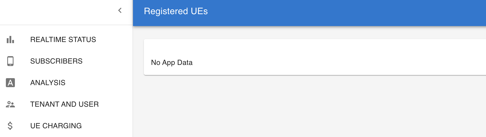
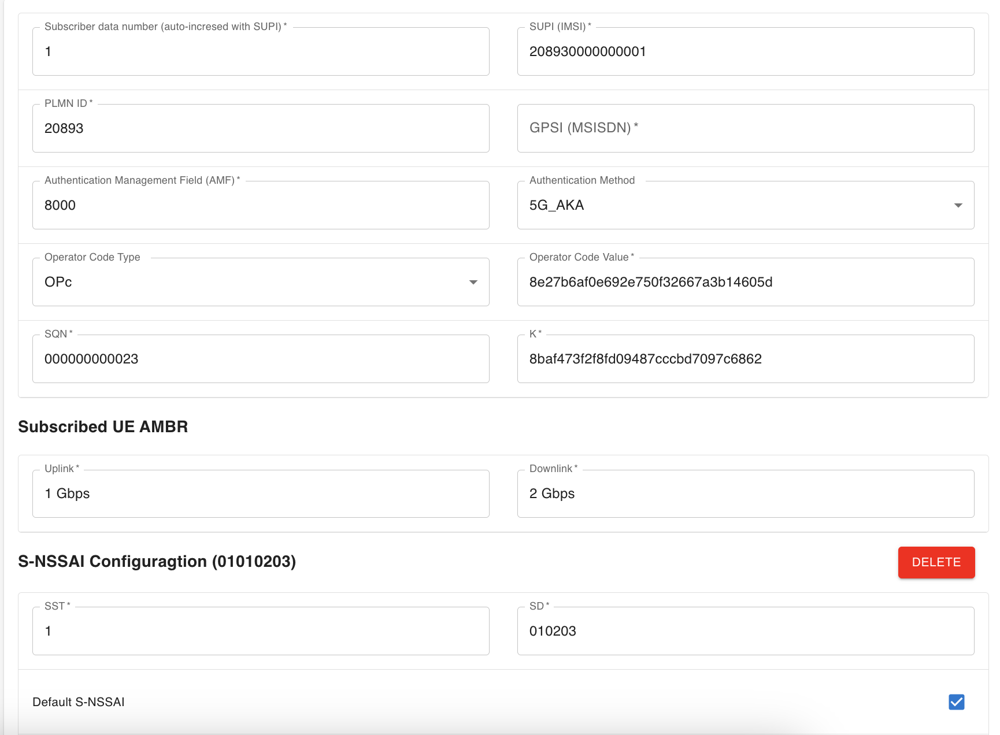

<!-- Google tag (gtag.js) --> <script async src="https://www.googletagmanager.com/gtag/js?id=G-JETJ7TJ805"></script> <script> window.dataLayer = window.dataLayer || []; function gtag(){dataLayer.push(arguments);} gtag('js', new Date()); gtag('config', 'G-JETJ7TJ805'); </script>

# Create Subscriber via Webconsole

## 1. Install Webconsole

If Webconsole isn't installed yet, please, follow the instructions from [GitHub page](https://github.com/free5gc/webconsole).

## 2. (Optional) Delete MongoDB database

If another version of free5GC was ran before, you have to delete MongoDB.
```
$ mongo --eval "db.dropDatabase()" free5gc
```
    
## 3. Run Webconsole server
```
$ cd ~/free5gc/webconsole
$ go run server.go
```
    
## 4. Open Webconsole
Enter URL: `<Webconsole server's IP>:5000` in browser


Default credential:
```
Username: admin
Password: free5gc
```

## 5. Add new subscriber

> Click `SUBSCRIBERS` -> `CREATE`



> Edit the Subscriber's data and click `CREATE`, here you can configure the 

- **Network Slicing** configuration 
    - SST/SD
    - **DNN** configuration
        - AMBR
        - Default 5QI
        - **Flow** configuration
            - IP Filter
            - Precedence
            - 5QI
            - Uplink GBR/MBR
            - Downlink GBR/MBR
            - Flow-Based Charging Config




> Check that the new subscriber was added successfully


