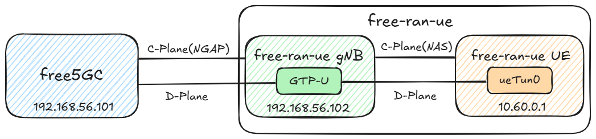

# Deployment of free5GC and free-ran-ue
>[!NOTE]
> Author: [Che Wei Lin](https://github.com/Zach1113)
> Date: 2026/09/02

<iframe width="100%" height="500" src="https://www.youtube.com/embed/3ueU8vGN9CA?si=D7Z4n1FHd0SQDi7T" title="YouTube video player" frameborder="0" allow="accelerometer; autoplay; clipboard-write; encrypted-media; gyroscope; picture-in-picture; web-share" referrerpolicy="strict-origin-when-cross-origin" allowfullscreen></iframe>

---

In this demo we will practice:

  * Installing free5GC and free-ran-ue
  * Configuring free5GC, the gNB, and the UE
  * Running free-ran-ue against free5GC

Topology:



## 1. Install free-ran-ue VM

Repeat the steps of cloning `free5gc` VM from the base VM, create a new VM for the `free-ran-ue` simulator:

- Name the VM `free-ran-ue`, and create new MAC addresses for all network cards.
- Make sure the VM has internet access and can log in using SSH.
- Change the hostname to `free-ran-ue`.
- Make the Host-only network interface have static IP address `192.168.56.102`.
- Reboot the free-ran-ue VM, as well as the free5gc VM.
You can ping `192.168.56.101` from the free-ran-ue VM, and also ping `192.168.56.102` from the free5gc VM.

## 2. Install free-ran-ue

Perform the following installation steps on the **free-ran-ue VM**.

### Install Go and Required Tools

The version of free-ran-ue used in this guide requires Go `1.26.2`. First install the required tools:

```bash
sudo apt update
sudo apt install -y git make iproute2 wget
```

If `go version` does not show `go1.26.2 linux/amd64`, install Go `1.26.2`:

```bash
cd /tmp
wget https://dl.google.com/go/go1.26.2.linux-amd64.tar.gz
sudo rm -rf /usr/local/go
sudo tar -C /usr/local -xzf go1.26.2.linux-amd64.tar.gz

echo 'export GOPATH=$HOME/go' >> ~/.bashrc
echo 'export GOROOT=/usr/local/go' >> ~/.bashrc
echo 'export PATH=$PATH:$GOPATH/bin:$GOROOT/bin' >> ~/.bashrc
source ~/.bashrc

go version
```

### Clone and Build free-ran-ue

- Clone
```bash
git clone https://github.com/free-ran-ue/free-ran-ue.git
```

- Build
```bash
cd free-ran-ue
make
```

The executable is `~/free-ran-ue/build/free-ran-ue`

## 3. Install free5GC WebConsole
free5GC provides a simple web tool WebConsole to help creating and managing UE registrations to be used by various 5G network functions (NF). 

If WebConsole isn't installed yet, please, SSH into free5gc's VM and follow the [instructions contained on this section here](https://free5gc.org/guide/3-install-free5gc/#d-install-webconsole).


## 4. Use WebConsole to Add an UE

First activate free5GC then start up the webconsole server at another terminal:
```bash
cd ~/free5gc/webconsole
go run server.go
```

The screen shows the port number `:5000` at the end. Open your web browser from your host machine, and enter the URL `http://192.168.56.101:5000`

- On the login page, enter username `admin` and password `free5gc`.
- Once logged in, widen the page until you see “Subscribers” on the left-hand side column.
- Click on the `Subscribers` tab and then on the `Create` button
- Scroll all the way down and click `Create` again
- You can view more tutorials through this [link](https://free5gc.org/guide/Webconsole/Create-Subscriber-via-webconsole/). 
>[!NOTE]
>
>You have to make sure that the parameters on the webconsole are consistent with the UE settings at free-ran-ue's `ue.yaml`.


## 5. Configure free5GC and free-ran-ue

### Configure free5GC
In free5gc VM, we need to edit three files:

- `~/free5gc/config/amfcfg.yaml`
- `~/free5gc/config/smfcfg.yaml`
- `~/free5gc/config/upfcfg.yaml`

First SSH into free5gc VM, and change `~/free5gc/config/amfcfg.yaml`:

Replace ngapIpList IP from `127.0.0.1` to `192.168.56.101`, namely from:
```yaml
...
  ngapIpList:  # the IP list of N2 interfaces on this AMF
  - 127.0.0.1
```
into:
```yaml
...
  ngapIpList:  # the IP list of N2 interfaces on this AMF
  - 192.168.56.101  # 127.0.0.1
```

Next edit `~/free5gc/config/smfcfg.yaml`:

In the entry inside `userplaneInformation / upNodes / UPF / interfaces / endpoints`, change the IP from `127.0.0.8` to `192.168.56.101`, namely from:
```yaml
...
  interfaces: # Interface list for this UPF
   - interfaceType: N3 # the type of the interface (N3 or N9)
     endpoints: # the IP address of this N3/N9 interface on this UPF
       - 127.0.0.8
```
into:
```yaml
...
  interfaces: # Interface list for this UPF
   - interfaceType: N3 # the type of the interface (N3 or N9)
     endpoints: # the IP address of this N3/N9 interface on this UPF
       - 192.168.56.101  # 127.0.0.8
```
Finally, edit `~/free5gc/config/upfcfg.yaml`，and change gtpu IP from `127.0.0.8` into `192.168.56.101`, namely from:
```yaml
...
  gtpu:
    forwarder: gtp5g
    # The IP list of the N3/N9 interfaces on this UPF
    # If there are multiple connection, set addr to 0.0.0.0 or list all the addresses
    ifList:
      - addr: 127.0.0.8
        type: N3
```
into:
```yaml
...
  gtpu:
    forwarder: gtp5g
    # The IP list of the N3/N9 interfaces on this UPF
    # If there are multiple connection, set addr to 0.0.0.0 or list all the addresses
    ifList:
      - addr: 192.168.56.101  # 127.0.0.8
        type: N3
```

### Configure the free-ran-ue

In free-ran-ue VM, we need to edit two files:

First edit `~/free-ran-ue/config/gnb.yaml` with the following changes, from:

```yaml
gnb:
  amfN2Ip: "10.0.1.1"
  ranN2Ip: "10.0.1.2"
  upfN3Ip: "10.0.1.1"
  ranN3Ip: "10.0.1.2"

  ranControlPlaneIp: "10.0.2.1"
  ranDataPlaneIp: "10.0.2.1"

...

  api:
    ip: "10.0.1.2"
    port: 40104

```

into:

```yaml
gnb:
  amfN2Ip: "192.168.56.101"  # 10.0.1.1
  ranN2Ip: "192.168.56.102"  # 10.0.1.2
  upfN3Ip: "192.168.56.101"  # 10.0.1.1
  ranN3Ip: "192.168.56.102"  # 10.0.1.2

  ranControlPlaneIp: "192.168.56.102"  # 10.0.2.1
  ranDataPlaneIp: "192.168.56.102"  # 10.0.2.1

...

  api:
    ip: "192.168.56.102"  # 10.0.1.2
    port: 40104

```

Then modify `~/free-ran-ue/config/ue.yaml` with the following changes, from:

```yaml
ue:
  ranControlPlaneIp: "10.0.2.1" 
  ranDataPlaneIp: "10.0.2.1"
```

into:

```yaml
ue:
  ranControlPlaneIp: "192.168.56.102"  # 10.0.2.1
  ranDataPlaneIp: "192.168.56.102"  # 10.0.2.1
```

## 7. Start free5GC and free-ran-ue

Use the following startup order:

```text
free5GC Core -> free-ran-ue gNB -> free-ran-ue UE
```

1. SSH into free5gc. If you have rebooted free5gc, remember to run:
```bash
sudo sysctl -w net.ipv4.ip_forward=1
sudo iptables -t nat -A POSTROUTING -o <dn_interface> -j MASQUERADE
sudo iptables -A FORWARD -p tcp -m tcp --tcp-flags SYN,RST SYN -j TCPMSS --set-mss 1400
sudo systemctl stop ufw
sudo systemctl disable ufw # prevents the firewall to wake up after a OS reboot
```
Or use `reload_host_config.sh` from free5GC
```bash
sudo ./<PATH-TO-free5GC>/reload_host_config.sh <dn_interface>
# Example
sudo ./free5gc/reload_host_config.sh enp0s3
```

2. Then start the gNB in the **first terminal on the free-ran-ue VM**:

```bash
cd ~/free-ran-ue
./build/free-ran-ue gnb -c config/gnb.yaml
```

3. Keep the gNB terminal running. Open a **second terminal on the free-ran-ue VM**, then start the UE:

```bash
cd ~/free-ran-ue
sudo ./build/free-ran-ue ue -c config/ue.yaml
```


## 8. Run the Ping Test

On the **free-ran-ue VM**, send ICMP traffic through `ueTun0`:

```bash
ping -I ueTun0 8.8.8.8 -c 5
```

If the test succeeds, the source address is from the free5GC `10.60.0.0/16` pool:

```text
PING 8.8.8.8 (8.8.8.8) from 10.60.0.1 ueTun0: 56(84) bytes of data.
64 bytes from 8.8.8.8: icmp_seq=1 ttl=116 time=4.01 ms
64 bytes from 8.8.8.8: icmp_seq=2 ttl=116 time=3.92 ms
...
5 packets transmitted, 5 received, 0% packet loss
```


## References

- [free5GC Quick Setup](https://free5gc.org/guide/quick-setup/)
- [free-ran-ue User Guide](https://free-ran-ue.github.io/doc-user-guide/02-free-ran-ue/)
- [free5GC: Installing UERANSIM](https://free5gc.org/guide/5-install-ueransim/)
- [free5GC: Create Subscriber via WebConsole](https://free5gc.org/guide/Webconsole/Create-Subscriber-via-webconsole/)
