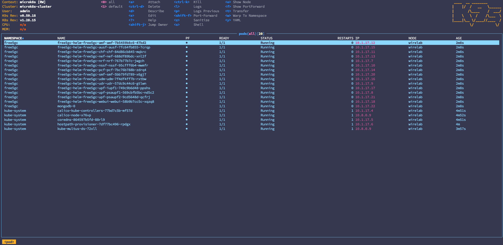

# Deploy free5GC helm in Minutes: The Ultimate One-Script Setup Guide

Welcome to the free5GC helm quick setup guide! If you are using the [free5gc-helm](https://github.com/free5gc/free5gc-helm) to deploy your k8s environment. Here is a new method which is more convenient to setup a new helm in new machine.

---

> [!Note]
> This ansible script is used for quick setup at an empty machine. If you have already setup previously, please refer to [free5gc-helm](./7-free5gc-helm.md) for customized operation.

## Prerequisites

- **CPU**: AMD or Intel CPU.
- **OS**: Ubuntu 20.04, 22.04, 24.04, or 25.04.
- **Tools**: The `git` command must be installed on your system.

In this quick setup scrip, we will use `ansible` to run the whole installation. As a result, it can be deploy on both remote machine and local machine.

Install `ansible`:

```bash
sudo apt update
sudo apt install -y software-properties-common
sudo add-apt-repository --yes --update ppa:ansible/ansible
sudo apt install -y ansible
```

## Get the Ansible book

The ansible files is placed under our free5GC repo.

```bash
git clone https://github.com/free5gc/free5gc
```

## Setup Your Destination Machine

In the file, `free5gc/ansible-helm/inventory.ini`, you have to specify the destination machine you want to setup the free5gc-helm.

```ini
[k8s]
<host IP> work_node=<host name>
```

## Run the Script

```bash
cd free5gc
./quick-setup-helm.sh
```

`ansible` will use ssh to do the install operation in the target machine so you will be asked about the user and user password.

Ansible will help you to install:

- microk8s
- kubectl
- helm
- k9s
- enable required addons in microk8s
- gtp5g
- free5gc-helm

    - core network chart

## Result

Ansible will show if there is failed task:


After installed, use `k9s -A` to check all pods are running:



## RAN/UE test

### free-ran-ue

free-ran-ue's helm chart is a submodule under `free5gc-helm/charts`. So it is necessary to get the source by:

```bash
cd free5gc-helm
git submodule update --init
```

Then use exec command to enter the pod:

```bash
kubectl exec -it -n free5gc fru-freeranue-ue-xxxxxxxxxx-xxxxx -- sh
```

Run UE simulator:

```bash
./free-ran-ue ue -c config/ue.yaml
```

Ping test(open another terminal):

```bash
ping -I ueTun0 1.1.1.1 -c 5
```

It is expected to see:

```bash
PING 1.1.1.1 (1.1.1.1) from 10.60.0.1 ueTun0: 56(84) bytes of data.
64 bytes from 1.1.1.1: icmp_seq=1 ttl=48 time=3.99 ms
64 bytes from 1.1.1.1: icmp_seq=2 ttl=48 time=3.85 ms
64 bytes from 1.1.1.1: icmp_seq=3 ttl=48 time=3.70 ms
64 bytes from 1.1.1.1: icmp_seq=4 ttl=48 time=3.63 ms
64 bytes from 1.1.1.1: icmp_seq=5 ttl=48 time=3.95 ms

--- 1.1.1.1 ping statistics ---
5 packets transmitted, 5 received, 0% packet loss, time 4005ms
rtt min/avg/max/mdev = 3.632/3.823/3.993/0.140 ms
```

### UERANSIM

```bash
cd free5gc-helm
helm install -n free5gc ueransim ./charts/ueransim
```
