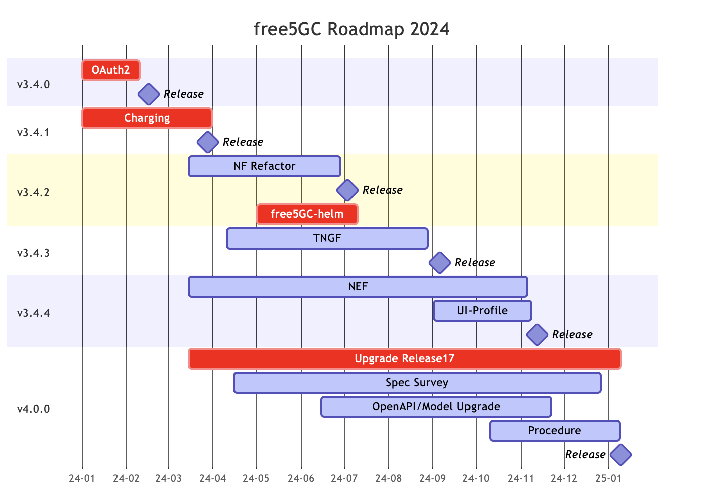

# History

## 2025 Roadmap

## April 22, 2025: v4.0.1

In the release v4.0.1 of free5GC, we have fixed a series of bugs, which including:

- [Kernel panic issue in GTP5G](https://github.com/free5gc/gtp5g/pull/143)
- [CGF Passive port range should be configurable](https://github.com/free5gc/chf/issues/41)
- [Registration is possible even if the IMSI (first part) and PLMN (MCC/MNC) do not match.](https://github.com/free5gc/free5gc/issues/669)
- [fix: race condition in OpenCDR()](https://github.com/free5gc/chf/pull/44)

Moreover, we also enhanced our integration test framework, which now supports the [TNGF registration](https://github.com/free5gc/free5gc/pull/659).

## March 3, 2025: v4.0.0

The release v4.0.0 of free5GC upgrade the SBI server/consumer implementaions for All of NFs (except for NEF) to 3GPP R17 standards.
The NEF upgrade is ongoing, and the R17 support will be released in v4.0.2.

## Feb 26, 2025: v3.4.5

The release v3.4.5 of free5GC fixed a series of bugs, which including:

- Online Charging feature with ULCL deployment
- [SMF #71: SM contexts collection Response not compliant to standard](https://github.com/free5gc/smf/issues/71)
- [free5GC #627: There is an error in the information listed for QoS-related parameters](https://github.com/free5gc/free5gc/issues/627)
- [free5GC #630: Regarding the PDU session release process during IDLE state](https://github.com/free5gc/free5gc/issues/630)
- free5GC Issue #617 - #620, #635 - #638

Besides, the version v3.4.5 is the final release for 3GPP R15.
We're no longer maintain the 3GPP R15 branch, any technical issue/vulnerability/feature will be added in the 3GPP R17 branch only.

## 2024 Roadmap 

## Nov 12, 2024: v3.4.4

The release of free5GC v3.4.4 includes several new features, including default profile values in the Webconsole, a search bar for profiles and subscribers, NEF support for Traffic Influence, and NAT-T support for N3IWUE in N3IWF. The N3IWF configuration file has been refactored. Bug fixes address SMF ULCL charging issues, AMF authentication procedures, UE RAT type determination, and a UDM SUCI profile B decrypt error, along with other issues reported on GitHub and the free5GC forum.

**[Features]**

- Add Profile(default values) for create subscriber in Webconsole
- Add Webconsole Search Bar for Profiles and Subscribers
- Released NEF that supporting Traffic Influence
- N3IWF support NAT-T with N3IWUE
- Go-UPF with [v0.9.3 GTP5G Version](https://github.com/free5gc/gtp5g/tree/v0.9.3)
- SMF support SDM Subscription and Unsubscription for UE Session [#123](https://github.com/free5gc/smf/pull/123)

**[Refactor]**

- N3IWF Refactor, including the configuration file [#618](https://github.com/free5gc/free5gc/pull/618)
- SMF Refactor, using Go context to track UPF association state [#122](https://github.com/free5gc/smf/pull/122)

**[Bugs]**

- SMF ULCL Charging Bugs
- AMF authentication procedure and UE RAT type determination issues.
- UDM SUCI profile B decrypt error [#41](https://github.com/free5gc/udm/pull/41)
- Fix some bug reports from [Issues](https://github.com/free5gc/free5gc/issues) or [Forum](https://forum.free5gc.org/)

## Sep 5, 2024: v3.4.3

The release of free5GC v3.4.3 includes several new features, such as new network function TNGF, support for an empty SD value in SNSSAI, and the ability to disable CGF in CHF. It also features a refactored Subscriber Modal Page in the Webconsole. Additionally, several bugs have been fixed, including issues with double registration with N3IWF and unauthorized UE context releases, along with other bug fixes reported via GitHub issues and the free5GC forum.

**[Features]**

- Release TNGF & TNGFUE
- Support empty SD value (SNSSAI)
- Support disable CGF in CHF

**[Refactor]**

- Refactor Subscriber Modal Page in Webconsole

**[Bugs]**

- Fix can't registration with N3IWF twice problems
- Fix UEs can be context released by a second UE without authentication (src: [Issue](https://github.com/free5gc/free5gc/issues/580))
- Fix some bug reports from [Issues](https://github.com/free5gc/free5gc/issues) or [Forum](https://forum.free5gc.org/)

## July 3, 2024: v3.4.2

The free5GC v3.4.2 includes a Go version update to 1.21 and refactoring all Network Functions. New features include setting static IPs for UEs and OAuth2 authentication for the webconsole, plus a ULCL example in free5gc-compose. Bug fixes and a new commit message check are also included.

**[Refactor]**

- Go version bump to Go1.21
- Refactor NFs for preparation upgrading openapi to Release17

**[Features]**

- Set Static-IP for UE in webconsole 
- Webconsole acts as AF and uses OAuth2 authentication to get OAM service from NFs
- Add ULCL docker-compose example in [free5gc-compose](https://github.com/free5gc/free5gc-compose)
- Session AMBR in Data Plane
- CHF on k8s

**[Bugs]**

- Fix N3IWUE fails to ping when having flow rules([v1.0.1](https://github.com/free5gc/n3iwue/tree/v1.0.1))
- Fix some bug reports from [Issues](https://github.com/free5gc/free5gc/issues) or [Forum](https://forum.free5gc.org/)

**[Chore]**

- Apply [Conventional Commit Message](https://www.conventionalcommits.org/en/v1.0.0/) check in Pull Request

## March 28, 2024: v3.4.1

In free5GC v3.4.1, Convergent Charging on PDU Session will be fully supported!
Users will see the data usage on the webconsole after the PDU Session is created (please note that: The charging method (Online/Offline) needs to be determined during the subscription creation).

If you're interested in the implementation details, please visit the [CHF design document](https://free5gc.org/guide/Chf/design/).

## Feb 16, 2024: v3.4.0

We are delighted to unveil the release of free5GC v3.4.0! In this latest version, free5GC now boasts support for [OAuth](https://oauth.net/2/) within the Service-Based Architecture (SBA), marking a significant advancement in its capabilities. Furthermore, we have diligently addressed several issues and bugs that were reported by the Open-Source community, ensuring a smoother and more reliable user experience.

- OAuth Support
    - NRF acts as authorization server
    - All Services in AMF, SMF, NRF, PCF, UDR, UDM, AUSF, NSSF are supported to validate/request access token
- Implicit De-registration
    - Use case: UE has registered on Old AMF and send registration request to new AMF
        - New AMF is able to get the UE context by asking the old AMF, and old AMF will do the implicit de-registration.
- Support NAS Reroute ([Issue #413](https://github.com/free5gc/free5gc/issues/413))
- Support NITZ (Network Identiy and Time Zone) in UE Configuration Update Command ([Issue #113](https://github.com/free5gc/free5gc/issues/113))
- Bugfix
    - [Issue #421](https://github.com/free5gc/free5gc/issues/421)
    - [Issue #387](https://github.com/free5gc/free5gc/issues/387)
- Release N3IWUE
    - Source code: [https://github.com/free5gc/n3iwue](https://github.com/free5gc/n3iwue)
