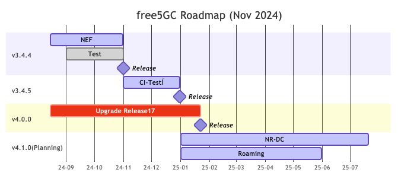

<!-- <iframe width="616" height="400" src="https://www.youtube.com/embed/SFO2z5-4zxs?list=PLeDUIabcS2_p4fjApgJHNiVpfYSzz1oJi" title="free5GC Demonstration with 5G SA gNB and UE" frameborder="0" allow="accelerometer; autoplay; clipboard-write; encrypted-media; gyroscope; picture-in-picture; web-share" allowfullscreen></iframe> -->

<!-- Google tag (gtag.js) -->  

The free5GC (a Linux Foundation project) is an open-source project for 5th generation (5G) mobile core networks. The ultimate goal of this project is to implement the 5G core network (5GC) defined in 3GPP Release 15 (R15) and beyond.

Currently, the major contributors are from National Yang Ming Chiao Tung University ([NYCU](https://en.nycu.edu.tw/){target=_blank}).

- The source code of the latest version of free5GC can be downloaded from [here](https://github.com/free5gc/free5gc){target=_blank}.
- Information about TSC (Technical Steering Committee) can be found at [free5gc/governance](https://github.com/free5gc/governance/blob/main/CONTRIBUTORS.md).
- Follow our [LinkedIn](https://www.linkedin.com/company/free5gc/){target=_blank} page to get the news about free5GC.
- Please refer to our roadmap for the features of each release.

> [!NOTE]
> The Linux Foundation announced that free5GC officially joined the Linux Foundation on September 16, 2024, during the Open Source Summit Europe in Vienna, Austria. Check out the press release [here](https://www.linuxfoundation.org/press/worlds-leading-open-source-mobile-packet-core-free5gc-moves-under-linux-foundation-to-provide-open-source-alternatives-across-5g-deployments).

> [!NOTE]
> Thank you very much for your interest in free5GC. The license of free5GC follows Apache 2.0. That is, anyone can use free5GC for commercial purposes for free.

> [!NOTE]
> Please check out the [Google Scholar](https://scholar.google.com/scholar?hl=en&as_sdt=2007&q=free5gc) page here for publications using free5GC.

> [!NOTE]
> Want to contribute to free5GC? Check out our [How to contribute](https://free5gc.org/guide/contribute/) page for more information.

## 2025/03/03: free5GC v4.0.0 released!

The release v4.0.0 of free5GC upgrade the SBI server/consumer implementaions for All of NFs (except for NEF) to 3GPP R17 standards.
The NEF upgrade is ongoing, and the R17 support will be released in v4.0.1.

> [!NOTE]
> The history of the version release can be found on the [history page](./history.md).

### Next Step(s)

We remain committed to enhancing free5GC with new features, and we have a roadmap in place to support the following functionalities:

- NR-DC
- Roaming
